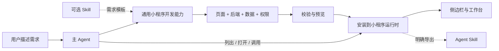

<p align="center">
  
</p>

<h1 align="center">YiW</h1>

<p align="center">
  <strong>让桌面 Agent 把自然语言需求变成可安装、可操作、可升级的小程序。</strong>
</p>

<p align="center">
  <a href="https://github.com/vibeinging/yiWork/actions/workflows/ci.yml"></a>
  <a href="LICENSE"></a>
  
</p>

YiW 是一个本地优先的桌面 Agent 工作台。它不把应用能力写死在固定页面里，而是把稳定的桌面底座和可热插拔的小程序分开：用户说出需求，主 Agent 可以生成产品方案和代码，经过校验与预览后，将新功能安装到侧边栏，并继续打开、操作、升级或回滚它。

> [!IMPORTANT]
> YiW 目前是开发者预览版。接口、数据库结构和小程序协议仍可能变化，请勿用它保存重要数据的唯一副本。

## 一个具体例子

用户可以直接告诉主 Agent：

> 帮我在侧边栏添加一个股票模块，信息结构和交互方式参考成熟的股票软件。

YiW 的目标流程是：

1. 主 Agent 澄清行情、持仓、自选股、数据源和权限等需求。
2. 使用现有 Skill 作为需求模板，或直接生成产品方案。
3. 生成小程序的前端页面、后端逻辑、数据结构和权限声明。
4. 在隔离环境中校验并预览，由用户确认后安装到侧边栏。
5. 主 Agent 可以继续打开和操作这个小程序；后续修改作为新版本升级，并可回滚。

这里的“参考”是指借鉴公开的信息结构和交互方式，不复制第三方的商标、素材或私有代码。

## 主 Agent、小程序和 Skill

| 概念 | 它是什么 | 在 YiW 中的作用 |
| --- | --- | --- |
| 主 Agent | 应用里的总入口 | 理解需求、调用工具、开发并操作小程序 |
| 小程序 | 可安装的完整产品包 | 提供页面、后端逻辑、数据和权限，可独立升级或回滚 |
| Skill | 可复用的需求与执行模板 | 帮助 Agent 稳定完成一类工作，也可以用来生成小程序 |

三者不是一一对应的：

- Skill 可以直接运行，不一定要做成小程序。
- 小程序可以来自 Skill，也可以由用户和主 Agent 从零开发。
- 普通小程序只有在明确导出为 Agent Skill 后，才会成为 Agent 可复用的执行能力。

## 工作流程



## 当前能力

- **本地 Agent**：项目、会话、附件、流式回复、工具调用和运行记录。
- **动态小程序**：生成、校验、预览、安装、启用、停用、升级和回滚。
- **Agent 操作小程序**：主 Agent 可以列出、打开和调用已安装小程序，再把页面交给用户继续操作。
- **Skill 产品化**：Skill 可以生成前后端能力；成熟小程序也可以显式导出为 Agent Skill。
- **数据工作台**：结构化数据、文档、自然语言问数、报告和 Trace 优化。
- **扩展接入**：按项目安装外部 Skill，并通过 MCP 接入外部工具。

### 三种更新路径

| 更新对象 | 适合放什么 | 更新方式 |
| --- | --- | --- |
| YiW 核心应用 | Agent 底座、账号、安全、系统运行时 | 通过正式版本发布；自动更新仍在规划中 |
| 小程序 | 面向用户的独立功能 | 运行时安装、升级、停用和回滚，不必重装整个应用 |
| Skill | 需求模板和 Agent 执行逻辑 | 按版本安装或更新，需要时生成小程序或由小程序导出 |

## 项目结构

| 目录 | 用途 |
| --- | --- |
| `electron/` | Electron 主进程、窗口、预加载和本地系统能力 |
| `renderer/` | React 18、TypeScript 和 Vite 前端 |
| `server/` | 本地 API、SQLite、Agent、Skills、MCP 和小程序运行时 |
| `eval/` | 自动测试、桌面端评测和可选外部数据集适配 |
| `docs/` | 设计、规格、调研和测试报告 |

桌面主链路通过 Electron 进程通信连接本地后端。HTTP 入口只用于开发和评测，并绑定本机地址。

## 快速开始

环境要求：

- Node.js `>= 26.3.0`
- npm `>= 11.16.0`
- macOS、Linux 或 Windows；目前完整验证以 macOS arm64 为主

```bash
git clone https://github.com/vibeinging/yiWork.git
cd yiWork
npm run setup
npm run dev
```

`npm run setup` 会安装 Server、Renderer 和 Electron 的锁定依赖，并构建项目内置的 pi Agent 运行时。

## 常用命令

| 命令 | 用途 |
| --- | --- |
| `npm run setup` | 安装三个子项目并构建 pi |
| `npm run dev` | 启动 YiW 桌面应用 |
| `npm run typecheck` | 检查前端 TypeScript |
| `npm run test:renderer` | 运行前端测试 |
| `npm run test:server` | 运行小程序与模块运行时测试 |
| `npm run build:renderer` | 构建桌面 Renderer |
| `npm run check` | 运行当前开源基线检查 |

## 设计文档

- [Agent 小程序运行时](docs/design/2026-07-22_agent-miniapp-runtime.md)
- [动态 UI 模块运行时](docs/design/2026-07-20_dynamic-ui-module-runtime.md)
- [Skill 产品固化](docs/design/2026-07-22_skill-product-solidification.md)
- [动态 UI 模块规格](docs/specs/2026-07-20_dynamic-ui-modules.md)
- [外部 Skill 产品化测试](docs/reports/2026-07-22_external-skill-product-test.md)

## 数据与安全

- 默认本地数据目录为 `~/.yiw/`。
- 不要提交 `.env`、模型密钥、数据库、日志、构建产物或个人配置。
- `server/scripts/init_local_db.mjs` 是可选的数据迁移脚本，连接信息只通过 `SRC_DB_*` 环境变量提供。
- 公开仓库不分发 VexDB 本地扩展二进制；未提供扩展时，相关检索会降级为关键词路径。
- KDD 等外部评测数据不进入仓库，需要通过 `YIW_KDD_ROOT` 指向用户有权使用的数据集。

安全问题请不要创建公开 Issue，请按 [SECURITY.md](SECURITY.md) 私下报告。

## 路线图

- [ ] 小程序包签名、来源校验和公开仓库。
- [ ] YiW 核心应用的正式打包与自动更新。
- [ ] 更丰富的小程序界面组件和稳定协议。
- [ ] 更严格的后端隔离、权限审计和资源限制。
- [ ] macOS、Windows 和 Linux 的完整发布验证。

## 参与开发

欢迎提交 Issue 和 Pull Request。开始前请阅读 [CONTRIBUTING.md](CONTRIBUTING.md)；重要的设计、规格和评测结果应同步写入 `docs/`。

## 许可证

除单独说明的第三方内容外，YiW 使用 [MIT License](LICENSE)。第三方代码和资源见 [THIRD_PARTY_NOTICES.md](THIRD_PARTY_NOTICES.md)。
