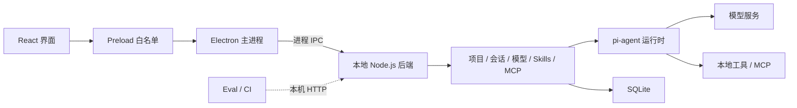

# PI Desktop

[](https://github.com/vibeinging/pi-desktop/actions/workflows/ci.yml)
[](LICENSE)
[](https://github.com/earendil-works/pi)

一个基于 [earendil-works/pi](https://github.com/earendil-works/pi) 的本地桌面 Agent 底座。

PI Desktop 把 Electron、React、本地 Node.js 后端、SQLite、模型配置、Skills、MCP 和本地工具放在同一个仓库里。你可以直接在它上面开发自己的桌面 Agent，不必从窗口管理、进程通信、会话保存和工具调用重新搭建。

> [!IMPORTANT]
> PI Desktop 是独立的社区项目，不是 `earendil-works/pi` 的官方桌面客户端。当前仍是开发者预览版：核心开发和 macOS arm64 打包链路已经可用，但还没有正式安装包、代码签名和自动升级。

## 与 pi 的关系

[pi](https://github.com/earendil-works/pi) 提供统一模型接口、Agent runtime、coding-agent 和工具调用基础。PI Desktop 在这些能力之上增加 Electron 桌面壳、React 界面、本地 SQLite 持久化、IPC、安全边界和桌面打包流程。

仓库固定使用 pi `v0.80.6`，来源 commit、本地修改和更新方法记录在 [Vendored pi 说明](server/vendor/README.md) 与 [第三方代码说明](THIRD_PARTY_NOTICES.md) 中。升级 pi 时会继续保留上游版权和 MIT 许可证。

## 已有能力

- 本地优先：桌面主链路不开放 HTTP，界面通过 Electron IPC 访问本地后端。
- Agent 会话：支持流式回复、附件、上下文压缩、停止运行和历史恢复。
- 本地工作区：提供文件读取、搜索、编辑和 Shell 工具；写入与执行操作受确认控制。
- 模型配置：支持 OpenAI Chat Completions、OpenAI Responses、Anthropic Messages 及常见兼容接口。
- Skills 和 MCP：可以在应用设置中创建 Skill、接入使用 `stdio` 的 MCP Server，并按项目启用。
- 数据持久化：保留 `better-sqlite3`，用于项目、会话、消息、模型、Skills、MCP 和 Agent 运行记录。
- 桌面安全边界：启用 Electron sandbox、CSP、导航限制、IPC 来源校验和 Markdown/HTML 清洗。
- 可重复构建：提供统一 setup、检查、pi 构建和 Electron 隔离打包脚本。

## 适合什么项目

PI Desktop 适合开发代码助手、文件助手、知识工作助手、内部工具 Agent，以及需要本地文件或命令能力的桌面应用。

它目前不是多用户服务端框架，也不适合直接暴露到公网。HTTP 入口只用于本机评测、CI 和明确开启的浏览器调试。

## 架构



IPC 和本机 HTTP 共用同一套路由和用例。桌面应用默认只启动 IPC；HTTP 仅监听 `127.0.0.1`。

更完整的进程、数据和打包说明见[架构文档](ARCHITECTURE.md)。

## 快速开始

环境要求：

- Node.js `>= 22.19.0`
- npm `>= 11.0.0`（CI 固定使用 `11.16.0`）
- macOS、Linux 或 Windows；当前完整打包验证以 macOS arm64 为主

```bash
git clone https://github.com/vibeinging/pi-desktop.git
cd pi-desktop
npm run setup
npm run dev
```

`npm run setup` 会分别安装 Server、Renderer 和 Electron 的锁定依赖，并构建缺失的 pi 运行文件。根目录不需要执行 `npm install`。

建议使用仓库 `.nvmrc` 或 `.node-version` 指定的 Node.js 版本。切换 Node 主版本后请重新运行 `npm run setup`，避免复用不兼容的 `better-sqlite3` 原生文件。

应用启动后：

1. 打开“设置 → 模型设置”，添加并测试一个主模型。
2. 新建对话，或创建工作区后开始任务。
3. 按需在设置中创建 Skills、接入 MCP Server。
4. 涉及文件修改或命令执行时，在确认窗口中检查操作内容。

## 常用命令

| 命令 | 用途 |
| --- | --- |
| `npm run setup` | 安装三个子项目的依赖并准备 pi 运行文件 |
| `npm run dev` | 启动 Renderer、Electron 和本地后端 |
| `npm run test` | 运行 Server 与 Renderer 测试 |
| `npm run lint` | 检查 Renderer 代码 |
| `npm run typecheck` | 运行 TypeScript 检查 |
| `npm run build` | 构建 vendored pi 和 Renderer |
| `npm run check` | 依次运行 lint、类型检查、测试和构建 |
| `npm run package:dir` | 生成当前平台的未签名 Electron 应用目录 |

依赖由 `server/package-lock.json`、`renderer/package-lock.json` 和 `electron/package-lock.json` 分别固定。修改依赖后，请提交对应 lockfile。

## 打包桌面应用

```bash
npm run setup
npm run package:dir
```

打包脚本会：

1. 构建 Renderer 和 vendored pi。
2. 在一次性的 `staging/` 中安装 Server 生产依赖。
3. 使用 `@electron/rebuild` 为当前 Electron ABI 重编 `better-sqlite3`。
4. 将应用目录写入 `release/`。

它不会修改开发目录里的 `server/node_modules`，因此系统 Node.js 和 Electron 可以分别使用正确的原生模块。

当前已经验证 `release/mac-arm64/PI Desktop.app` 可以启动、访问 IPC API 并读写 SQLite。该产物没有签名，也不是 `.dmg`、`.exe` 或 Linux 安装包。

## 在底座上开发

| 扩展内容 | 推荐位置 |
| --- | --- |
| 后端用例 | `server/src/app/` |
| API 注册 | `server/src/transport/registry*.js` |
| Agent、工具和运行时组合 | `server/src/engine/` |
| 页面 | `renderer/src/views/` |
| 公共组件 | `renderer/src/components/` |
| 路由 | `renderer/src/router/routes.tsx` |
| 通用外部工具 | MCP |
| 提示词和流程能力 | Skills |

业务逻辑不要直接写进 IPC 或 HTTP 层。新增文件、Shell 或 MCP 能力时，需要说明权限范围、取消方式和输出上限，并增加对应测试。

`server/vendor/pi/` 固定了当前使用的 pi 版本。不要直接覆盖该目录；升级步骤和本地修改见 [server/vendor/README.md](server/vendor/README.md)。

新增一个后端能力时，最短流程是：

1. 在 `server/src/app/<feature>/` 编写不依赖 IPC 或 HTTP 的用例。
2. 在 `server/src/transport/registry.<feature>.js` 注册方法和路径，再合并到 `registry.js`。
3. 在 `server/test/` 增加成功、失败和取消场景测试；Renderer 通过 API 适配层调用。

## 数据与安全

默认本地数据：

```text
~/.pi-desktop/local.db   项目、会话、消息和配置
~/.pi-desktop/projects/  工作区文件
```

测试和自动化请设置 `PI_DB_PATH`，避免读写个人数据库。

模型密钥和 MCP 环境变量目前保存在本地 SQLite 中，读取接口不会返回明文，但落盘还没有接入系统凭据存储。不要共享数据库文件，也不要把密钥写进仓库。

安全问题请阅读 [SECURITY.md](SECURITY.md)，不要直接公开包含利用细节的 Issue。

## 浏览器调试本地 HTTP

桌面开发一般不需要 HTTP。只有独立启动后端或设置 `PI_TCP=1` 时，服务才会监听 `127.0.0.1`。浏览器访问必须同时配置允许来源和本地令牌：

```bash
PI_TCP=1 \
PI_ALLOWED_ORIGINS=http://127.0.0.1:52731 \
PI_HTTP_TOKEN=replace-with-a-long-random-value \
npm --prefix server start
```

另一个终端启动浏览器调试页：

```bash
VITE_PI_HTTP_TOKEN=replace-with-the-same-value \
npm --prefix renderer run dev
```

浏览器打开 `http://127.0.0.1:52731`。不要提交令牌，也不要把 `PI_ALLOWED_ORIGINS` 设置为任意来源。

## 当前限制

- 扩展接口和数据库结构还没有进入稳定兼容期。
- MCP 当前只支持 `stdio` transport。
- macOS、Windows 和 Linux CI 已接通；正式安装包仍需分别验证。
- 尚无正式安装包、代码签名、公证和自动升级。
- 模型与 MCP 密钥尚未接入系统凭据存储。
- Renderer 主包仍需继续拆分和减小体积。

## 项目目录

```text
electron/       Electron 主进程、preload 和打包配置
renderer/       React 界面
server/         本地后端、SQLite 和 Agent 运行时
server/vendor/  固定版本的 pi 源码与第三方许可
eval/           桌面 smoke 和评测工具
docs/           面向开发者的公开发布记录
```

## 文档

- [架构与扩展点](ARCHITECTURE.md)
- [参与开发](CONTRIBUTING.md)
- [安全说明](SECURITY.md)
- [MIT 许可证](LICENSE)
- [第三方代码说明](THIRD_PARTY_NOTICES.md)
- [公开发布检查](docs/reports/2026-07-13_public-release-check.md)

## 许可证

除单独说明的第三方内容外，PI Desktop 采用 [MIT License](LICENSE)。Vendored pi 也使用 MIT 许可证，但继续保留上游作者的版权和许可证副本；其他第三方内容见 [THIRD_PARTY_NOTICES.md](THIRD_PARTY_NOTICES.md)。
