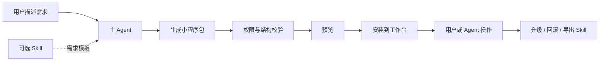

# YiW

[](https://github.com/vibeinging/yiWork/actions/workflows/ci.yml)
[](LICENSE)

YiW 是一个本地优先的桌面 Agent 工作台。它把 Electron、React、本地 Node.js 后端、SQLite、Skills、MCP、数据分析和可插拔小程序放在同一个应用里。

YiW 的目标不只是让 Agent 回答问题，而是让应用能力随用户需求一起成长：主 Agent 可以根据自然语言需求生成小程序，预览后安装到侧边栏，并继续打开、操作和更新这些小程序。

> [!IMPORTANT]
> 当前仍是开发者预览版。接口、数据库结构和小程序协议还可能调整；请勿直接用于保存唯一副本的重要数据。

## 核心能力

- 本地 Agent：项目、会话、附件、流式回复、工具调用和运行记录。
- 动态小程序：生成、校验、预览、安装、启用、停用、升级和回滚。
- Agent 操作小程序：主 Agent 可以列出、打开和调用已安装小程序，并把页面交给用户继续操作。
- Skill 固化：Skill 可以作为需求模板生成前后端逻辑，也可以把成熟小程序导出为 Agent Skill。
- 数据工作台：支持结构化数据、文档、自然语言问数、报告和 Trace 优化。
- MCP 与外部 Skill：按项目接入外部工具和可安装能力。

Skill 和小程序不是一一对应：

- Skill 是可选的需求和执行模板。
- 小程序是可安装的产品包，可以来自 Skill，也可以由用户和主 Agent 直接开发。
- 普通小程序需要明确导出为 Agent Skill 后，才能作为 Agent 的可复用执行能力。

## 工作流程



小程序的详细协议见：

- [Agent 小程序运行时设计](docs/design/2026-07-22_agent-miniapp-runtime.md)
- [动态 UI 模块设计](docs/design/2026-07-20_dynamic-ui-module-runtime.md)
- [Skill 产品固化设计](docs/design/2026-07-22_skill-product-solidification.md)

## 项目结构

| 目录 | 用途 |
| --- | --- |
| `electron/` | Electron 主进程、窗口、预加载和本地系统能力 |
| `renderer/` | React 18 + TypeScript + Vite 前端 |
| `server/` | 本地 API、SQLite、Agent、Skills、MCP 和小程序运行时 |
| `eval/` | 自动测试、桌面端评测和可选外部数据集适配 |
| `docs/` | 设计、规格、调研和测试报告 |

桌面主链路通过 Electron 进程通信连接本地后端。HTTP 入口只用于开发和评测，并绑定本机地址。

## 快速开始

环境要求：

- Node.js `>= 26.3.0`
- npm `>= 11.16.0`
- macOS、Linux 或 Windows；当前本机完整验证以 macOS arm64 为主

```bash
git clone https://github.com/vibeinging/yiWork.git
cd yiWork
npm run setup
npm run dev
```

`npm run setup` 会安装 Server、Renderer 和 Electron 的锁定依赖，并构建 vendored pi。

## 常用命令

| 命令 | 用途 |
| --- | --- |
| `npm run setup` | 安装三个子项目并构建 pi |
| `npm run dev` | 启动 YiW 桌面应用 |
| `npm run typecheck` | 检查前端 TypeScript |
| `npm run test:renderer` | 运行前端测试 |
| `npm run test:server` | 运行小程序与模块运行时测试 |
| `npm run build:renderer` | 构建桌面 Renderer |
| `npm run check` | 运行当前开源基线检查 |

## 数据与安全

- 默认本地数据目录为 `~/.yiw/`。
- 不要提交 `.env`、模型密钥、数据库、日志、构建产物或个人配置。
- `server/scripts/init_local_db.mjs` 是可选的数据迁移脚本，连接信息只通过 `SRC_DB_*` 环境变量提供。
- 公开仓库不分发 VexDB 本地扩展二进制；未提供扩展时，相关检索会降级为关键词路径。
- KDD 等外部评测数据不进入仓库，需要通过 `YIW_KDD_ROOT` 指向用户有权使用的数据集。

安全问题请不要创建公开 Issue，按 [SECURITY.md](SECURITY.md) 私下报告。

## 参与开发

请阅读 [CONTRIBUTING.md](CONTRIBUTING.md)。重要的设计、规格和评测结果应同步写入 `docs/`。

## 许可证

除单独说明的第三方内容外，YiW 使用 [MIT License](LICENSE)。第三方代码和资源见 [THIRD_PARTY_NOTICES.md](THIRD_PARTY_NOTICES.md)。
