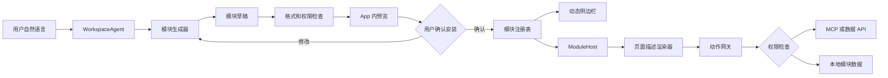
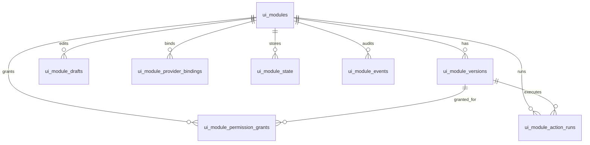
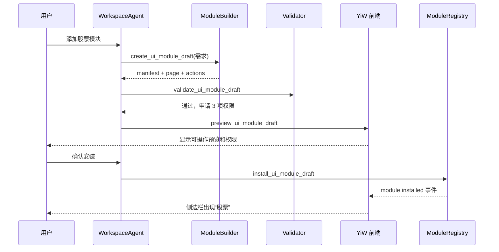

# YiW 动态 UI 模块运行方案

日期：2026-07-20

关联分析：[YiW 自动更新与动态模块能力分析](../analysis/2026-07-20_app-self-update-dynamic-modules.md)

## 1. 目标

让用户通过自然语言为 YiW 增加个人功能。例如：

> 在侧边栏添加一个股票模块，参考同花顺的使用方式，先做自选股、行情、K 线和价格提醒。

用户看到的是“App 的 UI 自动成长”。系统内部真正做的是：

1. Agent 生成一个结构化模块。
2. YiW 检查模块格式、数据来源和权限。
3. 用户在 App 内预览。
4. 用户确认后安装一个新模块版本。
5. YiW 从模块清单读取侧边栏入口和页面内容，不修改核心 App 文件。

## 2. 核心原则

### 2.1 模型不直接改核心 UI

核心代码仍通过正常开发、测试、签名和 App 自动更新发布。用户生成的功能放在独立模块目录和模块数据库中。

这样可以保证：

- 一个模块出错不会让整个 App 无法启动。
- 模块可以停用、卸载和退回旧版本。
- 核心 App 升级时可以检查模块兼容性。
- 用户能看清模块申请了哪些权限。

### 2.2 第一版使用页面描述，不运行任意前端代码

第一版由 Agent 生成 JSON 页面描述。YiW 内置一组可靠组件，再根据 JSON 组合页面。

不要在第一版让模型生成 React 代码、执行 `npm install`、重新打包整个 App。那种方式虽然自由，但运行慢、容易坏，也很难控制网络、文件和系统权限。

### 2.3 所有外部操作都经过能力入口

模块不能直接读取文件、请求任意网址或使用账号凭证。模块只能声明动作，交给 YiW 后端执行：

- 读取本地模块数据
- 调用已经配置的 MCP 工具
- 调用经过允许的数据 API
- 创建提醒
- 导出文件

后端先检查权限，再执行动作。

## 3. 总体结构



系统分成五层：

1. **宿主层**：YiW 核心窗口、侧边栏、模块容器和错误保护。
2. **模块层**：模块清单、页面描述、动作定义和资源文件。
3. **生成层**：把用户要求转成模块草稿。
4. **治理层**：格式检查、权限确认、安装、版本和退回。
5. **数据层**：MCP、行情 API、本地数据库和提醒服务。

## 4. 模块文件格式

模块存放在用户数据目录，而不是 App 安装目录：

```text
~/.yiw/modules/
└── stock-center/
    ├── current.json
    └── versions/
        └── 1.0.0/
            ├── manifest.json
            ├── page.json
            ├── actions.json
            └── assets/
```

### 4.1 manifest.json

```json
{
  "schemaVersion": 1,
  "id": "stock-center",
  "name": "股票",
  "description": "查看自选股、行情和价格提醒",
  "icon": "chart-candlestick",
  "version": "1.0.0",
  "minAppVersion": "0.2.0",
  "sidebar": {
    "visible": true,
    "group": "personal",
    "order": 20
  },
  "entryPage": "home",
  "permissions": [
    "storage:stock-center",
    "provider:market-data:read",
    "notification:create"
  ]
}
```

### 4.2 page.json

```json
{
  "id": "home",
  "title": "股票",
  "layout": {
    "type": "Stack",
    "gap": "md",
    "children": [
      {
        "type": "Toolbar",
        "children": [
          {
            "type": "SearchInput",
            "placeholder": "搜索股票名称或代码",
            "onSubmit": { "action": "searchStock", "input": "$event.value" }
          }
        ]
      },
      {
        "type": "Tabs",
        "items": [
          { "label": "自选", "content": { "type": "DataTable", "source": "watchlist" } },
          { "label": "行情", "content": { "type": "MarketOverview", "source": "marketOverview" } }
        ]
      },
      {
        "type": "CandlestickChart",
        "source": "selectedStockKline",
        "emptyText": "选择一只股票查看 K 线"
      }
    ]
  }
}
```

### 4.3 actions.json

```json
{
  "actions": {
    "searchStock": {
      "type": "provider.call",
      "provider": "market-data",
      "tool": "search_stock",
      "permission": "provider:market-data:read"
    },
    "loadKline": {
      "type": "provider.call",
      "provider": "market-data",
      "tool": "get_kline",
      "permission": "provider:market-data:read"
    }
  }
}
```

页面描述里不允许 JavaScript、`eval` 或任意网络地址。值绑定只支持简单路径，例如 `$state.selectedStock`、`$result.rows` 和 `$event.value`。

## 5. YiW 内置组件注册表

前端建立固定的组件注册表：

```ts
const moduleComponents = {
  Stack,
  Grid,
  Tabs,
  Toolbar,
  SearchInput,
  Button,
  MetricCard,
  DataTable,
  LineChart,
  CandlestickChart,
  MarketOverview,
  EmptyState,
  ErrorState
}
```

`SchemaRenderer` 递归读取 `page.json`，只渲染注册表中存在的组件。发现未知组件时，显示模块错误，不执行未知代码。

这一步决定了生成质量。内置组件越完整，Agent 越容易生成稳定、统一的 UI。股票模块需要先补齐 K 线、分时、涨跌颜色、行情表格和数据过期提示等组件。

## 6. 当前 YiW 的代码改造点

### 6.1 前端

当前 `YiWShell.tsx` 只在左侧显示工作区，并在中间显示对话。需要增加统一的页面状态：

```ts
type ActiveSurface =
  | { type: 'conversation'; workspaceId: string; sessionId?: string }
  | { type: 'module'; moduleId: string; pageId?: string }
```

建议增加：

```text
renderer/src/modules/
├── ModuleHost.tsx
├── SchemaRenderer.tsx
├── componentRegistry.ts
├── ModuleErrorBoundary.tsx
├── moduleBindings.ts
└── api.ts
```

具体变化：

- `YiWShell.tsx`：加载已启用模块；根据 `ActiveSurface` 显示对话或模块。
- `YiWNav.tsx`：增加模块列表和模块点击事件。
- `routes.tsx`：只增加一个通用入口 `/agent/modules/:moduleId`，不为每个模块生成路由代码。
- `ModuleHost.tsx`：加载模块版本、页面描述和运行状态。
- `SchemaRenderer.tsx`：只渲染允许的内置组件。
- `ModuleErrorBoundary.tsx`：模块失败时只停用模块页面，不影响对话和设置。

### 6.2 后端

建议增加：

```text
server/src/engine/modules/
├── module_registry.js
├── module_store.js
├── module_validator.js
├── module_action_gateway.js
├── module_permission_service.js
└── module_builder.js

server/src/app/modules/
└── index.js

server/src/transport/
└── registry.modules.js
```

后端接口至少包括：

```text
GET    /api/modules
GET    /api/modules/:id
POST   /api/modules/drafts
PATCH  /api/modules/drafts/:draftId
POST   /api/modules/drafts/:draftId/validate
POST   /api/modules/drafts/:draftId/preview
POST   /api/modules/drafts/:draftId/install
POST   /api/modules/:id/actions/:actionName
PATCH  /api/modules/:id/toggle
POST   /api/modules/:id/rollback
DELETE /api/modules/:id
```

安装必须由后端完成原子切换：先写完整新版本，检查通过后再更新 `current_version`。中途失败时，旧版本继续可用。

### 6.3 接口接入方式

YiW 当前前端的普通请求已经通过 `axios-req.ts` 自动转成 Electron IPC，再由 `ipc_server.js` 调用与 HTTP 共用的路由表。HTTP 只用于 eval 和 CI。

动态模块继续使用这条链路：

```text
ModuleHost
→ renderer/src/modules/api.ts
→ axios-req IPC adapter
→ electron/main.js
→ server/src/transport/ipc_server.js
→ registry.ui_modules.js
→ server/src/app/modules/index.js
→ module service
→ SQLite / MCP
```

因此下面写的是 REST 风格的逻辑接口。桌面 App 正常运行时不需要开放本机 HTTP 端口。

路由注册文件：

```js
// server/src/transport/registry.ui_modules.js
import * as modules from '../app/modules/index.js';

export const uiModuleRoutes = [
  { m: 'GET', p: '/api/ui-modules', fn: modules.listModules, auth: true },
  { m: 'GET', p: '/api/ui-modules/:moduleId', fn: modules.getModule, auth: true },
  { m: 'GET', p: '/api/ui-modules/:moduleId/versions', fn: modules.listVersions, auth: true },
  { m: 'POST', p: '/api/ui-modules/:moduleId/versions/:versionId/activate', fn: modules.activateVersion, auth: true },
  { m: 'PATCH', p: '/api/ui-modules/:moduleId/status', fn: modules.setModuleStatus, auth: true },
  { m: 'PUT', p: '/api/ui-modules/:moduleId/providers/:providerAlias', fn: modules.bindProvider, auth: true },
  { m: 'POST', p: '/api/ui-modules/:moduleId/actions/:actionName', fn: modules.runModuleAction, auth: true },
  { m: 'DELETE', p: '/api/ui-modules/:moduleId', fn: modules.deleteModule, auth: true },

  { m: 'POST', p: '/api/ui-module-drafts', fn: modules.createDraft, auth: true },
  { m: 'GET', p: '/api/ui-module-drafts/:draftId', fn: modules.getDraft, auth: true },
  { m: 'PUT', p: '/api/ui-module-drafts/:draftId', fn: modules.replaceDraft, auth: true },
  { m: 'POST', p: '/api/ui-module-drafts/:draftId/validate', fn: modules.validateDraft, auth: true },
  { m: 'POST', p: '/api/ui-module-drafts/:draftId/preview', fn: modules.previewDraft, auth: true },
  { m: 'POST', p: '/api/ui-module-drafts/:draftId/install', fn: modules.installDraft, auth: true },
];
```

把 `uiModuleRoutes` 展开到现有 `server/src/transport/registry.js` 即可。所有成功响应继续使用 YiW 当前信封：

```json
{
  "success": true,
  "message": "操作成功",
  "data": {},
  "detail": {}
}
```

失败继续抛 `ApiError`，由 IPC 和 HTTP transport 统一变成：

```json
{
  "success": false,
  "code": 409,
  "message": "草稿已被更新，请重新加载",
  "data": null
}
```

### 6.4 核心接口契约

#### 6.4.1 读取侧边栏模块

```http
GET /api/ui-modules?status=active
```

返回：

```json
{
  "items": [
    {
      "id": "mod_01",
      "module_key": "stock-center",
      "name": "股票",
      "description": "自选股、行情、K 线和提醒",
      "icon": "chart-candlestick",
      "status": "active",
      "current_version": {
        "id": "ver_01",
        "version": "1.0.0",
        "schema_version": 1
      },
      "sidebar": {
        "visible": true,
        "group": "personal",
        "order": 20
      },
      "compatibility": {
        "compatible": true,
        "reason": null
      }
    }
  ],
  "revision": 18
}
```

`revision` 是模块列表总版本。前端发现它变化时才重建侧边栏，避免每次页面渲染都重复处理。

#### 6.4.2 读取模块运行内容

```http
GET /api/ui-modules/mod_01
```

返回当前激活的不可变版本：

```json
{
  "id": "mod_01",
  "module_key": "stock-center",
  "status": "active",
  "version": {
    "id": "ver_01",
    "version": "1.0.0",
    "manifest": {},
    "pages": {},
    "actions": {},
    "checksum": "sha256:..."
  },
  "provider_bindings": {
    "market-data": {
      "provider_type": "mcp",
      "provider_id": "mcp_provider_01",
      "ready": true
    }
  },
  "granted_permissions": [
    "storage:stock-center",
    "provider:market-data:read"
  ]
}
```

前端不能指定并运行任意历史版本。只有当前版本或预览草稿能够进入 `ModuleHost`。

#### 6.4.3 创建模块草稿

新建：

```http
POST /api/ui-module-drafts
Content-Type: application/json

{
  "request_text": "增加股票模块，包含自选股、行情、K 线和价格提醒",
  "module_key": "stock-center",
  "base_module_id": null
}
```

修改已有模块时传 `base_module_id`。服务端复制当前版本作为草稿起点。

返回：

```json
{
  "id": "draft_01",
  "module_id": null,
  "module_key": "stock-center",
  "revision": 1,
  "status": "editing",
  "content": {
    "manifest": {},
    "pages": {},
    "actions": {}
  }
}
```

#### 6.4.4 替换草稿内容

```http
PUT /api/ui-module-drafts/draft_01

{
  "expected_revision": 1,
  "content": {
    "manifest": {},
    "pages": {},
    "actions": {}
  }
}
```

服务端执行：

```sql
UPDATE ui_module_drafts
   SET manifest_json=$1,
       pages_json=$2,
       actions_json=$3,
       revision=revision+1,
       validation_json=NULL,
       validation_hash=NULL,
       status='editing',
       updated_at=now()
 WHERE id=$4
   AND owner_user_id=$5
   AND revision=$6
   AND deleted_at IS NULL
RETURNING *;
```

没有返回行代表草稿已被其他请求修改，返回 409。这样 Agent、预览页和设置页不会互相覆盖。

#### 6.4.5 检查草稿

```http
POST /api/ui-module-drafts/draft_01/validate

{
  "expected_revision": 2
}
```

返回：

```json
{
  "valid": true,
  "revision": 2,
  "validation_hash": "sha256:validation...",
  "errors": [],
  "warnings": [
    {
      "code": "MARKET_DATA_PROVIDER_UNBOUND",
      "message": "尚未绑定行情数据 Provider"
    }
  ],
  "requested_permissions": [
    "storage:stock-center",
    "provider:market-data:read",
    "notification:create"
  ],
  "new_permissions": [
    "notification:create"
  ],
  "removed_permissions": []
}
```

检查至少覆盖：

- manifest、pages、actions 的 JSON Schema。
- 组件是否在注册表中。
- action 是否存在、输入是否匹配。
- permission 是否存在于允许列表。
- action 声明的 permission 是否出现在 manifest。
- Provider 别名是否绑定。
- App 版本和模块接口版本是否兼容。
- 图标、资源路径、页面深度、节点数量和文本大小是否超限。

#### 6.4.6 打开预览

```http
POST /api/ui-module-drafts/draft_01/preview

{
  "expected_revision": 2,
  "validation_hash": "sha256:validation..."
}
```

返回：

```json
{
  "draft_id": "draft_01",
  "revision": 2,
  "validation_hash": "sha256:validation...",
  "preview_token": "preview_01",
  "entry_page": "home",
  "preview_mode": true,
  "data_mode": "mock",
  "expires_at": "2026-07-20T18:00:00.000Z"
}
```

预览默认使用模拟数据。用户明确连接真实 Provider 后，才允许在预览里读取真实行情。

#### 6.4.7 安装草稿

```http
POST /api/ui-module-drafts/draft_01/install

{
  "expected_revision": 2,
  "validation_hash": "sha256:validation...",
  "preview_token": "preview_01",
  "idempotency_key": "install_draft_01_revision_2",
  "permission_decisions": {
    "storage:stock-center": true,
    "provider:market-data:read": true,
    "notification:create": true
  }
}
```

返回：

```json
{
  "module_id": "mod_01",
  "module_key": "stock-center",
  "version_id": "ver_01",
  "version": "1.0.0",
  "status": "active",
  "installed": true,
  "sidebar_changed": true
}
```

安装前服务端必须重新检查草稿内容，并确认 `expected_revision`、`validation_hash` 和 `preview_token` 来自同一次预览。不能用安装时临时生成的新哈希替代预览结果。`idempotency_key` 保证重试不会安装两次。

安装失败状态：

- 400：请求字段或权限决定不完整。
- 403：用户拒绝了模块运行必需的权限。
- 404：草稿不存在或不属于当前用户。
- 409：草稿 revision 已变化、版本冲突或相同安装请求正在执行。
- 422：模块内容检查不通过。

#### 6.4.8 执行模块动作

```http
POST /api/ui-modules/mod_01/actions/loadKline

{
  "request_id": "req_01",
  "page_id": "home",
  "version_id": "ver_01",
  "input": {
    "symbol": "600519",
    "period": "day"
  }
}
```

动作网关按照下面的顺序执行：

```text
确认模块属于当前用户且已启用
→ 确认 version_id 就是当前版本
→ 从 actions_json 读取动作定义
→ 检查输入 Schema
→ 检查权限授权
→ 解析 Provider 绑定
→ 调用 MCP / 内置服务
→ 限制返回大小并清理敏感信息
→ 记录 action run
→ 返回结果
```

同步动作返回：

```json
{
  "request_id": "req_01",
  "status": "completed",
  "data": {
    "columns": ["time", "open", "high", "low", "close", "volume"],
    "rows": []
  },
  "cache": {
    "hit": false,
    "expires_at": "2026-07-20T15:01:00.000Z"
  },
  "state_patch": []
}
```

超过短任务时间限制的动作返回 `status: queued` 和 `job_id`，复用现有后台任务能力，不让普通 IPC 请求长期挂起。

#### 6.4.9 启用、停用和退回

停用：

```http
PATCH /api/ui-modules/mod_01/status

{ "enabled": false }
```

退回：

```http
POST /api/ui-modules/mod_01/versions/ver_01/activate

{
  "expected_current_version_id": "ver_02",
  "reason": "新版本 K 线无法加载"
}
```

退回只是切换 `current_version_id`，不删除新旧版本。目标版本不兼容当前 App 时拒绝激活。

#### 6.4.10 绑定数据 Provider

```http
PUT /api/ui-modules/mod_01/providers/market-data

{
  "provider_type": "mcp",
  "provider_id": "mcp_provider_01"
}
```

`provider_id` 必须来自已有 `app_mcp_providers`，模块里不保存 MCP command、环境变量、API Key 或账号密码。

### 6.5 数据库设计

YiW 当前使用 `better-sqlite3` 和 `~/.yiw/local.db`。模块元数据、版本 JSON、权限、状态和运行记录继续放在同一个 SQLite。较大的图片等静态资源放到 `~/.yiw/modules`。

数据库是模块清单的真相源。文件系统只保存不可变资源，不用扫描目录来决定侧边栏显示什么。

这些运行态表应像现有 Skill、MCP 和 Trace 表一样，在 `server/src/db.js` 中使用 `CREATE TABLE IF NOT EXISTS` 做幂等迁移。当前 `server/db/schema.sql` 是从完整数据库生成的基础快照，不应只手工改快照而漏掉代码迁移。

#### 6.5.1 表关系



#### 6.5.2 ui_modules

一行代表一个已安装模块，也是侧边栏读取的主表。

```sql
CREATE TABLE IF NOT EXISTS "ui_modules" (
  "id" TEXT PRIMARY KEY,
  "module_key" TEXT NOT NULL,
  "owner_user_id" TEXT NOT NULL,
  "name" TEXT NOT NULL,
  "description" TEXT,
  "icon" TEXT,
  "status" TEXT NOT NULL DEFAULT 'active',
  "source" TEXT NOT NULL DEFAULT 'agent',
  "current_version_id" TEXT,
  "sidebar_json" TEXT NOT NULL DEFAULT '{}',
  "last_error" TEXT,
  "failure_count" INTEGER NOT NULL DEFAULT 0,
  "created_by" TEXT,
  "updated_by" TEXT,
  "created_at" TEXT NOT NULL,
  "updated_at" TEXT NOT NULL,
  "deleted_at" TEXT,
  "deleted_by" TEXT
);

CREATE UNIQUE INDEX IF NOT EXISTS "idx_ui_modules_owner_key"
  ON "ui_modules"(owner_user_id, module_key)
  WHERE deleted_at IS NULL;

CREATE INDEX IF NOT EXISTS "idx_ui_modules_owner_status"
  ON "ui_modules"(owner_user_id, status, updated_at)
  WHERE deleted_at IS NULL;
```

状态只允许：

```text
active | disabled | error | incompatible
```

删除使用 `deleted_at` 软删除。侧边栏只查询 `active`。

侧边栏总 revision 使用单独的单行表，避免每次根据所有模块时间重新计算：

```sql
CREATE TABLE IF NOT EXISTS "ui_module_registry_meta" (
  "id" TEXT PRIMARY KEY,
  "revision" INTEGER NOT NULL DEFAULT 0,
  "updated_at" TEXT NOT NULL
);

INSERT OR IGNORE INTO "ui_module_registry_meta" (id, revision, updated_at)
VALUES ('global', 0, now());
```

安装、启用、停用、退回和删除模块时，在同一个事务中执行：

```sql
UPDATE ui_module_registry_meta
   SET revision=revision+1, updated_at=now()
 WHERE id='global';
```

#### 6.5.3 ui_module_versions

版本一旦安装就不可修改。更新模块必须新建版本。

```sql
CREATE TABLE IF NOT EXISTS "ui_module_versions" (
  "id" TEXT PRIMARY KEY,
  "module_id" TEXT NOT NULL,
  "version" TEXT NOT NULL,
  "schema_version" INTEGER NOT NULL DEFAULT 1,
  "min_app_version" TEXT,
  "manifest_json" TEXT NOT NULL,
  "pages_json" TEXT NOT NULL,
  "actions_json" TEXT NOT NULL,
  "asset_root" TEXT,
  "checksum" TEXT NOT NULL,
  "status" TEXT NOT NULL DEFAULT 'installed',
  "validation_json" TEXT,
  "generated_by_model" TEXT,
  "source_request" TEXT,
  "created_by" TEXT,
  "created_at" TEXT NOT NULL,
  "deleted_at" TEXT,
  "deleted_by" TEXT
);

CREATE UNIQUE INDEX IF NOT EXISTS "idx_ui_module_versions_number"
  ON "ui_module_versions"(module_id, version)
  WHERE deleted_at IS NULL;

CREATE INDEX IF NOT EXISTS "idx_ui_module_versions_module_created"
  ON "ui_module_versions"(module_id, created_at)
  WHERE deleted_at IS NULL;
```

`manifest_json`、`pages_json` 和 `actions_json` 分开存，便于分别限制大小、检查和计算差异。`checksum` 根据规范化后的三份 JSON 和资源清单计算。

#### 6.5.4 ui_module_drafts

草稿可修改，使用 `revision` 解决并发覆盖。

```sql
CREATE TABLE IF NOT EXISTS "ui_module_drafts" (
  "id" TEXT PRIMARY KEY,
  "module_id" TEXT,
  "module_key" TEXT NOT NULL,
  "owner_user_id" TEXT NOT NULL,
  "base_version_id" TEXT,
  "target_version" TEXT,
  "request_text" TEXT,
  "revision" INTEGER NOT NULL DEFAULT 1,
  "status" TEXT NOT NULL DEFAULT 'editing',
  "manifest_json" TEXT NOT NULL DEFAULT '{}',
  "pages_json" TEXT NOT NULL DEFAULT '{}',
  "actions_json" TEXT NOT NULL DEFAULT '{}',
  "validation_json" TEXT,
  "validation_hash" TEXT,
  "idempotency_key" TEXT,
  "created_by" TEXT,
  "updated_by" TEXT,
  "created_at" TEXT NOT NULL,
  "updated_at" TEXT NOT NULL,
  "expires_at" TEXT,
  "deleted_at" TEXT,
  "deleted_by" TEXT
);

CREATE INDEX IF NOT EXISTS "idx_ui_module_drafts_owner_updated"
  ON "ui_module_drafts"(owner_user_id, updated_at)
  WHERE deleted_at IS NULL;

CREATE UNIQUE INDEX IF NOT EXISTS "idx_ui_module_drafts_idempotency"
  ON "ui_module_drafts"(owner_user_id, idempotency_key)
  WHERE idempotency_key IS NOT NULL AND deleted_at IS NULL;
```

草稿状态：

```text
editing | ready | installing | installed | rejected | expired
```

#### 6.5.5 ui_module_permission_grants

```sql
CREATE TABLE IF NOT EXISTS "ui_module_permission_grants" (
  "id" TEXT PRIMARY KEY,
  "module_id" TEXT NOT NULL,
  "permission" TEXT NOT NULL,
  "status" TEXT NOT NULL DEFAULT 'granted',
  "granted_for_version_id" TEXT NOT NULL,
  "scope_json" TEXT,
  "granted_by" TEXT,
  "granted_at" TEXT,
  "revoked_by" TEXT,
  "revoked_at" TEXT,
  "created_at" TEXT NOT NULL,
  "updated_at" TEXT NOT NULL
);

CREATE UNIQUE INDEX IF NOT EXISTS "idx_ui_module_permission"
  ON "ui_module_permission_grants"(module_id, permission);
```

新版本申请更多权限时，只确认新增项。权限被撤销后保留记录，将 `status` 改为 `revoked`。

#### 6.5.6 ui_module_provider_bindings

把模块里的逻辑别名映射到 App 已配置的 Provider。

```sql
CREATE TABLE IF NOT EXISTS "ui_module_provider_bindings" (
  "id" TEXT PRIMARY KEY,
  "module_id" TEXT NOT NULL,
  "provider_alias" TEXT NOT NULL,
  "provider_type" TEXT NOT NULL,
  "provider_id" TEXT NOT NULL,
  "config_json" TEXT,
  "enabled" INTEGER NOT NULL DEFAULT 1,
  "created_by" TEXT,
  "updated_by" TEXT,
  "created_at" TEXT NOT NULL,
  "updated_at" TEXT NOT NULL,
  "deleted_at" TEXT,
  "deleted_by" TEXT
);

CREATE UNIQUE INDEX IF NOT EXISTS "idx_ui_module_provider_alias"
  ON "ui_module_provider_bindings"(module_id, provider_alias)
  WHERE deleted_at IS NULL;
```

第一版 `provider_type` 只允许 `mcp` 和 `builtin`。行情账号、API Key 和环境变量仍由 `app_mcp_providers` 或专门的凭证存储管理。

#### 6.5.7 ui_module_state

保存自选股、模块设置和需要跨重启保留的轻量数据。

```sql
CREATE TABLE IF NOT EXISTS "ui_module_state" (
  "id" TEXT PRIMARY KEY,
  "module_id" TEXT NOT NULL,
  "owner_user_id" TEXT NOT NULL,
  "namespace" TEXT NOT NULL DEFAULT 'default',
  "state_key" TEXT NOT NULL,
  "value_json" TEXT,
  "revision" INTEGER NOT NULL DEFAULT 1,
  "created_at" TEXT NOT NULL,
  "updated_at" TEXT NOT NULL,
  "deleted_at" TEXT,
  "deleted_by" TEXT
);

CREATE UNIQUE INDEX IF NOT EXISTS "idx_ui_module_state_key"
  ON "ui_module_state"(module_id, owner_user_id, namespace, state_key)
  WHERE deleted_at IS NULL;
```

例如股票模块可以保存：

```text
namespace=watchlist, state_key=600519
namespace=settings,  state_key=default_period
```

实时行情不要持续写入这张表。短期行情缓存由 Provider 层管理，避免高频写 SQLite。

#### 6.5.8 ui_module_action_runs

记录动作状态、幂等和失败信息。

```sql
CREATE TABLE IF NOT EXISTS "ui_module_action_runs" (
  "id" TEXT PRIMARY KEY,
  "request_id" TEXT NOT NULL UNIQUE,
  "module_id" TEXT NOT NULL,
  "version_id" TEXT NOT NULL,
  "action_name" TEXT NOT NULL,
  "owner_user_id" TEXT NOT NULL,
  "status" TEXT NOT NULL,
  "input_json" TEXT,
  "output_summary_json" TEXT,
  "provider_type" TEXT,
  "provider_id" TEXT,
  "provider_tool" TEXT,
  "permission" TEXT,
  "error_code" TEXT,
  "error_message" TEXT,
  "started_at" TEXT,
  "finished_at" TEXT,
  "created_at" TEXT NOT NULL,
  "updated_at" TEXT NOT NULL
);

CREATE INDEX IF NOT EXISTS "idx_ui_module_action_runs_module"
  ON "ui_module_action_runs"(module_id, created_at);
```

完整的大结果不长期存这里，只存结果摘要、行数、缓存键和错误。否则行情结果会快速增大 `local.db`。

#### 6.5.9 ui_module_events

模块审计记录：

```sql
CREATE TABLE IF NOT EXISTS "ui_module_events" (
  "id" TEXT PRIMARY KEY,
  "module_id" TEXT,
  "version_id" TEXT,
  "draft_id" TEXT,
  "event_type" TEXT NOT NULL,
  "actor_user_id" TEXT,
  "source" TEXT,
  "detail_json" TEXT,
  "created_at" TEXT NOT NULL
);

CREATE INDEX IF NOT EXISTS "idx_ui_module_events_module"
  ON "ui_module_events"(module_id, created_at);
```

事件包括：

```text
draft.created
draft.validated
preview.opened
permission.granted
module.installed
module.updated
module.disabled
module.failed
module.rolled_back
module.deleted
```

#### 6.5.10 安装事务

当前 `ctx.query` 没有暴露事务，而模块安装需要真正的原子操作。建议在 `server/src/db.js` 增加同步事务入口，并注入 `ctx.transaction`：

```js
export function transaction(work) {
  const run = sqlite.transaction(() => work({
    query(sql, params = []) {
      const t = translate(sql, params);
      const stmt = sqlite.prepare(t.sql);
      return RETURNS_ROWS.test(t.sql) || HAS_RETURNING.test(t.sql)
        ? stmt.all(...t.params)
        : (stmt.run(...t.params), []);
    },
    queryOne(sql, params = []) {
      return this.query(sql, params)[0] || null;
    }
  }));
  return run();
}
```

事务回调必须是同步函数；模块格式检查、文件 checksum、资源准备等耗时工作要在事务开始前完成。

安装顺序：

```text
检查草稿 revision
→ 重新验证 JSON 和权限
→ 把资源写到临时目录
→ 计算 checksum
→ 原子 rename 成不可变版本目录
→ BEGIN SQLite transaction
   → 草稿状态改为 installing
   → 新增 ui_module_versions
   → 新建或更新 ui_modules
   → 更新 permission grants
   → 写 module.installed 事件
   → 草稿状态改为 installed
→ COMMIT
→ 发出 module.installed 前端事件
```

数据库事务失败时不更新 `current_version_id`，旧版本继续生效。已经写好的新资源目录可由启动时清理任务按“数据库中没有对应版本”的规则回收。

YiW 当前关闭了 SQLite 外键检查，因此模块服务不能依靠数据库外键保证归属。每次读写都必须同时检查 `owner_user_id`、`module_id`、`version_id` 和软删除状态。

## 7. Agent 如何生成模块

当前 WorkspaceAgent 已经有产品工具、Skill、MCP、写入确认和暂停恢复能力。可以沿用这条工具链，但不要给它 App 安装目录的直接写权限。

新增受控工具：

```text
create_ui_module_draft
get_ui_module_draft
patch_ui_module_draft
validate_ui_module_draft
preview_ui_module_draft
install_ui_module_draft
update_ui_module
rollback_ui_module
```

这些工具内部调用 `module_builder` 和 `module_store`，只接受通过 JSON Schema 检查的对象。

一次完整调用如下：



用户继续说“增加筹码分布”时，Agent 读取当前模块，生成 1.1.0 草稿，只展示新增权限和页面变化，再安装新版本。

## 8. 预览和热更新

模块预览不需要重启 App：

1. 后端保存草稿并返回 `draftId`。
2. 前端打开 `ModuleHost` 的预览模式。
3. `ModuleHost` 从草稿接口读取页面描述。
4. 草稿改变后，后端发出 `module.draft.updated` 事件。
5. 前端重新取草稿并刷新预览。

模块安装后同样发出 `module.installed` 或 `module.updated`。侧边栏重新加载模块列表，页面切换到正式版本。

因为运行的是 JSON 页面描述，所以不需要在用户电脑上安装 npm 依赖，也不需要重新编译 Renderer。

## 9. 权限系统

权限要按具体能力定义，不能只提供“全部允许”：

```text
storage:stock-center
provider:market-data:read
network:api.example.com
notification:create
filesystem:project:read
filesystem:project:write
broker:account:read
broker:order:create
```

规则：

- 普通行情读取可以长期授权。
- `provider:*:read` 只能调用 MCP 中明确标记 `readOnlyHint=true` 且没有标记为破坏性的工具；未标记工具默认拒绝，只有用户在 Provider 绑定的 `config.read_tools` 中逐项确认后才可调用，明确标记为破坏性的工具不能加入例外清单。
- 新增权限时必须再次确认。
- 下单、撤单、转账等操作每次都确认。
- 第一版股票模块不支持交易，只支持查看和提醒。
- 模块只能访问声明的域名、MCP Provider 和本地存储区。
- 模块停用后停止后台任务和提醒。

## 10. 代码模块的后续方案

页面描述覆盖不了所有功能时，再增加代码模块。代码模块不能和 YiW 核心 Renderer 运行在同一个上下文中。

可采用：

- 单独的沙箱页面或 iframe 显示模块 UI。
- `contextIsolation: true`、`nodeIntegration: false` 和渲染进程沙箱。
- `contextBridge` 只暴露一个个明确的方法，不能把完整 `ipcRenderer` 暴露给模块。
- 后台代码放到单独的 `utilityProcess`，通过消息传递与主进程通信。
- 使用 CSP、网络域名限制、运行超时、内存限制和崩溃自动停用。
- 模块包带 checksum；共享模块还需要签名和可信来源。

Electron 官方也建议使用上下文隔离、进程沙箱和窄接口；`utilityProcess` 可以把后台任务放入单独进程：

- [Electron Context Isolation](https://www.electronjs.org/docs/latest/tutorial/context-isolation)
- [Electron Security](https://www.electronjs.org/docs/latest/tutorial/security)
- [Electron utilityProcess](https://www.electronjs.org/docs/latest/api/utility-process)

## 11. 核心 App 自动更新

核心 App 更新与用户模块更新是两条独立链路。

核心 App 发布链路：

```text
代码合入
→ CI 测试
→ macOS / Windows 打包
→ 代码签名
→ macOS 公证
→ 上传安装包和版本信息
→ YiW 检查更新
→ 后台下载
→ 用户重启安装
```

Electron 的 `autoUpdater` 可在主进程检查和安装更新。macOS 自动更新要求应用签名；Electron 内置自动更新主要支持 macOS 和 Windows，Linux 通常交给系统包管理器。

YiW 的 preload 只需要暴露窄接口：

```ts
window.yiwUpdater.getState()
window.yiwUpdater.check()
window.yiwUpdater.restartAndInstall()
```

更新状态通过事件传给设置页。不要把 `autoUpdater` 或通用 IPC 直接暴露给 Renderer。

官方依据：

- [Electron Updating Applications](https://www.electronjs.org/docs/latest/tutorial/updates)
- [Electron autoUpdater](https://www.electronjs.org/docs/latest/api/auto-updater/)

## 12. 为什么 Codex 类产品适合这样做

Codex 类产品已经具备最难的一半：理解要求、读取项目、修改文件、运行命令、测试和根据结果继续修复。

缺少的另一半通常不是模型能力，而是产品运行环境：

- 哪里允许增加 UI？
- UI 用什么格式描述？
- 能调用哪些数据和系统能力？
- 怎样预览和确认？
- 怎样安装、升级和退回？
- 新功能崩溃时怎样保护核心产品？

因此，通用做法不是让 Codex 随意改正在运行的产品，而是让产品提供明确的扩展点和受控工具。Codex 负责生成模块，宿主负责安全运行模块。

同一个模型可以生成股票、销售、项目管理或运维模块；不同产品只需要提供不同的组件注册表和能力入口。

## 13. 测试要求

至少要有以下测试：

- 模块 JSON Schema 检查。
- 未知组件和未知动作拒绝测试。
- 权限新增、拒绝和撤销测试。
- 模块版本安装的原子性和退回测试。
- 核心 App 版本兼容测试。
- 模块崩溃不影响对话的测试。
- 从一句自然语言到预览、确认、侧边栏出现模块的 Electron 端到端测试。
- 股票模块的断网、慢请求、空数据、过期数据和错误行情测试。

## 14. 推荐落地顺序

1. **固定样例**：先手写一个 JSON 股票模块，证明动态侧边栏和 `ModuleHost` 可用。
2. **模块治理**：完成模块数据库、版本、权限、安装、停用和退回。
3. **模块生成器**：让 Agent 生成和修改页面描述，接入真实预览。
4. **数据能力**：通过 MCP 或受控 API 接入行情，补齐提醒和缓存。
5. **核心更新**：完成正式打包、签名、公证和 `autoUpdater`。
6. **代码模块**：等页面描述方案稳定后，再开放隔离的高级扩展。

第一阶段最重要的验收不是“模型能写出股票 React 页面”，而是：**不修改 YiW 核心代码、不重启 App，安装一个模块后，侧边栏立即出现入口；模块可以停用、升级和退回，并且模块失败不影响对话。**
