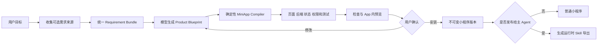
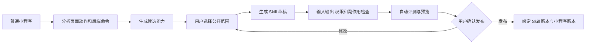
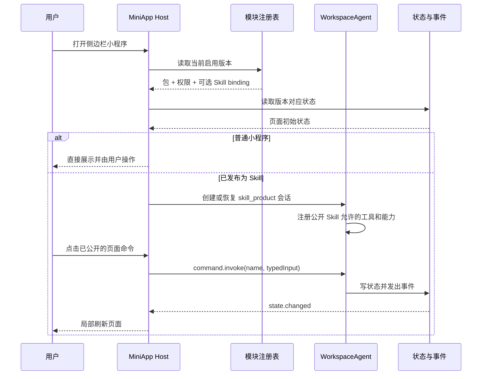

# Agent 小程序运行时：通用构建与可选 Agent 能力

日期：2026-07-22

## 1. 结论

“做小程序”是主 Agent 的通用开发能力，和输入是不是 Skill 没有关系。Skill 在构建阶段只是一种可选的需求模板。

需要明确区分两个完全不同的东西：

- **需求模板 Skill**：构建小程序时的参考材料，只帮助理解领域、流程和验收要求，不获得运行权限；
- **运行时导出 Skill**：小程序完成后，用户主动选择一部分命令“发布给主 Agent”时生成的能力协议。

因此 Skill 与小程序不是一一对应关系：

- Skill 是主 Agent 可发现、可调用的能力，可以没有界面；
- 小程序是用户可打开的产品，包含页面、后端逻辑、状态和数据，可以没有 Skill；
- 用户可以把某个 Skill 当作需求模板来做小程序，但构建器仍然是同一个通用构建器；
- 用户和主 Agent 开发的小程序默认只是普通程序，只有选择“发布为 Skill”后，主 Agent 才能调用它公开的业务能力。

统一流程是：

```text
用户目标 + 可选需求来源
  → 统一需求包
  → 通用小程序构建器
  → 草稿、检查、预览、安装
  → 可选“发布给主 Agent”
```

需求来源可以是对话、Skill、文档、截图、参考产品、已有小程序或数据源说明。来源 Skill 只进入 `requirements.sources`，不会写入运行时绑定，也不会自动添加 `AgentWorkspace`。

用户手动打开小程序不需要 Skill。主 Agent 要执行小程序内部业务时，必须调用该小程序已经发布的 Skill 命令。需要用户查看详情、补充信息或确认时，再把同一次执行状态接力到小程序页面。

微信小程序最值得借鉴的不是具体语法，而是下面这个分工：

> 核心 App 保持稳定，小程序只描述自己需要的界面和能力；真正的系统能力由宿主提供，安装包可以独立发布、加载、停用和升级。

YiW 已有动态模块注册、页面渲染、不可变版本、权限确认、Skill 快照、产品会话和模块状态。底座的大部分宿主能力已经存在。下一步不应再增加一个临时生成入口，而应把这些能力收拢成一套正式的 `Agent MiniApp Runtime`。

## 2. 微信小程序的实现方式

根据微信官方开源项目和工具，可以把其关键结构概括为五部分。

### 2.1 声明式界面

小程序用结构化模板、样式和组件描述页面，而不是直接操作宿主界面。微信官方的 `glass-easel` 是一套组件式界面框架，提供模板、事件、组件生命周期和后端适配；模板编译器把 WXML 转成运行时代码，样式编译器处理 WXSS。

这意味着小程序只表达“页面是什么”，实际怎么渲染由微信宿主控制。

### 2.2 宿主能力接口

小程序不能随意直接控制微信客户端。它通过微信提供的 API 调用存储、网络、设备、登录等能力。官方 `api-typings` 还为这些 API、Page 和 Component 接口提供了统一类型。

关键点是：小程序依赖的是稳定的宿主接口，不依赖微信内部实现。

### 2.3 标准安装包

官方示例项目使用固定工程结构，包括全局配置、页面目录、组件包、API 示例包和资源。开发工具能够构建 npm 依赖，再把项目编译成微信可以加载的包。

### 2.4 生命周期

应用和页面不是永久运行的代码。宿主负责创建、展示、隐藏和销毁，组件只响应规定的生命周期事件。

### 2.5 预览、上传和版本

微信官方的 `miniprogram-ci` 把开发工具中的编译能力抽出来，支持构建、预览和上传不同类型的小程序或插件包。一个版本先构建和预览，再上传发布，不会直接覆盖正在使用的逻辑。

### 2.6 对 YiW 的启发

微信的核心关系可以写成：

```text
小程序包 = 页面描述 + 逻辑 + 配置 + 资源
微信宿主 = 渲染器 + API + 权限 + 生命周期 + 版本管理
```

YiW 应采用同样的分层，但不复制 WXML、WXSS 或微信的具体运行环境。

## 3. 微信小程序与 Agent 小程序的对应关系

下表只描述“小程序选择公开 Agent 能力”后的对应关系。普通小程序不需要 `agent.skills`、`SKILL.md` 或 Agent 绑定。

| 微信小程序 | YiW Agent 小程序 |
| --- | --- |
| 微信客户端 | YiW 核心 App 与 Agent Host |
| 基础库版本 | `Agent MiniApp Runtime` 版本 |
| `app.json` | `manifest` |
| `agent.skills` | 小程序公开的 `skills[]` |
| `SKILL.md` | Skill 快照、业务流程和跨命令规则 |
| `mcp.json` 原子接口 | 类型化 `commands` |
| 原子组件 | 主对话中的结果卡片 |
| `handoff` / `wx.onAgentHandoff` | `miniapp_open` 与页面接力状态 |
| `page-meta.json` | 可被主 Agent 发现的页面元数据 |
| WXML / WXSS | 受控页面结构与主题令牌 |
| 页面逻辑 | 类型化命令、工作流和绑定的 Skill |
| `wx.*` API | `yiw.*` 能力接口 |
| 本地存储 | 按用户、模块和版本隔离的状态 |
| App / Page 生命周期 | 安装、启用、打开、挂起、升级、停用、卸载 |
| 分包 | 页面包、能力包和按需加载资源 |
| 插件 | Provider、Adapter 和 Skill 依赖 |
| 开发工具预览与上传 | 编译、检查、预览、确认和安装 |

## 4. YiW 与微信的关键区别

### 4.1 主 Agent 只调用主动公开的 Skill

微信 2026 年公开的“小程序 AI 开发模式”已经采用了“AI 选择 Skill 和原子接口，客户端运行时执行，必要时接力到小程序页面”的结构。YiW 应采用同样的职责分工：

- 主 Agent 理解用户的总目标，并从 Skill 目录选择能力；
- 普通小程序不会自动进入主 Agent 的工具目录；
- 小程序只有在用户选择发布后，才通过一个或多个 Skill 声明可调用命令；
- 命令可以由确定性逻辑、Provider、工作流或小程序专属 Agent 执行；
- 页面展示同一份执行结果和产品状态，也可以向主 Agent 提交后续命令。

因此，小程序页面可以独立运行；但一旦某项能力被发布为 Skill，主 Agent、产品页面和产品专属 Agent 对这项能力的调用就必须经过同一个命令网关。

### 4.2 Agent 执行并不完全确定

模型可能产生不同计划，所以 YiW 还必须记录：

- 本次使用的 Skill 快照；
- 模型、工具和权限版本；
- 输入命令和执行轨迹；
- 用户确认；
- 状态变更和最终结果。

微信只需要管理代码版本，YiW 还需要管理“执行上下文版本”。

### 4.3 第一阶段不开放任意 JavaScript

微信有成熟的隔离运行环境。YiW 当前没有必要立刻建立一套通用 JavaScript 沙箱。第一阶段继续使用：

- 受控页面组件；
- 类型化命令；
- 已注册 Provider；
- 已绑定 Skill 和工作流；
- 宿主提供的状态、通知、文件等能力。

后续确实需要复杂计算时，可以增加 Worker 类型的受限代码包，但它应是新的安全等级，不能混入普通小程序。

## 5. 小程序包与可选 Agent 导出包

逻辑上，一个安装包包含以下内容：

```text
miniapp/
├── manifest.json
├── pages.json
├── commands.json
├── state.schema.json
├── lifecycle.json
├── migrations/
├── tests/
├── assets/
└── agent-export/              # 可选
    ├── AGENTS.md
    └── skills/
        └── skill-name/
            ├── SKILL.md
            ├── commands.json
            └── skill.snapshot.json
```

普通小程序没有 `agent-export` 也应正常安装和运行。初期不必真的拆成多个文件，可以把它们保存在一个有 checksum 的 `package_json` 中。协议稳定后再支持导入和导出目录包。

### 5.1 `manifest`

描述产品身份和宿主要求：

```json
{
  "id": "stock-research",
  "name": "股票研究",
  "version": "1.0.0",
  "runtimeVersion": "1",
  "entryPage": "overview",
  "sidebar": { "visible": true, "order": 20 },
  "permissions": [
    "yiw.state.read",
    "yiw.state.write",
    "market.quote.read",
    "yiw.agent.invoke"
  ]
}
```

### 5.2 `agent-export` 与 `skill.snapshot`

只有用户选择把小程序能力发布给主 Agent 时，才生成 `agent-export`。其中保存真正发布的 Skill，而不是只保存 Skill 名称：

- 完整指令；
- 允许工具；
- prompt、workflow 或 service 运行方式；
- 引用文件和资源的 checksum；
- 来源和指纹。

普通小程序升级不能自动改写已发布 Skill；远程 Skill 更新也不能暗中改变已安装小程序。两边分别版本化，通过明确的绑定记录关联。

### 5.3 `agent`

描述这个产品的 Agent 角色：

```json
{
  "role": "primary",
  "entryIntents": [
    "分析一只股票",
    "整理投资论点",
    "跟踪论点是否失效"
  ],
  "approvalPolicy": "ask",
  "memoryNamespace": "stock-research"
}
```

### 5.4 `commands`

按钮不要临时拼接自然语言，而应发送结构化命令：

```json
{
  "name": "thesis.add_evidence",
  "inputSchema": {
    "type": "object",
    "required": ["ticker", "evidence"],
    "properties": {
      "ticker": { "type": "string" },
      "evidence": { "type": "string" }
    }
  },
  "handler": {
    "type": "agent.intent",
    "intent": "把新证据加入投资论点，并判断它支持还是反对当前结论"
  }
}
```

命令 handler 第一阶段支持：

- `agent.intent`：交给绑定 Agent；
- `workflow.run`：运行固定工作流；
- `provider.call`：调用已配置能力；
- `state.get`、`state.set`：读取或修改小程序状态。

后续可以增加 `job.schedule` 和 `navigation.open`。

### 5.5 `state.schema`

每个小程序声明自己的状态结构和版本。宿主检查后才能写入，不能把任意模型输出直接存入数据库。

## 6. 统一构建流程

核心原则是：

> 模型负责理解和设计，确定性编译器负责生成可安装包。

不应让模型一次性直接生成最终 `manifest/pages/actions` 并立即安装。所有小程序都走同一条流水线：



### 6.1 需求接收：Requirement Bundle

主 Agent 先把各种输入收成一个统一需求包：

```json
{
  "goal": "做一个股票复盘小程序",
  "sources": [
    {
      "type": "conversation",
      "summary": "需要自选股、每日复盘和风险提醒"
    },
    {
      "type": "skill",
      "ref": "thesis-tracker",
      "fingerprint": "sha256:...",
      "snapshot": { "description": "...", "instructions": "..." }
    }
  ],
  "constraints": ["本地优先", "写操作需要确认"],
  "acceptanceCriteria": ["可以保存自选股", "可以生成每日复盘"]
}
```

`sources` 只记录需求从哪里来。它不是依赖注入，不会给小程序开放工具，也不会让远程 Skill 的后续更新自动改变已安装版本。

### 6.2 产品设计：Product Blueprint

Blueprint 是模型和编译器之间的中间格式，表达产品含义，而不是底层组件细节：

```json
{
  "product": {
    "name": "股票研究",
    "jobs": ["维护自选股", "形成投资论点", "跟踪论点变化"]
  },
  "domain": {
    "entities": ["Stock", "Thesis", "Evidence", "Alert"]
  },
  "queries": ["watchlist.list", "thesis.detail"],
  "commands": ["watchlist.add", "thesis.add_evidence"],
  "events": ["quote.updated", "thesis.invalidated"],
  "surfaces": ["overview", "research", "alerts", "agent"],
  "capabilities": ["market.quote.read", "yiw.notification.create"],
  "acceptanceTests": [
    "用户可以把一只股票加入自选",
    "新证据加入后页面可以看到论点变化"
  ]
}
```

模型生成的 Blueprint 可以被人读懂和修改。编译器再按固定规则完成：

1. 页面选择和布局；
2. 命令输入格式；
3. 权限集合；
4. 需求来源快照；
5. 状态结构；
6. 自动验收用例；
7. checksum 和运行时版本。

如果需求需要 YiW 尚未提供的数据源或能力，编译报告应明确标记“缺少 Adapter”，不能生成一个看起来完整但实际无法运行的产品。来源恰好是 Skill 时，也只把其中的领域规则和验收要求用于设计。

### 6.3 通用编译与安装

编译器把 Blueprint 变成同一种 MiniApp Package：

```text
Requirement Bundle + Product Blueprint
  → manifest
  → pages
  → actions / backend commands
  → state schema
  → provider requirements
  → acceptance tests
  → checksum
```

默认 `agentExposure=none`，Package 不需要 `bindingId`、Skill 快照或 `AgentWorkspace`。用户可以直接打开并使用页面、状态、Provider 和确定性后端逻辑。

### 6.4 可选发布给主 Agent：Capability Export

用户和主 Agent 可以先开发一个普通小程序。此时小程序拥有页面、命令和后端逻辑，但默认：

```text
agentExposure = none
```

主 Agent 可以管理或按用户要求打开它，但不能把它的内部业务命令当成工具调用。用户选择“发布为 Skill”后，进入以下流程：



发布过程只导出被选择的业务能力，不把整个小程序自动交给模型。每个导出命令必须补齐：

- 名称、用途和不适用场景；
- 输入与输出结构；
- 对应的小程序内部命令；
- 读取、写入和外部副作用；
- 用户确认规则；
- 可选的结果卡片和页面接力位置；
- 自动测试。

小程序的 Agent 暴露状态为：

```text
none → draft → published → needs_review → suspended
```

- `none`：普通小程序，用户手动使用；
- `draft`：Skill 草稿生成中，主 Agent 不能调用；
- `published`：已经检查并确认，主 Agent 可以调用；
- `needs_review`：小程序升级后导出协议不再完全兼容，受影响的 Agent 调用暂停；
- `suspended`：停止 Agent 调用，但不影响用户打开小程序。

## 7. 怎样挂载到 Agent 底座

### 7.1 运行上下文

每次打开小程序时，宿主创建一个固定基础上下文。Skill 和 Agent 字段只在 `agentExposure=published` 时存在：

```ts
type MiniAppRuntimeContext = {
  userId: string
  projectId: string
  moduleId: string
  versionId: string
  runtimeVersion: string
  agentExposure: 'none' | 'draft' | 'published' | 'needs_review' | 'suspended'
  bindingId?: string
  sessionId?: string
  skillSnapshot?: SkillSnapshot
  toolPolicy?: ToolPolicy
  approvalPolicy?: 'ask'
  state: StateGateway
  events: EventGateway
  providers: ProviderGateway
}
```

这些标识由服务端根据当前已安装版本生成，前端不能自行替换。

### 7.2 挂载过程



现有 `AgentWorkspace`、`workspace_agent`、`ui_module_skill_bindings` 和 `ui_module_skill_sessions` 可以直接承担其中的大部分流程。

### 7.3 双向桥接

当前页面动作更偏向“页面调用 Provider”。Agent 小程序需要补齐双向桥：

```text
页面 -- command.invoke --> 命令网关 --> Agent / Workflow / Provider
页面 <-- state + event ---- 状态和事件 <--------- 执行结果
```

Agent 可以主动更新产品状态，页面订阅状态事件后刷新。这样 Agent 在对话中完成分析后，股票论点页、看板和提醒页也会同步变化。

### 7.4 Agent 工具挂载

宿主不应把全部内部工具注册给每个小程序。挂载时按以下顺序取交集：

```text
实际可用工具
= 核心 App 已安装工具
∩ Skill allowed_tools
∩ 小程序已申请能力
∩ 用户已授权范围
∩ 当前项目成员权限
```

只要其中一层不允许，Agent 就不能调用。

## 8. `yiw.*` 宿主能力

这层相当于微信的 `wx.*`。小程序依赖稳定名字，不直接依赖 YiW 内部模块函数。

第一版建议提供：

| 能力 | 用途 |
| --- | --- |
| `yiw.state.read` | 读取自己的状态 |
| `yiw.state.write` | 修改自己的状态 |
| `yiw.agent.invoke` | 向绑定 Agent 提交结构化意图 |
| `yiw.provider.call` | 调用授权的数据能力 |
| `yiw.navigation.open` | 打开本产品页面 |
| `yiw.file.read` | 读取用户明确授权的文件 |
| `yiw.file.write` | 导出文件，继续走确认 |
| `yiw.notification.create` | 创建通知或提醒 |
| `yiw.job.schedule` | 后台定时任务，后续开放 |

每项能力都需要：

- 类型化输入和输出；
- 权限和作用范围；
- API 版本；
- 超时、取消和错误格式；
- request id；
- 审计记录。

内部已有的 Agent 工具和 Provider 可以作为这些能力的实现，但小程序包只面向稳定的能力接口。

## 9. 生命周期

建议定义以下生命周期：

| 生命周期 | 宿主行为 |
| --- | --- |
| `compile` | 生成包、权限、测试和兼容性报告 |
| `install` | 建立权限、Skill binding 和初始状态 |
| `enable` | 注册侧边栏、意图入口和事件订阅 |
| `open` | 创建或恢复产品会话并加载状态 |
| `suspend` | 停止前台订阅，保存状态 |
| `upgrade` | 校验迁移并原子切换版本 |
| `disable` | 停止入口和后台任务，保留数据 |
| `uninstall` | 软删除产品；是否删除数据需再次确认 |

升级时不能让模型直接执行数据库迁移。编译器生成结构化迁移，宿主先在副本中验证，再放在事务中执行。失败时继续使用旧版本。

## 10. 热插拔和自动更新

### 10.1 安装

安装成功后：

1. 在同一事务中写入不可变版本、权限和 Skill binding；
2. 更新模块的 `current_version_id`；
3. 增加 registry revision；
4. 发出 `miniapp.installed` 事件；
5. 前端刷新侧边栏并挂载新版本。

现有模块注册逻辑已经接近这条路径。

### 10.2 更新

更新不是直接改旧版本，而是：

1. 下载或生成候选版本；
2. 检查 runtime 兼容性、权限变化和数据迁移；
3. 用现有数据副本运行验收测试；
4. 向用户展示页面变化和新增权限；
5. 安装新版本并原子切换指针。

只有不增加权限、测试通过、数据迁移可退回时，才适合以后支持自动更新。其他更新需要用户确认。

### 10.3 退回

退回主要是切换 `current_version_id`，但必须同时检查状态结构：

- 兼容：直接切换；
- 不兼容但有向下迁移：运行迁移后切换；
- 不可逆：保留新数据副本，旧版本只读打开，不能假装安全退回。

## 11. 数据库改造

现有表继续保留：

- `ui_modules`；
- `ui_module_versions`；
- `ui_module_drafts`；
- `ui_module_permission_grants`；
- `ui_module_provider_bindings`；
- `ui_module_state`；
- `ui_module_action_runs`；
- `ui_module_skill_bindings`；
- `ui_module_skill_sessions`；
- `ui_module_events`。

Skill 目录继续以现有 `app_skills` 为入口，小程序目录继续使用 `ui_modules`。两者不合并成一张表。

为了支持统一构建和可选发布，建议增加：

- `ui_modules.agent_exposure`：`none`、`draft`、`published`、`needs_review`、`suspended`，默认 `none`；
- `ui_module_drafts.requirements_json`：草稿的完整 Requirement Bundle，包括目标、来源、约束和验收条件；
- `ui_module_versions.requirements_json`：随不可变版本保存的 Requirement Bundle；
- `ui_module_skill_exports`：真正发布给主 Agent 的命令、权限、Skill 版本和小程序版本；
- `ui_miniapp_invocations`：主 Agent 和页面共用的命令执行记录。

来源 Skill 不写入 `ui_module_skill_bindings`。它只是 `requirements_json.sources` 中的一条来源记录，没有运行权限。`ui_module_skill_exports` 才表示“小程序把选中的能力发布给主 Agent”。现有 `ui_module_skill_bindings` 暂时保留，用于兼容已经安装的旧 Skill Product。

第一阶段建议给 `ui_module_versions` 增加：

- `package_json`：完整小程序包；
- `blueprint_json`：产品蓝图；
- `compiler_version`；
- `runtime_version`；
- `state_schema_json`；
- `lifecycle_json`；
- `test_report_json`。

等迁移和后台任务真正实现后再增加：

- `ui_module_migrations`：每次升级的状态和结果；
- `ui_module_jobs`：后台任务和下一次运行时间；
- `ui_module_dependencies`：Provider、Adapter 和其他包依赖。

不要一开始拆出大量表。第一版以不可变 `package_json` 为真相源，运行数据继续进入现有状态、会话、动作和事件表。

## 12. 内部接口

用户可以表达三类需求，但构建入口只有一个：

> 帮我做一个股票复盘小程序。

> 下载某某 Skill，把它做成小程序，嵌入到 App。

或者：

> 把我刚做的股票看盘小程序中的“添加自选”和“生成复盘”发布成 Skill，让你以后可以直接调用。

Agent 内部使用少量高层工具：

```text
# 创建和管理小程序
miniapp_draft_create
miniapp_preview
miniapp_install
miniapp_upgrade
miniapp_disable
miniapp_rollback

# 普通小程序选择发布为 Skill
miniapp_agent_export_draft
miniapp_agent_export_validate
miniapp_agent_export_publish
miniapp_agent_export_suspend

# 主 Agent 操作已经 published 的小程序能力
miniapp_list
miniapp_use
miniapp_open
```

运行时接口保持结构化：

```text
GET  /api/miniapps/:moduleId/runtime
GET  /api/miniapps/:moduleId/state
POST /api/miniapps/:moduleId/commands/:commandName
POST /api/miniapps/:moduleId/agent/sessions
POST /api/ui-modules/:moduleId/agent-exports
POST /api/ui-module-agent-exports/:exportId/validate
POST /api/ui-module-agent-exports/:exportId/publish
POST /api/ui-module-agent-exports/:exportId/suspend
GET  /api/miniapp-agent-skills
POST /api/miniapp-agent-skills/:exportId/commands/:commandName
```

现有 `/api/ui-module-*` 可以继续工作。新接口是稳定协议层，内部先适配到现有实现，不需要立即推翻旧接口。

## 13. 现有实现评估

### 已经具备

- 模块草稿、检查、预览和安装；
- 不可变模块版本和当前版本切换；
- 侧边栏动态加载和 `ModuleHost`；
- 受控组件注册表和页面结构渲染；
- 权限授权和 Provider 绑定；
- Skill 快照、指纹和产品绑定；
- 产品独立 Agent 会话；
- 按产品隔离的状态；
- 运行记录和事件；
- 远程 Skill 搜索、下载和固化的用户路径。

### 主要缺口

1. 通用构建入口已经支持普通小程序 Package 和需求来源；旧 Skill Product 专用入口仍需完成迁移和弃用周期。
2. 对话内已经可以选择动作、检查、确认和发布；还缺少独立的图形化发布管理页。
3. 主 Agent 已能调用已发布的 `state.get`、`state.set` 和只读 `provider.call`；复杂工作流和小程序专属 Agent 还没有进入新导出协议。
4. `miniapp_use` 当前统一要求确认，后续可按命令副作用细分为只读自动执行和写入确认。
5. 页面和主 Agent 已共用 `runModuleAction`，但还应把它正式收口为稳定的 `MiniAppCommandGateway` 接口。
6. 已有 invocation、结构化结果和页面打开接力；页面向主 Agent 回传后续命令仍需补齐。
7. 普通小程序支持零个、一个或多个导出 Skill；复杂命令编排和跨小程序依赖还未实现。
8. 对话结果卡片、输出 Schema 强检查以及状态版本迁移尚未统一。

所以，现在缺的已经不是“能不能热插拔”，而是把现有能力升级为稳定、可长期兼容的小程序协议。

## 14. 实施顺序

### 已完成：建立通用构建入口

1. 所有新小程序都走 `Requirement Bundle → Blueprint → MiniApp Compiler`；
2. 对话、Skill、文档和已有产品都只是可选需求来源；
3. 来源 Skill 只保存快照和指纹，不生成运行时绑定；
4. 普通小程序允许零 Skill 安装，默认 `agentExposure=none`；
5. 保留旧 Skill Product 兼容通道，但不再作为主 Agent 的默认新建入口；
6. 增加“小程序发布为 Skill”的选择、生成、检查和确认流程。

### 已完成核心链路：主 Agent 操作已发布能力

1. 已增加小程序 invocation 记录；
2. 已给主 Agent 增加 `miniapp_list`、`miniapp_use` 和 `miniapp_open`；
3. `miniapp_use` 只允许调用 `agentExposure=published` 且版本一致的导出命令；
4. 命令结果支持结构化数据、状态变化和页面接力；
5. 页面可以从接力事件打开正确页面；
6. 下一步把 `runModuleAction` 正式收口成 `MiniAppCommandGateway`，并补全页面向主 Agent 回传。

### 基础阶段：正式建立 MiniApp Package v1

优先完成：

1. 定义 Product Blueprint；
2. 定义 MiniApp Package v1；
3. 增加确定性编译器；
4. 增加 `agent.intent` 类型化命令；
5. 增加页面与 Agent 的状态事件桥；
6. 增加 `state.schema`；
7. 自动生成和运行基础验收测试。

完成后，“下载 Skill 并做成小程序”只是通用构建器带了一个 Skill 需求来源，不再是一条特殊产品链路。

### 第二阶段：生命周期和升级

- 正式的 enable、suspend、disable、uninstall；
- 状态迁移；
- 新旧版本兼容检查；
- 自动退回；
- Skill 目录、引用和资源完整打包。

### 第三阶段：后台能力和分发

- 定时任务和事件触发；
- Adapter 和依赖管理；
- 小程序市场或团队分发；
- 满足安全条件的自动更新；
- 受限 Worker 包。

## 15. 不建议现在做的事

- 不把模型生成的 React 或 JavaScript 直接放进 App 运行；
- 不让小程序直接访问内部数据库；
- 不把所有 Agent 工具默认开放给每个小程序；
- 不允许 Skill Library 的变化静默影响已安装产品；
- 不允许升级绕过预览、权限差异和数据迁移检查；
- 不为了模仿微信而复制它的语法和具体线程结构。

## 16. 官方调研来源

- 微信开放文档“小程序 AI 开发模式”：https://developers.weixin.qq.com/miniprogram/dev/ai/guide.html
- 微信开放文档“接入方式”：https://developers.weixin.qq.com/miniprogram/dev/ai/integration.html
- 微信开放文档“运行机制”：https://developers.weixin.qq.com/miniprogram/dev/ai/operating-mechanism.html
- 微信开放文档“最佳实践”：https://developers.weixin.qq.com/miniprogram/dev/ai/best-practices.html
- 微信官方 AI 开发模式完整示例：https://github.com/wechat-miniprogram/ai-mode-demo
- 微信官方 AI 开发模式辅助工具：https://github.com/wechat-miniprogram/ai-mode-skills
- 微信官方组件框架 `glass-easel`：https://github.com/wechat-miniprogram/glass-easel
- 微信小程序官方 API 类型定义：https://github.com/wechat-miniprogram/api-typings
- 微信小程序官方示例工程：https://github.com/wechat-miniprogram/miniprogram-demo
- 微信官方发布者提供的编译、预览和上传工具：https://www.npmjs.com/package/miniprogram-ci

## 17. 第一阶段实现状态

2026-07-22 已完成第一阶段实现。

### 已实现

- 新增 `Product Blueprint` 标准结构，包含产品任务、领域对象、页面方向、命令、宿主能力、状态结构和验收条件。
- 新增 `Requirement Bundle`，统一保存目标、对话、Skill、文档等需求来源、约束和验收条件。
- 新增确定性的 `MiniApp Package v1` 编译器。编译结果包含 runtime、compiler、需求包、页面、动作、能力、状态结构、生命周期、测试和多层 checksum；只有旧 Skill Product 才带 Agent binding。
- 普通 MiniApp Package 不再要求 `Agent bindingId`、Skill 快照或 `AgentWorkspace`，默认 `agentExposure=none`。
- `ui_module_draft_create` 已成为主 Agent 的通用构建入口；Skill 作为 `requirements.sources` 输入时不会创建 `ui_module_skill_bindings`。
- 草稿和不可变版本新增 `requirements_json`，模块新增 `agent_exposure`；旧 Skill Product 安装后保持 `published`，普通小程序保持 `none`。
- 新增 `ui_module_skill_exports` 和 `ui_miniapp_invocations`。导出 Skill 与来源 Skill 完全分开，并绑定到具体小程序版本。
- 新增 `miniapp_agent_export_draft/validate/publish/suspend`，只公开用户选中的动作；发布和停用需要确认。
- 新增 `miniapp_list`、`miniapp_use` 和 `miniapp_open`。主 Agent 只能发现已发布能力，所有调用复用模块权限、动作记录和幂等控制。
- 小程序升级后，已有导出自动进入 `needs_review` 的不可调用状态；退回到原绑定版本后可以恢复。
- `miniapp_open` 的页面与 invocation 接力事件已经进入 Renderer，能直接打开指定小程序页面。
- Blueprint 中的 `agent.intent` 会编译成受控模块动作；命令输入按照声明的 JSON Schema 检查。
- `agent.intent` 只能使用当前模块版本、当前 Skill binding 和已经授权的产品权限。
- 页面动作执行后必须产生已完成的 `ui_module_action_runs` 记录；Agent 对话入口会再次核对 request id、模块、版本、动作和输入，不能跳过动作网关直接伪造命令。
- Agent 小程序请求继续固定 `ask` 批准方式，并继续使用安装时的 Skill 快照和工具边界。
- 新增 `yiw.*` 宿主能力清单，Package v1 会自动声明 `yiw.agent.invoke`，未知 `yiw.*` 能力在编译时被拒绝。
- 新增状态 schema 检查。页面动作和 Agent 状态工具写入前都会使用当前版本的 `state_schema_json` 检查数据。
- Agent 写入产品状态后产生 `state.changed` 事件。
- 新增模块状态读取接口；Agent 执行结束后，`ModuleHost` 重新读取状态并重新执行当前页面的加载动作，使页面和对话共享同一份产品数据。
- 草稿和不可变版本都保存 Blueprint、完整 Package、compiler/runtime 版本、状态结构、生命周期和测试报告。
- 现有 `manifest/pages/actions` 继续作为当前渲染适配层，旧模块不需要立即迁移。

### 主要代码

- `server/src/engine/modules/miniapp_compiler.js`
- `server/src/engine/modules/skill_product.js`
- `server/src/engine/modules/module_registry.js`
- `server/src/engine/modules/skill_product_state.js`
- `server/src/app/chat/agent_chat.js`
- `renderer/src/modules/ModuleHost.tsx`
- `renderer/src/views/agent/YiWConversation.tsx`

### 验证结果

- 后端 MiniApp、模块、Skill Product、Agent 能力导出和治理测试：21 项通过，包括真实 SQLite 草稿、预览、安装、发布、主 Agent 调用、升级保护和退回链路。
- Renderer 测试：9 个测试文件、42 项通过。
- Renderer TypeScript 检查通过。
- Renderer desktop 生产构建通过。
- 构建仍显示仓库已有的中英文翻译重复键和 Sass `@import` 弃用警告，不影响本次构建。

### 仍属于后续阶段

- 独立的图形化 Agent 能力发布管理页；
- 复杂 workflow 和小程序专属 Agent 的新导出适配；
- 页面向主 Agent 回传后续命令；
- 对话结果卡片和输出 Schema 强检查；
- 状态升级迁移和不可逆迁移保护；
- 后台定时任务与事件触发；
- Provider/Adapter 依赖安装；
- 团队分发、小程序市场和自动更新策略；
- 受限 Worker 代码包。

## 18. 微信 AI 开发模式带来的设计校正

2026-07-22 对微信新公开的“小程序 AI 开发模式”复查后，设计关系修正如下：

```text
不是：所有 Skill 都要变成小程序
也不是：Skill 到小程序需要一套专用编译器
更不是：所有小程序天然都是 Skill
而是：做小程序是通用能力，Skill 只可能是需求模板；运行时 Skill 是另一次主动发布产生的输出
```

四种形态都必须成立：

```text
纯 Skill
普通小程序
普通小程序
带 Skill 需求模板构建的小程序
小程序选择发布为 Skill
```

YiW 第一阶段实现已经建立了 Package、页面、状态和产品 Agent，但完成的调用方向主要是：

```text
小程序页面 → agent.intent → 小程序专属 Agent
```

普通小程序仍可由用户手动使用。只有选择发布为 Skill 后，才增加另一条一等运行路径：

```text
主 Agent → 发现小程序 Skill → 调用结构化命令
         → 获得结果 → 必要时接力到小程序页面
         → 页面继续操作 → 回到主 Agent
```

主 Agent 调用和页面调用必须经过同一个服务端命令网关。正式协议不采用任意 GUI 坐标点击作为主路径。

完整调研和协议草案见：`docs/research/2026-07-22_wechat-ai-miniapp-skill.md`。
