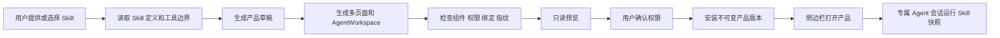

# Skill Product 固化设计

日期：2026-07-22

## 结论

YiW 不把 Skill 固化理解成“生成一个表单”，而是把一个 Skill 变成可安装、可升级、可退回的小产品。

现有 Agent 框架继续负责模型、工具、上下文、执行循环和审批。Skill Product 层负责产品外壳：

- 侧边栏入口；
- 多页面与产品内导航；
- 看板、图表、说明、数据页等页面；
- 专属 Agent 工作台和长期会话；
- Skill 指令与工具清单的不可变快照；
- 安装、权限确认、版本升级和退回；
- 页面状态、Provider 和后续专用后端适配。

因此，同一个底座可以长出“股票研究”“合同审查”“数据治理”“报告生产”等不同产品，而不是只改变输入框。

## 产品结构

一个 Skill Product 由四部分组成：

1. `manifest`：名称、图标、版本、侧边栏、页面导航和权限。
2. `pages`：产品页面。页面可以自由组合受控组件，也可以放入 `AgentWorkspace`。
3. `skill binding`：绑定安装时的 Skill 快照、指纹、项目范围和允许工具。
4. `sessions`：每个产品版本拥有自己的 Agent 会话，历史、任务过程和结果可以持续保留。

页面不是 Skill 的执行器。真正执行仍进入 `WorkspaceAgent`，但运行时会锁定产品绑定的 Skill 快照，不能切换到其他 Skill。

## 固化流程



用户在对话中给出一份新 Skill 时，Agent 可以先用现有 `skill_create` 建立 Skill，再用 `ui_skill_product_draft_create` 生成产品草稿。已有 Skill 可以直接固化。

## 运行合同

### 1. 固定 Skill，不固定界面

产品页面可以继续生成新版本，但一个已经安装的版本始终使用安装时的 Skill 快照。Skill Library 中的原定义后来被修改，不会暗中改变旧产品。

需要采用新 Skill 逻辑时，生成并安装一个新的产品版本。旧版本仍可退回。

### 2. 复用 Agent 执行能力

`AgentWorkspace` 继续使用已有 `WorkspaceAgent`：

- 提示型 Skill 直接作为本轮固定 Skill；
- workflow Skill 由产品内置的 `run_skill_workflow` 适配器执行，继续使用 JSON 输出合同，而不是让外层 Agent 直接伪造结果；
- service Skill 复用代码中的专用 handler；当前已接入 `query_agent`，未知 handler 不能只靠文本固化；
- 产品内不能临时切换到另一个提示型 Skill；
- Skill 的 `allowed_tools` 继续限制可调用工具。

产品模式不注册 `use_skill`。这样即使页面内容或外部数据诱导模型切换 Skill，也不能清空当前 Skill 后绕过工具清单。

### 3. 权限分两层

安装产品时，用户确认 `skill-product:<module-key>:run`，表示允许这个产品启动绑定的 Skill。

这项权限不会自动放大底层工具权限：

- 只读工具可以按 Skill 声明直接运行；
- 写文件、执行命令、修改数据等动作继续经过现有确认卡；
- 固化运行固定使用 `ask` 模式，不能由页面把它改成完全放行；
- 未在 Skill `allowed_tools` 中声明的工具会被拦截。

只有全部工具和副作用都为只读时，绑定才标记为 `automatic_safe=true`。这个标记为后续一键自动运行和定时运行提供边界，当前版本不开放无人确认的后台执行。

## 数据库

### `ui_module_skill_bindings`

保存草稿或已安装版本与 Skill 的绑定：

- `draft_id`、`module_id`、`version_id`；
- `skill_name`、`skill_scope`、`project_id`；
- `source_runtime`；
- `skill_snapshot_json`；
- `skill_fingerprint`；
- `permission`；
- `status`。

绑定从草稿开始，安装时在同一事务中转成指定模块版本的正式绑定。

### `ui_module_skill_sessions`

保存产品版本与 Agent 会话的归属：

- 一个会话只能属于一个模块版本和一个 Skill 绑定；
- 产品会话使用独立的 `action_type=skill_product`，不会进入普通 Agent 对话列表；
- 会话必须属于当前用户；
- 项目型 Skill 的会话必须运行在绑定项目；
- 创建产品、创建会话和每次运行都会检查当前项目成员关系，成员权限被移除后旧产品立即停止访问；
- App 型 Skill 使用 `__chat__` 工作区；
- 切换产品版本后使用该版本自己的会话。

服务端会返回当前产品版本最近使用的会话。即使本地缓存被清空，产品仍能恢复自己的长期会话。

## 页面能力

当前产品页面支持：

- 布局：`Stack`、`Grid`、`Tabs`、`Toolbar`、`Card`、`Section`；
- 内容：`Heading`、`Text`、`Markdown`、`Badge`、`Divider`；
- 数据：`MetricCard`、`DataTable`、`LineChart`、`CandlestickChart`、`MarketOverview`；
- 交互：`Button`、`SearchInput` 和受控模块动作；
- 核心运行区：`AgentWorkspace`。

`manifest.navigation` 定义产品内页面导航。Agent 可以根据 Skill 的业务方向设计不同页面，不需要所有产品使用同一布局。

## 接口与 Agent 工具

新增接口：

```text
POST /api/ui-skill-products/drafts
```

主要输入：

- `skill_name`；
- `project_id`；
- `module_key`、`name`、`description`；
- `navigation`、`pages`、`actions`；
- `allowed_tools`；
- 升级时的 `base_module_id` 和 `version`。

新增 Agent 工具：

```text
ui_skill_product_draft_create
```

它只生成草稿。后续仍复用现有检查、预览和安装工具，安装必须经过用户确认。

## 目前边界

- 已支持 prompt、workflow，以及已有产品 handler 的 service Skill；当前 service handler 为 `query_agent`。
- 未注册 handler 的 service Skill 不会伪装成可运行产品。
- 已支持完整的 Agent 工作台和多页面产品壳，但还没有无人值守定时运行。
- 产品页面使用受控组件，不加载任意远程 JavaScript 或任意 React 代码。
- 针对股票终端、编辑器、画布等更重的交互，可继续增加经过审核的产品组件或专用后端适配器，不改变版本和权限合同。
