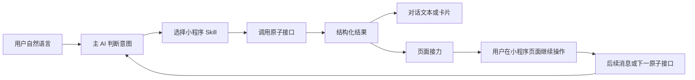

# 微信 AI 操作小程序机制，以及对 YiW 的启发

日期：2026-07-22

## 1. 结论

用户的判断是对的。微信正在做的不是简单地“在小程序里放一个聊天框”，而是让 AI 能理解并调用小程序公开的业务能力。

微信目前公开的技术关系是：

```text
小程序 = 产品、页面、登录身份、业务数据和运行容器
Skill = 小程序向 AI 提供的一组完整业务能力
原子接口 = AI 真正调用的最小业务动作
原子组件 = 原子接口结果在对话中的卡片
页面接力 = 从 AI 对话带着结果和状态进入小程序页面
```

因此，YiW 也不应该把 Skill 和小程序设计成二选一，更不应该把“小程序”理解成只会渲染表单的页面包。但还要再向前拆一层：**做小程序是通用开发能力，不是 Skill 的附属能力。**

更准确的关系应当是：

> 小程序和 Skill 是两种独立对象。小程序负责产品和界面；Skill 在构建时可以只是需求模板，在运行时则可以是用户主动发布给 Agent 的能力。两个角色不能混用。

不是所有 Skill 都需要做成小程序；一个纯分析、写作或自动化 Skill 可以只在主 Agent 中运行。也不是所有小程序都天然是 Skill；用户和主 Agent 开发的小程序可以先作为普通程序手动使用。用户拿一个 Skill 来“做成小程序”时，本质上只是把它放进通用构建器的需求来源。只有希望主 Agent 发现、调用或编排成品时，用户才需要另行选择“发布为 Skill”。

YiW 当前已经实现了“页面动作调用该产品绑定的 Agent”，但还没有完整实现“主 Agent 主动发现并操作已安装小程序”。这一层应当成为下一阶段的重点。

## 2. 微信官方已经公开的能力

### 2.1 小程序想被 AI 调用，需要先公开为 Skill

微信官方把“小程序 AI 开发模式”定义为：开发者把小程序功能抽象为原子接口和原子组件，再封装成 `SKILL`，供小程序 AI 调用。AI 通过小程序 MCP 选择接口、执行任务并整合结果。

这只约束“小程序被 AI 操作”的场景，不表示所有小程序都必须带 Skill。它说明：

- 小程序仍然是产品主体；
- Skill 不是普通提示词，而是 AI 可执行的业务能力包；
- AI 不需要理解小程序内部所有代码，只理解 Skill 说明和接口结构；
- AI 操作小程序的主要方式是调用公开接口，而不是猜测界面坐标。

### 2.2 一个小程序可以选择公开多个 Skill

官方接入文档允许一个小程序声明多个 Skill，并提供全局 `AGENTS.md`，用于说明服务范围、多个 Skill 的关系和选择方式。`agent.skills` 是 AI 能力入口，不应被理解成普通小程序的必备组成部分。

每个 Skill 包含：

```text
SKILL.md       业务流程、跨接口规则和意图分流
mcp.json       原子接口名称、说明、输入和输出结构
index.js       原子接口注册入口
apis/          原子接口实现
components/    原子结果的可视化组件
```

官方设计把信息放在不同层：

- `mcp.json.description` 决定 AI 该不该选择某个接口；
- `inputSchema.description` 约束参数应该怎样填写；
- `SKILL.md` 描述整个业务流程、接口依赖和跨接口规则；
- 接口返回的 `content` 告诉 AI 本次发生了什么以及下一步做什么。

这比“把所有逻辑都写进一个长提示词”稳定得多。

### 2.3 主 AI 调接口，客户端执行，第三方服务完成业务

微信官方运行机制把系统分为三部分：

1. 小程序 AI 后台读取 Skill，由模型判断并下发原子接口调用；
2. 微信客户端在独立环境中执行原子接口、调用登录或支付等宿主能力，并渲染卡片；
3. 第三方服务处理订单、查询和数据写入等真实业务。

也就是说，Agent 是调度者，宿主运行时是安全边界，小程序或第三方后端才是业务数据的所有者。

### 2.4 AI 执行后可以把流程接力到小程序页面

微信支持两种结果形态：

- 直接在对话中渲染原子组件卡片；
- 返回 `handoff`，把结构化结果、`query` 和 `payload` 带到指定小程序页面。

小程序通过 `wx.onAgentHandoff` 接收这些数据，让页面直接进入正确的业务状态。例如 AI 已经建好订单，用户点击卡片后可以直接进入该订单的结算页，而不是重新从首页开始操作。

页面也不是流程终点。页面或半屏页面可以发送后续消息，甚至明确指定下一步应调用哪个原子接口；还可以重新执行前一个接口来刷新卡片。

这形成了完整闭环：



### 2.5 页面直达与业务执行是两种不同能力

微信还提供页面元数据。AI 可以根据页面名称、说明和查询参数生成小程序卡片，让用户直达服务页面。

需要区分：

- 页面直达：AI 找到正确页面并打开；
- 业务执行：AI 调用原子接口，真正查询或修改业务数据；
- 页面接力：AI 已完成一部分工作，把执行状态交给页面继续。

YiW 也应该分别提供这三种能力，不能只做“打开侧边栏页面”。

## 3. 官方机制没有证明什么

目前官方材料能确认的是“声明式接口调用 + 受控页面接力”。它没有证明微信主 AI 会像人一样，对任意旧小程序进行通用视觉识别和任意点击。

所以 YiW 不应把第一版建立在屏幕坐标、按钮文字匹配或模拟点击上。那种方式可以作为没有接口时的兼容手段，但不应成为小程序的正式协议。

正式协议应优先使用：

- 可发现的 Skill；
- 有输入输出结构的命令；
- 宿主检查过的权限；
- 可追踪的执行记录；
- 可恢复的页面接力。

## 4. YiW 应采用的关系

### 4.1 通用小程序构建器与两个独立目录

YiW 应分别维护 `Skill Registry` 和 `MiniApp Registry`，不能强制一一对应。

| 形态 | 是否有界面 | 主 Agent 能否调用 | 典型来源 |
| --- | --- | --- | --- |
| 纯 Skill | 否 | 能 | 下载、编写或内置的分析与自动化能力 |
| 普通小程序 | 是 | 不能直接调用 | 用户和主 Agent 共同开发的程序 |
| Agent 小程序 | 是 | 能 | 普通小程序选择“发布为 Skill” |
| 带 Skill 模板的小程序 | 是 | 不能，除非另行发布 | 通用构建器把 Skill 当成需求来源 |

构建只有一条通用流程；“带 Skill 构建”不是另一种产品类型：

```text
对话 / Skill / 文档 / 截图 / 已有产品
  → Requirement Bundle
  → 通用 MiniApp Builder
  → 普通小程序
  → 可选“发布为 Skill”
  → 主 Agent 可调用的产品能力
```

来源 Skill 只保存为需求快照，没有运行权限，也不会随远程版本自动更新小程序。小程序发布为 Skill 时，只导出用户选择的业务命令、输入输出结构、规则和权限。未导出的页面逻辑仍只能由用户在小程序内操作。

### 4.2 四个角色

| 角色 | 责任 |
| --- | --- |
| 主 Agent | 理解用户总目标，从已发布 Skill 中选择能力，必要时打开关联小程序 |
| 小程序 | 产品边界，拥有页面、状态、版本、权限和数据入口；可以不向 Agent 公开能力 |
| Skill | 某个业务场景的完整执行规则，声明命令、流程和边界；可以不带小程序 |
| 小程序专属 Agent | 可选的领域执行者，处理需要推理的命令；不是主 Agent 的替代品 |

一个小程序可以没有 Skill，也可以公开一个或多个协作 Skill。一个 Skill 也可以没有小程序，或者只作为需求模板被多个小程序参考。需求来源保存快照；运行时导出单独保存版本和权限。二者都不能随远程 Skill 或小程序代码静默变化。

### 4.3 主 Agent 不应直接进入小程序内部乱调用工具

主 Agent 只能看到小程序公开的能力合同：

```json
{
  "name": "stock.thesis.create",
  "description": "根据股票资料建立投资论点",
  "inputSchema": {
    "type": "object",
    "required": ["ticker"],
    "properties": {
      "ticker": { "type": "string" },
      "focus": { "type": "string" }
    }
  },
  "outputSchema": {
    "type": "object",
    "properties": {
      "thesisId": { "type": "string" },
      "summary": { "type": "string" }
    }
  },
  "handler": {
    "type": "agent.intent"
  },
  "handoff": {
    "page": "thesis-detail"
  }
}
```

主 Agent 调用命令后，可以获得：

```json
{
  "invocationId": "inv_xxx",
  "status": "completed",
  "content": "已经建立贵州茅台投资论点",
  "structuredContent": {
    "thesisId": "thesis_123",
    "summary": "……"
  },
  "handoff": {
    "page": "thesis-detail",
    "query": { "thesisId": "thesis_123" },
    "payload": { "focus": "估值与增长" }
  }
}
```

### 4.4 页面和主 Agent 必须共用同一个命令网关

不论命令来自主 Agent、产品页面还是产品专属 Agent，都必须进入同一个 `MiniAppCommandGateway`：

```text
调用方
  → 查找当前安装版本
  → 检查命令输入
  → 检查调用方权限和产品权限
  → 判断是否需要用户确认
  → 建立 invocation 记录
  → 执行确定性命令、Provider 或产品 Agent
  → 检查输出和状态变化
  → 返回结果或页面接力
```

这样页面不能绕过 Agent 的权限，主 Agent 也不能绕过页面动作的安全检查。

## 5. YiW 当前实现的差距

### 已经具备

- MiniApp Package、Product Blueprint 和不可变版本；
- Skill 快照、产品绑定和专属 Agent 会话；
- `agent.intent`、输入结构检查和权限检查；
- 页面动作记录、产品状态和状态事件；
- `ModuleHost` 页面渲染，以及页面动作进入产品 Agent 对话。

### 仍然缺少

1. 通用构建入口已经支持 Requirement Bundle 和无 Agent 绑定的 MiniApp Package；旧 Skill Product 专用入口仍需完成迁移和弃用周期。
2. 对话内已经具备“选择动作 → 生成 Skill 草稿 → 检查 → 确认发布”，还缺少独立的图形化管理页。
3. 主 Agent 已有 `miniapp_list`、`miniapp_use` 和 `miniapp_open`，但复杂 workflow 和小程序专属 Agent 尚未进入新导出协议。
4. 主 Agent 可以在页面未打开时执行已发布的确定性动作；旧 `agent.intent` 兼容链路仍依赖页面动作记录。
5. 页面和主 Agent 已复用同一动作执行层，仍需把它正式收口成稳定的 `MiniAppCommandGateway`。
6. 已有 `ui_miniapp_invocations`、结构化结果和页面接力；页面向主 Agent 回传后续动作仍缺少统一协议。
7. 普通小程序支持零个、一个或多个导出 Skill；复杂编排和跨小程序依赖仍未实现。
8. 页面元数据、命令结果卡片和输出 Schema 强检查还没有统一协议。

所以现状是：

```text
已经实现：主 Agent → 已发布小程序命令 → 结构化结果 → 打开指定页面
仍需实现：页面 → 主 Agent 的后续命令，以及复杂 workflow/专属 Agent 的统一导出
```

## 6. 建议的 YiW MiniApp Skill 协议

### 6.1 包结构

```text
miniapp/
├── manifest.json
├── pages.json
├── page-meta.json
├── state.schema.json
├── tests/
└── agent-export/              # 可选；未发布为 Skill 时不存在
    ├── AGENTS.md
    └── skills/
        └── stock-research/
            ├── SKILL.md
            ├── commands.json
            └── skill.snapshot.json
```

第一版仍可存在一个 `package_json` 中，不需要立刻变成真实目录。`agent-export` 必须是可选内容，普通小程序不能因为没有它而被判为无效。

### 6.2 发布状态

小程序增加独立的 Agent 暴露状态：

```ts
type AgentExposure = 'none' | 'draft' | 'published' | 'suspended'
```

- `none`：普通小程序，只能由用户在页面中使用；
- `draft`：已经生成 Skill 草稿，但主 Agent 还不能调用；
- `published`：已检查并经用户确认，主 Agent 可以调用公开命令；
- `suspended`：暂时停止 Agent 调用，不影响用户手动打开小程序。

Skill 版本和小程序版本应分别保存，再通过绑定记录关联。升级小程序不能自动改写已经发布的 Skill；命令发生变化时，需要重新检查和发布。

### 6.3 主 Agent 工具保持少量

建议只给主 Agent 暴露三个高层工具：

```text
miniapp_list   列出小程序及其 Agent 暴露状态；只有 published 项带可调用能力
miniapp_use    选择并调用一个已发布的小程序 Skill 命令
miniapp_open   打开指定页面或执行结果对应的接力页面
```

`describe`、命令查找、执行记录查询和状态刷新可以先作为 `miniapp_use` 内部能力，不需要把大量底层工具都暴露给模型。

### 6.4 调用上下文

每次主 Agent 调用必须带上真实来源：

```ts
type MiniAppInvocationContext = {
  invocationId: string
  caller: {
    type: 'main_agent' | 'miniapp_page' | 'miniapp_agent'
    sessionId: string
    runId?: string
    toolCallId?: string
  }
  target: {
    moduleId: string
    versionId: string
    skillName: string
    commandName: string
  }
  input: Record<string, unknown>
  idempotencyKey: string
  uiMode: 'background' | 'open' | 'ask_user'
}
```

### 6.5 执行结果

结果协议应参考微信，但保留 YiW 自己的运行记录：

```ts
type MiniAppInvocationResult = {
  invocationId: string
  status: 'waiting_approval' | 'running' | 'completed' | 'failed'
  content?: string
  structuredContent?: Record<string, unknown>
  statePatch?: Array<Record<string, unknown>>
  handoff?: {
    page: string
    query?: Record<string, unknown>
    payload?: Record<string, unknown>
  }
  traceId?: string
  error?: { code: string; message: string }
}
```

### 6.6 权限

一次调用真正能使用的能力应取以下交集：

```text
宿主已安装能力
∩ 小程序版本声明
∩ 用户对小程序的授权
∩ Skill 快照允许的工具
∩ 本次调用方允许的权限
∩ 当前项目的数据范围
```

查询命令可以后台执行。写入、支付、发送、删除和外部副作用必须按命令声明要求用户确认。主 Agent 不能因为权限更高而跳过小程序的确认规则。

## 7. 建议实施顺序

### 第一阶段：统一小程序构建，并建立选择发布流程（已完成）

1. 对话、Skill、文档、截图和已有产品统一进入 `Requirement Bundle`；
2. Skill 只作为可选需求来源，不创建运行时绑定；
3. 所有新建任务使用同一个 MiniApp Builder；
4. 小程序默认 `agentExposure=none`；
5. 用户选择“发布为 Skill”后，由主 Agent 分析页面动作和后端命令，生成候选能力；
6. 用户选择要公开的命令、写入范围和确认规则；
7. 检查、预览、评测并再次确认后发布，并分别保存导出 Skill 版本和小程序版本。

### 第二阶段：主 Agent 可以真正操作已发布的小程序 Skill（核心链路已完成）

1. 已增加 `ui_miniapp_invocations` 执行记录；
2. 已增加 `miniapp_list`、`miniapp_use`、`miniapp_open`；
3. 页面和主 Agent 已复用 `runModuleAction`；
4. 命令结果已包含结构化数据、状态变化和页面接力信息；
5. 页面已能接收接力事件并打开正确页面；
6. 下一步把现有执行层正式命名和收口为 `MiniAppCommandGateway`，并补全结果卡片。

### 第三阶段：多 Skill 与页面回传

1. 把单个绑定升级为 `skills[]`；
2. 增加小程序级 `AGENTS.md`，描述 Skill 选择关系；
3. 页面可以向主 Agent 发送结构化后续命令；
4. 支持主 Agent 组合多个小程序完成一个任务；
5. 增加循环调用深度、重复调用和跨小程序权限保护。

### 第四阶段：结果卡片和后台任务

- 在主对话中渲染小程序结果卡片；
- 长任务、定时任务和事件触发；
- 结果卡片过期和刷新；
- 团队分发、升级和兼容性检查。

## 8. 股票小程序示例

用户对主 Agent 说：

> 用股票研究小程序分析贵州茅台，建立一份投资论点，并打开详情。

执行过程应当是：

1. 主 Agent 从已安装小程序中找到“股票研究”；
2. `miniapp_use` 选择 `stock.thesis.create`；
3. 命令调用行情、财务和研究 Provider，或交给产品专属 Agent 推理；
4. 结果写入股票小程序自己的状态和数据库范围；
5. 主 Agent 在对话中给出摘要；
6. 结果返回 `handoff.page=thesis-detail`；
7. `miniapp_open` 打开详情页，页面直接展示刚建立的论点；
8. 用户在页面点击“加入跟踪”，仍通过同一个命令网关执行并把结果同步回主 Agent。

这才是“主 Agent 可以操作小程序”的完整含义。

## 9. 官方来源

- 微信开放文档，小程序 AI 开发模式（beta）接入指南：<https://developers.weixin.qq.com/miniprogram/dev/ai/guide.html>
- 微信开放文档，接入方式：<https://developers.weixin.qq.com/miniprogram/dev/ai/integration.html>
- 微信开放文档，运行机制：<https://developers.weixin.qq.com/miniprogram/dev/ai/operating-mechanism.html>
- 微信开放文档，最佳实践：<https://developers.weixin.qq.com/miniprogram/dev/ai/best-practices.html>
- 微信官方完整示例：<https://github.com/wechat-miniprogram/ai-mode-demo>
- 微信官方 AI 开发模式辅助工具：<https://github.com/wechat-miniprogram/ai-mode-skills>
- 腾讯云官方 `mp-skills` 工具：<https://github.com/TencentCloudBase/mp-skills>
- 腾讯云小程序 AI 开发模式介绍：<https://cloud.tencent.com/solution/la>

## 10. 当前状态说明

截至 2026-07-22，微信官方文档仍把“小程序 AI 开发模式”标为 beta，并明确说明当前处于内测阶段。YiW 可以借鉴它的协议和分层，但不能把微信尚未正式开放的范围写成已经全面上线的稳定能力。
