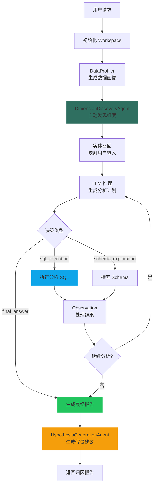
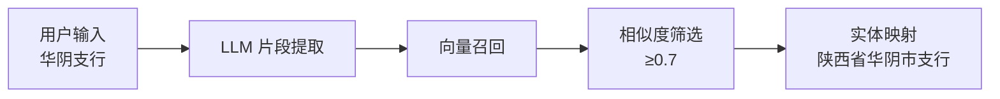
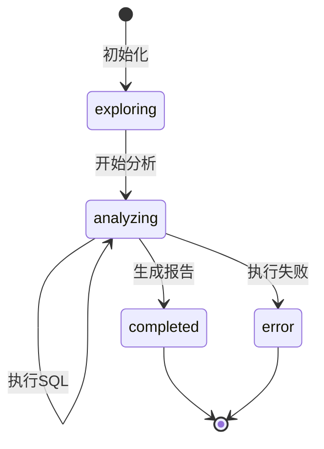

# Attribution Agent 设计文档

> **版本**: 1.0
> **更新日期**: 2025-01-16
> **架构**: ReAct 循环 + 多子 Agent 协作

## 概述

Attribution Agent（归因分析 Agent）负责对指标变化进行多维度归因分析，帮助用户发现指标波动的根本原因。通过自动维度发现、实体映射、贡献度计算等能力，生成完整的归因分析报告。

### 核心特性

- 🔍 **自动维度发现**: 基于数据画像自动识别分析维度
- 🔗 **实体智能映射**: 将用户输入映射到数据库实际值
- 📊 **贡献度计算**: 计算各维度对指标变化的贡献
- 💡 **假设生成**: 基于分析结果生成进一步验证建议
- 📁 **Workspace 管理**: 持久化分析过程和结果

---

## 1. 系统架构

### 1.1 组件清单

#### 子 Agents

| Agent | 职责 | 输入 | 输出 |
|-------|------|------|------|
| DimensionDiscoveryAgent | 自动发现分析维度 | profiles | candidate_dimensions |
| HypothesisGenerationAgent | 生成验证假设 | contributions | hypotheses |

#### Tools

| Tool | 职责 | 触发时机 |
|------|------|----------|
| SQLExecutionTool | 执行分析 SQL | 维度分析查询 |
| SchemaExplorationTool | 探索数据库结构 | 初始化阶段 |

#### 核心依赖

| 组件 | 职责 |
|------|------|
| DataProfiler | 生成数据画像 |
| AttributionWorkspace | 管理分析状态和结果 |
| AgentSettings | 获取 Prompt 配置 |

### 1.2 执行流程图



### 1.3 状态管理

```python
# agent_context.data 结构
{
    "steps": [...],                    # 决策历史
    "profiles": [...],                 # 数据画像
    "profiles_dict": {...},            # 画像字典
    "dimensions_discovered": True,      # 维度发现标记
    "discovered_dimensions": [...],     # 发现的维度
    "final_breakdown_dimensions": [...],# 最终分析维度
    "entity_recall_done": True,         # 实体召回标记
    "entity_mappings": [...],           # 实体映射
    "workspace_path": "...",            # Workspace 路径
}
```

---

## 2. 核心阶段详解

### 2.1 数据画像生成

使用 `DataProfiler` 获取数据源的结构信息：

```python
profiling_result = await self.data_profiler(agent_context, stream_callback)
data["profiles"] = profiling_result.profiles
data["profiles_dict"] = profiling_result.profiles_dict
```

**画像信息包含**：
- 表结构信息
- 字段类型和分布
- 枚举值统计
- 数据量级

### 2.2 自动维度发现

`DimensionDiscoveryAgent` 从数据画像中识别可用于分析的维度：

```python
discovered_dims = discover_dimensions_from_profiles(
    profiling_result.profiles,
    max_dimensions=10
)
```

**维度发现规则**：
- 字符串类型字段优先
- 低基数字段（枚举值少）优先
- 排除 ID、时间戳等技术字段

**维度补充逻辑**：
```python
# 用户指定了维度 → 补充相关维度
if breakdown_dimensions:
    related_dims = [d for d in discovered_dims if d.name not in base_dim_names][:2]
    breakdown_dimensions = breakdown_dimensions + [d.name for d in related_dims]
# 用户未指定 → 使用自动发现的前 5 个维度
else:
    breakdown_dimensions = [d.name for d in discovered_dims[:5]]
```

### 2.3 实体召回

将用户输入的业务术语映射到数据库中的实际值：



**映射结果格式**：
```python
entity_mappings = [
    {
        "user_input": "华阴支行",
        "db_value": "陕西省华阴市支行",
        "table": "rpt_org",
        "column": "org_nm",
        "similarity": 0.95
    }
]
```

**注入 Prompt 上下文**：
```
## 实体映射（用户输入 → 数据库实际值）
- 「华阴支行」→ `陕西省华阴市支行` (表: rpt_org, 列: org_nm, 相似度: 0.95)

**重要**: 生成 SQL 时，请使用上述映射中的 `db_value` 作为 WHERE 条件的值。
```

### 2.4 LLM 推理决策

使用结构化输出控制 Agent 行为：

```python
class AttributionDecision(BaseModel):
    thought: str           # 思考过程
    subtask: str           # 子任务描述
    tool: str              # 选择的工具
    params: Dict[str, Any] # 工具参数
```

**Prompt 构建**：
```python
config = await AgentSettings.get_attribution_config(
    project_id=...,
    business_id=...,
    user_message=user_query,
    target_metric=...,
    comparison_period=...,
    analysis_type="dimension",
    breakdown_dimensions=dimensions,
    dataprofile=profiles_str,
    exploration_summary=exploration_summary,
    tools_info=tools_info
)
```

### 2.5 SQL 执行与观察

执行分析 SQL 并计算统计信息：

```python
# 执行 SQL
result = await sql_execution_tool.execute(context, sql=sql, database_id=database_id)

# 计算统计信息
stats_result, cv_interpretation = calculate_dimension_stats(raw_data, value_key=value_key)

# 计算贡献度
contributions, total_value = calculate_contributions(dimension_results, max_items=10)
```

**统计指标**：
- CV (变异系数): 衡量数据分散程度
- 贡献度百分比: 各维度值对总量的贡献
- Top N 贡献者: 主要影响因素

### 2.6 假设生成

基于分析结果，生成进一步验证建议：

```python
hypothesis_agent = HypothesisGenerationAgent()
hypothesis_result = await hypothesis_agent.execute(
    hypothesis_context, stream_callback
)
```

**假设格式**：
```python
class Hypothesis(BaseModel):
    dimension: str      # 相关维度
    description: str    # 假设描述
    validation_sql: str # 验证 SQL
    priority: int       # 优先级
```

---

## 3. Workspace 管理

### 3.1 目录结构

```
workspaces/{task_id}/
├── status.json           # 任务状态
├── exploration_log.json  # 探索日志
├── contributions.json    # 贡献度数据
├── errors.json           # 错误记录
└── findings/            # 分析结果文件
    ├── dimension_1.json
    └── dimension_2.json
```

### 3.2 状态流转



### 3.3 核心方法

```python
class AttributionWorkspace:
    def update_status(self, status: str)
    def append_exploration(self, dimension, sql, result_count, findings, raw_data)
    def add_contribution(self, contribution_data)
    def record_error(self, error_msg)
    def format_summary_for_prompt(self) -> str
    def get_full_findings(self) -> dict
```

---

## 4. 配置与规则

### 4.1 输入参数

| 参数 | 类型 | 必填 | 说明 |
|------|------|------|------|
| user_message | str | 是 | 用户分析请求 |
| target_metric | str | 否 | 目标指标名称 |
| comparison_period | str | 否 | 对比周期 |
| analysis_type | str | 否 | 分析类型 (dimension/factor) |
| breakdown_dimensions | list | 否 | 指定分析维度 |
| factor_formula | str | 否 | 因子分解公式 |
| generate_hypotheses | bool | 否 | 是否生成假设 (默认 True) |

### 4.2 数据源配置

```python
data_sources_info = {
    "source_type": "database",  # database 或 business
    "source_id": "db_123",      # 数据库 ID 或业务 ID
    "business_data_sources": {...}  # 业务模式下的数据源
}
```

---

## 5. 使用示例

### 5.1 基本调用

```python
from yiw_kernel.data_science.dsagents.agents.attribution_agent import AttributionAgent

agent = AttributionAgent()

context = AgentContext(
    task_id="task_001",
    user_id="user_123",
    project_id="proj_456",
    input_data={
        "user_message": "分析本月销售额下降的原因",
        "target_metric": "销售额",
        "comparison_period": "环比上月",
        "breakdown_dimensions": ["地区", "产品类别"],
        "data_sources_info": {
            "source_type": "database",
            "source_id": "db_sales"
        }
    }
)

result = await agent.execute(context, stream_callback)
```

### 5.2 处理结果

```python
if result.success:
    data = result.data
    print(f"归因报告: {data.get('final_report')}")
    print(f"发现维度: {data.get('discovered_dimensions')}")
    print(f"验证假设: {data.get('hypotheses')}")
    print(f"Workspace: {data.get('workspace_path')}")
else:
    print(f"分析失败: {result.error}")
```

---

## 6. 日志解读

### 6.1 正常执行流程

```log
[AttributionAgent] 📁 初始化 Workspace: /workspaces/task_001
[AttributionAgent] 🔍 自动发现分析维度...
[AttributionAgent] 自动发现维度: ['地区', '产品类别', '销售渠道']
[AttributionAgent] 🔍 识别问题中的业务实体...
[AttributionAgent] 📝 提取到片段: ['本月', '销售额']
[AttributionAgent] ✅ 识别到 2 个实体映射
[AttributionAgent] Parsed decision: {"thought": "...", "tool": "sql_execution", ...}
[AttributionAgent] 🚀 Calling tool: sql_execution for subtask: 分析地区维度
[AttributionAgent] Tool 'sql_execution' succeeded.
[AttributionAgent] 📊 统计分析: CV=45.2% (高度分散)
[AttributionAgent] 💡 生成进一步验证建议...
[AttributionAgent] Final Answer ready.
```

### 6.2 实体映射日志

```log
[AttributionAgent] 🔍 识别问题中的业务实体...
[AttributionAgent] 📝 提取到片段: ['华阴支行', '贷款余额']
[AttributionAgent] ✅ 识别到 2 个实体映射
[AttributionAgent] 实体映射上下文已添加到 prompt:
## 实体映射（用户输入 → 数据库实际值）
- 「华阴支行」→ `陕西省华阴市支行` (表: rpt_org, 列: org_nm, 相似度: 0.95)
```

---

## 7. 统计计算

### 7.1 变异系数 (CV)

```python
def calculate_dimension_stats(data, value_key):
    values = [row[value_key] for row in data]
    mean = sum(values) / len(values)
    std = (sum((v - mean) ** 2 for v in values) / len(values)) ** 0.5
    cv = (std / mean) * 100 if mean != 0 else 0

    interpretation = (
        "高度集中" if cv < 20 else
        "中度分散" if cv < 50 else
        "高度分散"
    )
    return stats_result, interpretation
```

### 7.2 贡献度计算

```python
def calculate_contributions(dimension_results, max_items=10):
    total = sum(r["value"] for r in dimension_results)
    contributions = []
    for r in sorted(dimension_results, key=lambda x: -x["value"])[:max_items]:
        pct = (r["value"] / total * 100) if total else 0
        contributions.append(Contribution(
            dimension=r["dimension"],
            group=r["group"],
            value=r["value"],
            contribution_pct=pct
        ))
    return contributions, total
```

---

## 8. 相关文件

### 后端

| 文件 | 说明 |
|------|------|
| `attribution_agent.py` | 主 Agent 实现 |
| `dimension_discovery_agent.py` | 维度发现 |
| `hypothesis_generation_agent.py` | 假设生成 |
| `workspace.py` | Workspace 管理 |
| `statistics.py` | 统计计算工具 |

### 配置

| 文件 | 说明 |
|------|------|
| `agent_settings.py` | Agent 配置管理 |
| `prompt_templates.yaml` | Prompt 模板 |

---

**文档版本**: 1.0
**最后更新**: 2025-01-16
**维护者**: YiW Team
