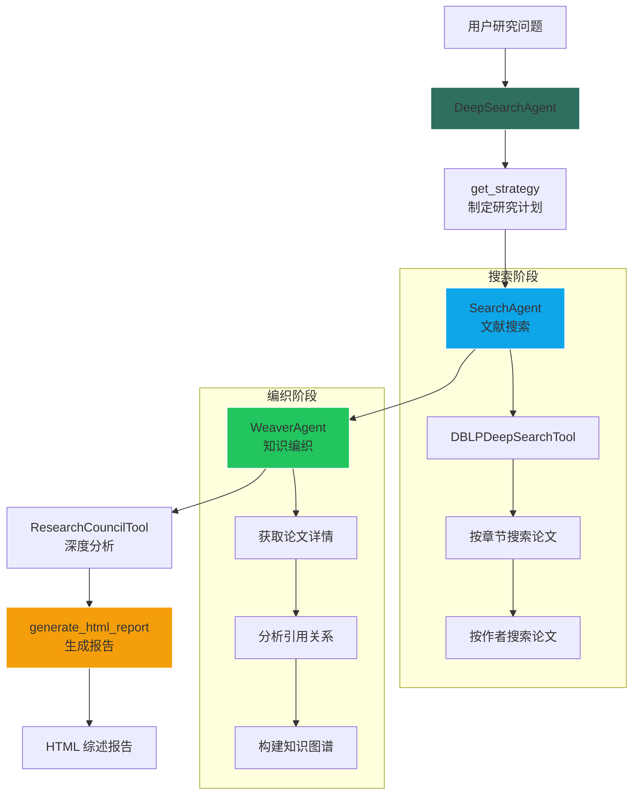
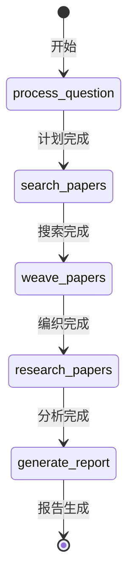
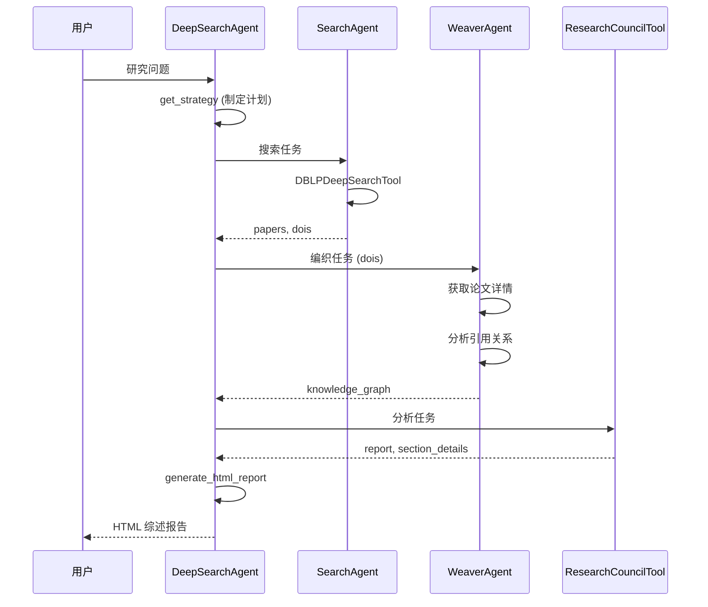

# DeepResearch Agent 设计文档

> **版本**: 1.0
> **更新日期**: 2025-01-16
> **架构**: 多 Agent 协作 + 目标驱动

## 概述

DeepResearch Agent（深度研究 Agent）是一个学术文献研究系统，通过多 Agent 协作完成文献搜索、知识图谱构建、综述报告生成等任务。主要用于帮助用户快速了解某个研究领域的学术进展。

### 核心特性

- 📚 **动态章节规划**: LLM 自动规划研究章节结构
- 🔍 **多源文献检索**: 支持 DBLP、Crossref 等学术数据源
- 🕸️ **知识图谱构建**: 分析论文引用关系，构建知识网络
- 📝 **综述报告生成**: 自动生成结构化的学术综述报告

---

## 1. 系统架构

### 1.1 Agent 组件

| Agent | 职责 | 说明 |
|-------|------|------|
| DeepSearchAgent | 主协调器 | 控制整体研究流程 |
| SearchAgent | 文献搜索 | 执行学术文献检索 |
| WeaverAgent | 知识编织 | 构建引用关系图谱 |

### 1.2 Tool 组件

| Tool | 职责 | 数据源 |
|------|------|--------|
| DBLPDeepSearchTool | DBLP 文献搜索 | dblp.uni-trier.de |
| ResearchCouncilTool | 研究分析 | 多源聚合 |

### 1.3 执行流程图



### 1.4 目标驱动状态机



---

## 2. 核心阶段详解

### 2.1 研究计划制定 (get_strategy)

LLM 根据用户问题动态生成研究章节规划：

```python
async def get_strategy(self, context, question):
    system_prompt = """你是一位学识渊博的资深导师。请针对用户提出的课题，进行深度的逻辑构建。

    你的任务是：
    1. 【纵横拆解】：根据课题的复杂程度，自行划分研究章节（Sections）
    2. 【定策搜索】：为每一个章节定制 3-4 条英文学术搜索查询词和 1-2 个该领域有影响力的作者
    """
    # ...
```

**输出格式**：
```json
{
    "research_plan": [
        {
            "section_id": "section_1",
            "title": "理论基础",
            "description": "该领域的核心理论框架",
            "queries": ["theory of X", "foundations of Y"],
            "authors": ["John Smith", "Jane Doe"]
        }
    ],
    "total_sections": 3,
    "philosophical_analysis": "研究逻辑说明..."
}
```

### 2.2 文献搜索 (SearchAgent)

`SearchAgent` 调用 `DBLPDeepSearchTool` 执行搜索：

```python
class SearchAgent(BaseAgent):
    def __init__(self):
        super().__init__(name='SearchAgent', description='web search agent')
        self.register_tool("web_search", DBLPDeepSearchTool())

    async def reasoning(self, agent_context, stream_callback):
        return {
            'type': 'call_tool',
            'target': 'web_search',
            'params': agent_context.input_data
        }
```

**搜索策略**：
1. 按章节的查询词搜索
2. 按指定作者搜索其代表作
3. 去重并保留高质量论文

### 2.3 知识编织 (WeaverAgent)

根据搜索到的论文 DOI，获取详细信息并构建引用关系：

```python
class WeaverAgent(BaseAgent):
    async def reasoning(self, agent_context, stream_callback):
        dois = agent_context.input_data.get("dois", [])
        # 获取论文详情
        # 分析引用关系
        # 构建知识图谱
```

**知识图谱结构**：
```python
knowledge_graph = {
    "章节标题": [
        {
            "doi": "10.1000/xxx",
            "title": "论文标题",
            "year": "2024",
            "abstract": "摘要...",
            "references": [...],   # 引用的论文
            "citations": [...]     # 被引用的论文
        }
    ]
}
```

### 2.4 深度分析 (ResearchCouncilTool)

对知识图谱进行深度分析，生成章节述评：

```python
# 输入
knowledge_graph = {...}

# 输出
{
    "report": "综述正文 HTML",
    "section_details": {
        "章节1": "该章节的深度分析...",
        "章节2": "..."
    }
}
```

### 2.5 报告生成 (generate_html_report)

将所有分析结果整合为 HTML 格式的学术综述报告：

```python
async def generate_final_report(
    self,
    context,
    final_report_html,      # 综述正文
    section_details,        # 章节述评
    knowledge_graph,        # 知识图谱
    timeline_data           # 时间轴数据
) -> str:
    # 生成完整 HTML 报告
```

**报告结构**：
1. 研究主题标题
2. 综述正文
3. 章节考据与文献谱系
4. 引用/被引用关系表

---

## 3. 数据流转

### 3.1 完整数据流



### 3.2 context.data 结构

```python
{
    "strategy": {
        "research_plan": [...],
        "total_sections": 3
    },
    "web_result": {
        "used_strategy": {...},
        "dois": [...],
        "papers_by_dimension": {...}
    },
    "weave_results": {
        "knowledge_graph": {...}
    },
    "conclusions": {
        "report": "...",
        "section_details": {...}
    },
    "html_report": "..."
}
```

---

## 4. 使用示例

### 4.1 基本调用

```python
from api.services.deepresearchagents.agents.research_agent import DeepreSearchAgent

agent = DeepreSearchAgent(max_search_round=3)

context = AgentContext(
    task_id="research_001",
    user_id="user_123",
    project_id="proj_456",
    input_data={
        "question": "大语言模型在代码生成领域的最新进展",
        "max_results": 20
    }
)

result = await agent.execute(context, stream_callback)
```

### 4.2 处理结果

```python
if result.success:
    html_report = result.data.get("html_report")
    # 保存或展示 HTML 报告
    with open("research_report.html", "w") as f:
        f.write(html_report)
else:
    print(f"研究失败: {result.error}")
```

### 4.3 流式回调

```python
async def stream_callback(message, **kwargs):
    title = kwargs.get("title", "")
    content_type = kwargs.get("content_type", "text")
    print(f"[{title}] {message}")

# 示例输出:
# [研究计划] 📋 研究计划制定完成，共规划 4 个章节
# [文献搜索] 🔍 正在搜索章节 1: 理论基础...
# [知识编织] 🕸️ 正在构建知识图谱...
```

---

## 5. 论文详情获取

### 5.1 DBLP BibTeX 解析

```python
async def _fetch_paper_details_xml(self, dblp_key):
    """根据 dblp key 获取论文详情"""
    url = f"http://dblp.uni-trier.de/rec/bibtex/{dblp_key}.xml"

    # 解析 BibTeX 格式
    # 提取: title, authors, year, venue, doi
```

**解析字段**：
- `title`: 论文标题
- `author`: 作者列表（用 `and` 分隔）
- `year`: 发表年份
- `booktitle` / `journal`: 发表地点
- `doi`: 数字对象标识符

### 5.2 重试机制

```python
max_retries = 5
for attempt in range(max_retries):
    try:
        resp = await client.get(url)
        if resp.status_code == 200:
            return parse_result(resp.text)
    except httpx.RequestError:
        pass
    await asyncio.sleep(random.uniform(0.2, 0.3) * (2 ** attempt))
```

---

## 6. 报告模板

### 6.1 HTML 结构

```html
<!DOCTYPE html>
<html lang="zh-CN">
<head>
    <title>{research_topic} · 学术综述报告</title>
</head>
<body>
<div class="report-wrapper">
    <!-- 标题 -->
    <h1>学术综述报告</h1>
    <div class="topic-banner">Topic: {research_topic}</div>

    <!-- 正文 -->
    <article class="main-report">
        {final_report_html}
    </article>

    <!-- 名家著述 -->
    <h2>🔍 名家著述目录</h2>
    {author_section}

    <!-- 文献谱系 -->
    <h2>章节考据与文献谱系</h2>
    {appendices}
</div>
</body>
</html>
```

### 6.2 引用关系表格

```html
<h5>📚 引用的前序工作</h5>
<table class='relation-table'>
    <thead>
        <tr><th>标题</th><th>年份</th><th>DOI</th></tr>
    </thead>
    <tbody>
        <tr>
            <td><a href="https://doi.org/...">{title}</a></td>
            <td>{year}</td>
            <td>{doi}</td>
        </tr>
    </tbody>
</table>
```

---

## 7. 配置参数

### 7.1 Agent 参数

| 参数 | 类型 | 默认值 | 说明 |
|------|------|--------|------|
| max_search_round | int | 3 | 最大搜索轮次 |

### 7.2 输入参数

| 参数 | 类型 | 必填 | 说明 |
|------|------|------|------|
| question | str | 是 | 研究问题/主题 |
| max_results | int | 是 | 每个查询词的最大结果数 |

---

## 8. 日志解读

```log
🔄 [DeepSearchAgent] 开始研究: 大语言模型在代码生成领域的最新进展
📋 研究计划制定完成，共规划 4 个章节

🔄 [SearchAgent] 开始推理阶段
🔧 [SearchAgent] 调用工具websearch进行搜索
✅ [WebSearch] 搜索成功: 找到 45 个结果

👁️ [WeaverAgent] 开始知识编织
🕸️ 正在分析论文引用关系...
✅ 知识图谱构建完成

📝 正在生成学术综述报告...
✅ 报告生成完成
```

---

## 9. 相关文件

### 后端

| 文件 | 说明 |
|------|------|
| `research_agent.py` | 主协调 Agent |
| `search_agent.py` | 文献搜索 Agent |
| `weaver_agent.py` | 知识编织 Agent |
| `web_search_tool.py` | DBLP 搜索工具 |
| `research_tool.py` | 研究分析工具 |

### 数据源

| 来源 | URL | 用途 |
|------|-----|------|
| DBLP | dblp.uni-trier.de | 计算机科学文献 |
| Crossref | api.crossref.org | DOI 元数据 |
| OpenCitations | opencitations.net | 引用数据 |

---

**文档版本**: 1.0
**最后更新**: 2025-01-16
**维护者**: YiW Team
