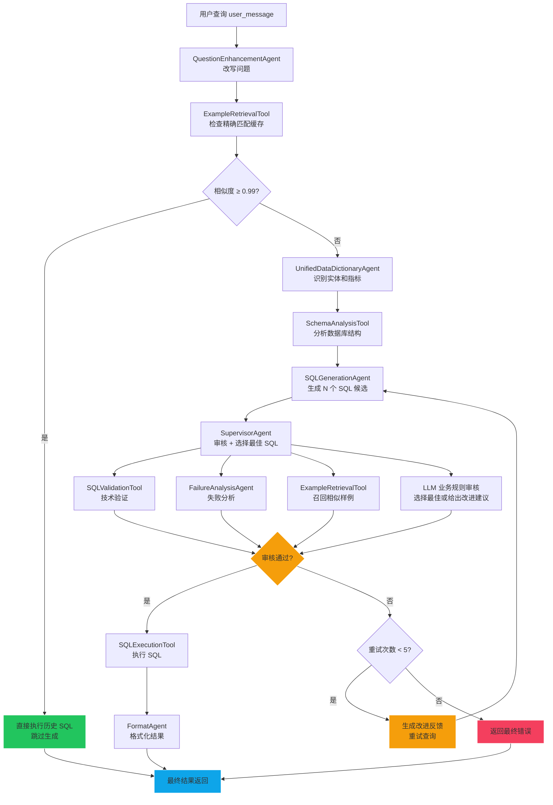
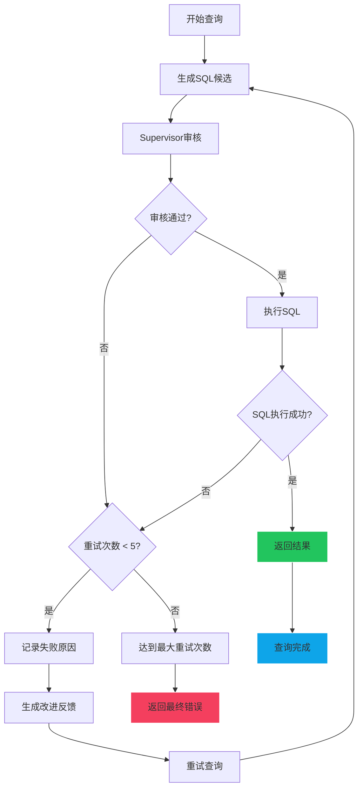

# NL2SQL Agent 设计文档

> **版本**: 2.0
> **更新日期**: 2025-01-05
> **架构**: SupervisorAgent 统一协调模式

## 概述

NL2SQL Agent 是系统的核心协调器，负责将用户的自然语言查询转换为 SQL 并执行，返回结果。采用 **SupervisorAgent 统一协调模式**，通过业务规则驱动和智能重试机制，确保高质量的 SQL 生成。

### 核心特性

- 🎯 **Supervisor 模式**: 统一的 SQL 质量监督和改进指导
- 🔄 **智能重试**: 失败后自动分析和重试，最多 5 次
- ⚡ **精确匹配缓存**: 相似度 ≥ 0.99 时直接复用历史 SQL
- 🛡️ **业务规则导向**: 所有规则从配置中心动态获取
- 🤝 **Ask User 支持**: 实体歧义时请求用户澄清
- 📊 **清晰日志**: 详细的执行日志便于调试

---

## 1. 系统架构

### 1.1 组件清单

#### 子 Agents

| Agent | 职责 | 输入 | 输出 |
|------|------|------|------|
| **QuestionEnhancementAgent** | 理解并改写用户问题 | user_message | enhanced_question |
| **UnifiedDataDictionaryAgent** | 识别实体和指标 | user_message | entities, metrics |
| **SQLGenerationAgent** | 生成 SQL 候选 | question, schema, entities | sql_candidates |
| **SupervisorAgent** | 审核并选择最佳 SQL | candidates | selected_sql 或 feedback |
| **FormatAgent** | 格式化查询结果 | query_result | feedback_content |

#### Tools

| Tool | 职责 | 触发时机 |
|------|------|----------|
| **ExampleRetrievalTool** | 召回历史查询样例 | enhance_question, supervise |
| **SchemaAnalysisTool** | 分析数据库 Schema | analyze_schema |
| **SQLExecutionTool** | 执行 SQL 并返回结果 | execute_sql |

### 1.2 执行流程图



### 1.3 数据驱动流程

```python
# 目标驱动的状态转换
enhance_question → check_example_cache → process_entities
→ process_rules → analyze_schema → generate_sql → supervise_sql
→ execute_sql → generate_feedback → complete

# 数据存储位置
agent_context.data = {
    "user_message": "...",           # 改写后的问题
    "entities": [...],               # 识别的实体
    "metrics": [...],                # 识别的指标
    "schema_info": "...",            # Schema 信息
    "cached_examples_text": "...",   # 缓存的样例
    "sql_candidates": [...],         # SQL 候选
    "selected_sql": "...",           # 选中的 SQL
    "final_result": {...},           # 最终结果
}
```

---

## 2. 核心阶段详解

### 2.1 问题增强 (QuestionEnhancementAgent)

```python
# 输入
user_message = "查询销售额最高的地区"

# 输出
enhanced_question = "查询销售额最高的地区，需要按销售额降序排列，返回地区名称和销售额"
```

**作用**：
- 补全隐含的查询意图
- 标准化查询表达
- 添加必要的排序和字段说明

### 2.2 精确匹配缓存 (ExampleRetrievalTool)

```python
# 召回条件
similarity >= 0.99  # 精确匹配阈值

# 命中时
data["selected_sql"] = cached_sql  # 直接使用历史 SQL
agent_context.current_goal = "execute_sql"  # 跳过生成

# 未命中时
data["cached_examples_text"] = examples_text  # 缓存样例供参考
agent_context.current_goal = "process_entities"  # 正常流程
```

**优势**：
- 秒级响应（跳过 LLM 生成）
- 高准确率（历史验证过的 SQL）
- 降低成本（减少 LLM 调用）

### 2.3 实体与指标处理 (UnifiedDataDictionaryAgent)

```python
# 输入
user_message = "查询华阴市支行的存款余额"

# 输出
entities = [
    {"text": "华阴市支行", "matched_entity": {"table": "branches", "column": "branch_name"}}
]

metrics = [
    {"text": "存款余额", "matched_metric": {"table": "accounts", "column": "balance", "aggregation": "sum"}}
]
```

**Ask User 机制**：
当检测到歧义时（如"华阴市支行"可能匹配多个实体），调用 `ask_user()` 请求用户澄清：

```python
# 暂停执行
return self.ask_user(
    pause_step="entity_ambiguity",
    prompt="问题中的「华阴市支行」匹配以下哪个？",
    options=[
        {"value": "华蓥市支行", "label": "华蓥市支行", "meta": {"similarity": 0.9}},
        {"value": "华阴县支行", "label": "华阴县支行", "meta": {"similarity": 0.85}}
    ],
    allow_custom=True
)

# 用户选择后恢复
user_selections = self.parse_user_response(user_input_response)
# {"华阴市支行": "华蓥市支行"}
```

### 2.4 Schema 分析 (SchemaAnalysisTool)

```python
# 输入
user_message = "查询销售额"
entities = [...]
metrics = [...]

# 输出
schema_info = """
## 数据表结构

### sales_table
- region_id (地区ID)
- sales_amount (销售额)
- created_at (创建时间)

### regions
- id (主键)
- name (地区名称)
"""
```

**协同召回**：
- 使用原始问题 + 实体信息 + 指标信息
- 召回相关表及其列定义
- 包含表之间的关系说明

### 2.5 SQL 生成 (SQLGenerationAgent)

```python
# 输入
user_message = "..."
entities = [...]
metrics = [...]
schema_info = "..."
cached_examples_text = "..."  # 如果有缓存样例
retry_feedback = "..."         # 如果是重试

# 输出
sql_candidates = [
    {"id": 1, "sql": "SELECT ...", "reasoning": "..."},
    {"id": 2, "sql": "SELECT ...", "reasoning": "..."},
    {"id": 3, "sql": "SELECT ...", "reasoning": "..."},
]
```

**生成策略**：
- 默认生成 3-5 个候选
- 使用 Few-Shot Prompting
- 考虑实体映射和指标聚合
- 参考 Cache 的相似样例

### 2.6 SQL 监督 (SupervisorAgent)

```python
# 输入
candidates = [...]

# 输出：情况1 - 接受
{
    "selected_sql": "SELECT ...",
    "supervisor_feedback": "✅ 候选1符合业务规则"
}

# 输出：情况2 - 拒绝
{
    "selected_sql": None,
    "retry_feedback": "❌ 缺少地区分组，需要按地区统计"
}
```

**审核流程**：

```
1. SQLValidationTool (技术验证)
   ├─ 语法检查
   ├─ 表/列存在性验证
   └─ 返回 validated_candidates

2. 如果全部验证失败 → FailureAnalysisAgent
   └─ 生成 retry_feedback

3. ExampleRetrievalTool (召回相似样例)
   └─ 提供 LLM 参考案例

4. LLM 业务规则审核
   ├─ 规则从 AgentSettings 获取
   ├─ 选择最佳候选 或 给出改进建议
   └─ 返回 decision + reasoning
```

### 2.7 智能重试机制

```python
# 重试条件
1. Supervisor 拒绝 (retry_feedback 不为空)
2. SQL 执行失败
3. 连续空结果 (连续 2 次生成为空)

# 重试限制
MAX_ATTEMPTS = 5           # 总预算
MAX_CONSECUTIVE_EMPTY = 2  # 快速失败
```



**终止条件**：
- 总尝试次数 ≥ 5
- 连续空结果 ≥ 2 次
- SQL 执行失败且重试次数耗尽

### 2.8 结果格式化 (FormatAgent)

```python
# 输入
query_result = {
    "success": True,
    "data": [...],
    "row_count": 100
}

# 输出：情况1 - 直接返回
{
    "feedback_type": "text",
    "feedback_content": "查询完成，共 100 条数据"
}

# 输出：情况2 - Ask User (选择展示类型)
{
    "feedback_type": "user_input",
    "groups": [
        {"name": "展示类型", "options": [
            {"value": "table", "label": "表格"},
            {"value": "chart", "label": "图表"}
        ]}
    ]
}
```

---

## 3. 配置与规则

### 3.1 业务规则来源

规则从 **AgentSettings** 动态获取，不再硬编码：

```python
# Agent 配置表
agent_settings = {
    "project_id": "xxx",
    "business_id": "xxx",
    "rules": [
        "必须按日期分组",
        "销售额需要求和",
        "只返回最近30天数据"
    ],
    "model_config": {...}
}
```

### 3.2 核心常量

```python
MAX_ATTEMPTS = 5              # 最大尝试次数
MAX_CONSECUTIVE_EMPTY = 2     # 连续空结果快速失败
EXACT_MATCH_THRESHOLD = 0.99  # 精确匹配阈值
```

---

## 4. 日志解读

### 4.1 正常执行流程

```log
🚀 「NL2SQL智能引擎」已启动，开始进行深度语义分析和查询规划...

🧠 「语义解析引擎」启动中，正在进行自然语言理解...
✅ 问题增强完成: 查询销售额最高的地区（需按销售额降序排列）

🔍 检查历史查询缓存...
📋 [ExampleCache] 未达到精确匹配阈值: 0.85 < 0.99
📋 [ExampleCache] 继续正常流程，样例将作为参考传给SQLGenerationAgent

🔗 「实体链接引擎」激活，映射业务术语和数据库字段...
✅ 实体和指标处理完成: entities=2, metrics=1

🔍 「数据库扫描器」启动，分析数据模型和关系...
✅ Schema分析完成: 召回3个表

🔨 「SQL生成引擎」启动，将自然语言转换为数据库查询...
✅ 第1次生成成功，获得 3 个候选

⚖️ 「业务规则监督引擎」校验SQL质量和业务合规性...
👨‍💼 [Leader] 开始审核 3 个SQL候选
✅ [Leader] SQL验证完成: 3/3 通过
🎯 [Leader] 审核决策: accept - 选择候选1
✅ 第1次尝试 - Supervisor选择最佳SQL

⚡ 「SQL执行引擎」连接数据库并执行查询...
✅ SQL执行成功
✅ 查询完成，共 10 条数据

🤖 启动智能格式化引擎...
✅ 格式化展示完成 - 类型: table

✅ NL2SQL流程完成
```

### 4.2 重试流程

```log
🔨 「SQL生成引擎」启动，将自然语言转换为数据库查询...
✅ 第1次生成成功，获得 3 个候选

⚖️ 「业务规则监督引擎」校验SQL质量和业务合规性...
👨‍💼 [Leader] 开始审核 3 个SQL候选
❌ [Leader] 审核决策: reject - 缺少地区分组

🔄 第2次尝试准备...
🔨 「SQL生成引擎」启动...
✅ 第2次生成成功，获得 3 个候选

⚖️ 「业务规则监督引擎」校验...
✅ [Leader] 审核决策: accept - 选择候选1

⚡ 「SQL执行引擎」连接数据库并执行查询...
✅ SQL执行成功
```

### 4.3 Ask User 流程

```log
🔗 「实体链接引擎」激活，映射业务术语和数据库字段...
⏸️ 实体处理需要用户输入，暂停执行
📤 [NL2SQL] 返回结果: type=waiting_user_input, params.groups=2 个

# 用户选择后恢复
🔄 [NL2SQL] 从子 Agent 返回，继续执行...
✅ 实体和指标处理完成: entities=2, metrics=1
```

---

## 5. 使用示例

### 5.1 基本调用

```python
from yiw_kernel.data_analyze.planner.dbagents.agents.nl2sql_agent import NL2SQLAgent

# 创建 Agent
agent = NL2SQLAgent(enable_multi_step_query=False)

# 准备上下文
context = {
    "user_message": "查询销售额最高的地区",
    "database_id": "db_123",
    "project_id": "proj_456",
    "business_id": "biz_789",
    "session_context": []  # 对话历史
}

# 创建 AgentContext
agent_context = AgentContext(
    task_id="task_001",
    user_id="user_123",
    input_data=context
)

# 流式回调
async def stream_callback(content, **kwargs):
    print(content)

# 执行
result = await agent.execute(agent_context, stream_callback)
```

### 5.2 处理结果

```python
if result.success:
    final_result = result.data.get("final_result")

    if final_result.get("success"):
        data = final_result.get("data", [])
        print(f"查询成功，共 {len(data)} 条")
    else:
        error = final_result.get("error")
        print(f"查询失败: {error}")
else:
    error = result.error
    print(f"执行异常: {error}")
```

---

## 6. 与旧架构的差异

| 特性 | 旧架构 (文档 v1.0) | 当前架构 (v2.0) |
|------|-------------------|-----------------|
| 协调模式 | Query Graph 驱动 | SupervisorAgent 统一协调 |
| 规划器 | QueryPlannerAgent | 无（简化流程） |
| 投票机制 | SelfConsistencyAgent | SupervisorAgent + LLM |
| 失败处理 | ReflectionAgent | FailureAnalysisAgent |
| 图执行器 | GraphExecutorTool | 目标驱动的 reasoning/observation |
| 规则来源 | 硬编码 | AgentSettings 动态配置 |
| 状态管理 | QueryGraph 节点状态 | agent_context.data 字典 |

---

## 7. 常见问题

### Q1: 为什么移除了 Query Graph？

**A**: Query Graph 设计用于支持复杂的多步查询，但实际业务中 95%+ 是单步查询。SupervisorAgent 模式更简洁，满足当前需求的同时降低了复杂度。

### Q2: 如何处理多步查询？

**A**: 当前 `enable_multi_step_query=False`。如果需要多步查询，用户可以分多次提问，或者后续可以通过组合多个单步查询来实现。

### Q3: SupervisorAgent 如何保证 SQL 质量？

**A**: 三层验证机制：
1. **SQLValidationTool** - 技术验证（语法、表列存在性）
2. **FailureAnalysisAgent** - 失败分析
3. **LLM 业务审核** - 基于动态规则的业务逻辑校验

### Q4: 精确匹配缓存为什么用 0.99 阈值？

**A**:
- ≥ 0.99 表示几乎完全相同的问题，可以安全复用 SQL
- < 0.99 可能存在细微差异，需要重新生成
- 这个阈值在准确率和召回率之间取得了平衡

### Q5: 如何调整重试次数？

**A**: 修改 `NL2SQLAgent` 类中的常量：
```python
MAX_ATTEMPTS = 5           # 改为你需要的次数
MAX_CONSECUTIVE_EMPTY = 2  # 快速失败阈值
```

---

## 8. 性能优化建议

### 8.1 启用精确匹配缓存

确保 Example 数据有足够的历史样例，提高缓存命中率。

### 8.2 调整候选数量

在 `SQLGenerationAgent` 中调整生成的候选数量：
- 复杂查询：5 个候选
- 简单查询：3 个候选

### 8.3 使用流式输出

前端使用 SSE 流式接收结果，改善用户体验。

---

## 9. 相关文件

### 后端

| 文件 | 说明 |
|------|------|
| `nl2sql_agent.py` | 主协调 Agent |
| `question_enhancement_agent.py` | 问题增强 |
| `unified_data_dictionary_agent.py` | 实体和指标处理 |
| `sql_generation_agent.py` | SQL 生成 |
| `supervisor_agent.py` | SQL 监督 |
| `format_agent.py` | 结果格式化 |
| `example_retrieval_tool.py` | 样例召回 |
| `schema_analysis_tool.py` | Schema 分析 |
| `sql_execution_tool.py` | SQL 执行 |

### 配置

| 文件 | 说明 |
|------|------|
| `AgentSettings` | Agent 配置和业务规则 |

---

**文档版本**: 2.0
**最后更新**: 2025-01-05
**维护者**: YiW Team
