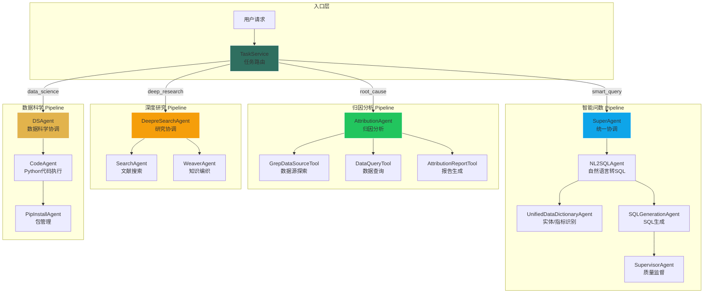

# Agent 系统概览

> **版本**: 3.0
> **更新日期**: 2026-03-13

## 概述

YiW 采用多 Agent 协作架构，通过专业化的 Agent 分工，实现智能问数、归因分析、深度研究、数据科学等复杂任务。系统基于统一的 BaseAgent 框架构建，所有 Agent 遵循 ReAct (Reasoning-Action-Observation) 循环模式。

## 系统架构



## 四大业务 Pipeline

### 1. 智能问数 Pipeline (SuperAgent)

将自然语言查询转换为 SQL 并执行，支持结构化与非结构化数据的混合查询。

| Agent / Tool | 职责 | 输入 | 输出 |
|-------|------|------|------|
| SuperAgent | 顶层协调器 | user_message | final_result |
| NL2SQLAgent | NL→SQL 转换 | user_message | sql_result |
| UnifiedDataDictionaryAgent | 实体/指标识别 | user_message | entities, metrics |
| SQLGenerationAgent | 生成 SQL 候选 | question, schema | sql_candidates |
| SupervisorAgent | 审核并选择最佳 SQL | candidates | selected_sql |
| SemanticScanTool | 知识库语义搜索 | query | semantic_results |
| WebSearchTool | 网络搜索 | query | web_results |

**核心特性**：
- SuperAgent 统一协调多种数据源（SQL、语义、网络搜索）
- Self-Consistency 多候选生成
- 精确匹配缓存 (≥0.99 相似度)
- 智能重试机制 (最多 5 次)
- 中间数据源 (DuckDB) 支持多步分析
- Ask User 歧义澄清

### 2. 归因分析 Pipeline (AttributionAgent)

针对指标变化进行逐层探索，发现根本原因。

| Agent / Tool | 职责 | 输入 | 输出 |
|-------|------|------|------|
| AttributionAgent | 分析协调 | user_message | analysis_report |
| GrepDataSourceTool | 数据源探索 | query | data_sources |
| GrepTablesTool | 表探索 | query | tables |
| GrepColumnsTool | 列探索 | query | columns |
| GrepEntitiesTool | 实体探索 | query | entities |
| DataQueryTool | 数据查询 | sql | query_result |
| AttributionReportTool | 报告生成 | findings | report |

**核心特性**：
- 自动数据源和维度探索
- 迭代式分析（最多 15 轮）
- 路径追踪防止重复查询
- Workspace 状态管理 (plan.md)
- 收敛触发（≥6 次查询后建议生成报告）
- Markdown 表格渲染

### 3. 深度研究 Pipeline (DeepreSearchAgent)

基于学术文献的深度研究和综述生成。

| Agent / Tool | 职责 | 输入 | 输出 |
|-------|------|------|------|
| DeepreSearchAgent | 研究流程协调 | question | html_report |
| SearchAgent | 学术文献搜索 | strategy | papers |
| WeaverAgent | 知识图谱编织 | dois | knowledge_graph |
| ResearchCouncilTool | 研究分析 | knowledge_graph | report |

**核心特性**：
- 动态章节规划
- 多源文献检索 (DBLP, Crossref)
- 引用关系分析
- HTML 学术综述报告生成

### 4. 数据科学 Pipeline (DSAgent)

基于 Python 的数据科学工作流，支持预测、回归、统计分析等。

| Agent / Tool | 职责 | 输入 | 输出 |
|-------|------|------|------|
| DSAgent | 数据科学协调 | user_message | analysis_result |
| CodeAgent | Python 代码生成与执行 | task | code_result |
| PipInstallAgent | Python 包安装 | package_name | install_result |
| NL2SQLTool | 数据查询 | query | sql_result |
| SemanticScanTool | 知识库搜索 | query | semantic_results |
| PythonCodeAnalysisTool | 代码分析执行 | code | execution_result |

**核心特性**：
- Python 代码生成与沙箱执行
- 自动依赖安装 (pip)
- 支持 pandas、numpy、sklearn、matplotlib 等
- 中间数据源辅助结果存储
- 多步数据分析工作流

## 核心组件

### BaseAgent 框架

所有 Agent 继承自 `BaseAgent`，遵循统一的 ReAct 循环：

```python
class BaseAgent:
    async def execute(context, stream_callback) -> AgentResult:
        while True:
            # Reasoning: 分析状态，决定下一步动作
            action = await self.reasoning(context, stream_callback)

            # Action: 执行动作 (调用工具/子Agent/方法)
            result = await self._execute_action(action)

            # Observation: 处理结果，更新状态
            observation = await self.observation(result, context)

            if observation["next_goal"] == "complete":
                return AgentResult(success=True, data=observation["data"])
```

### Action 类型

| 类型 | 说明 | 示例 |
|------|------|------|
| `call_tool` | 调用注册的工具 | DataQueryTool |
| `call_sub_agent` | 调用子 Agent | SearchAgent |
| `call_method` | 调用内部方法 | generate_report |
| `waiting_user_input` | 等待用户输入 | 实体歧义澄清 |
| `complete` | 完成执行 | 返回最终结果 |
| `error` | 执行错误 | 异常处理 |

### AgentContext

执行上下文，贯穿整个 Agent 生命周期：

```python
class AgentContext:
    task_id: str          # 任务唯一标识
    user_id: str          # 用户 ID
    project_id: str       # 项目 ID
    input_data: dict      # 输入参数
    data: dict            # 运行时数据存储
    current_goal: str     # 当前目标
```

### Tool 系统

Agent 通过 Tool 与外部系统交互：

| Tool | 用途 | 所属 Pipeline |
|------|------|---------------|
| NL2SQLTool | NL→SQL 转换 | 智能问数, 数据科学 |
| SemanticScanTool | 语义搜索 | 智能问数, 数据科学 |
| SemanticJoinTool | 跨表关联 | 智能问数, 数据科学 |
| WebSearchTool | 网络搜索 | 智能问数 |
| FormatResultTool | 结果格式化 | 智能问数, 数据科学 |
| GrepDataSourceTool | 数据源探索 | 归因分析 |
| DataQueryTool | 数据查询 | 归因分析 |
| AttributionReportTool | 归因报告 | 归因分析 |
| DBLPDeepSearchTool | DBLP 文献搜索 | 深度研究 |
| ResearchCouncilTool | 研究分析 | 深度研究 |
| PythonCodeAnalysisTool | Python 代码执行 | 数据科学 |

## 任务路由

TaskService 根据 `action_type` 路由到对应 Agent：

```python
# api/services/task_service.py
action_type = session.action_type

if action_type == 'smart_query':
    agent = SuperAgent()          # 智能问数
elif action_type == 'root_cause':
        agent = AttributionAgent()    # 归因分析
elif action_type == 'deep_research':
    agent = DeepreSearchAgent()   # 深度研究
elif action_type == 'data_science':
    agent = DSAgent()             # 数据科学
```

## 配置管理

### AgentSettings

Agent 配置通过 `AgentSettings` 统一管理：

```python
# 获取智能问数配置
config = await AgentSettings.get_nl2sql_config(
    project_id=project_id,
    business_id=business_id,
    user_message=question,
    entities=entities,
    metrics=metrics
)

# 获取归因分析配置
config = await AgentSettings.get_attribution_config(
    project_id=project_id,
    business_id=business_id,
    target_metric=metric,
    breakdown_dimensions=dimensions
)
```

### Prompt 模板

Prompt 配置支持动态占位符：

| 占位符 | 说明 |
|--------|------|
| `{rules}` | 业务规则 |
| `{dataprofile}` | 数据画像 |
| `{tools_info}` | 可用工具列表 |
| `{exploration_summary}` | 探索摘要 |

## 扩展指南

### 添加新 Agent

1. 继承 `BaseAgent`
2. 实现 `reasoning()` 和 `observation()`
3. 注册工具/子 Agent
4. 添加配置模板

```python
class MyAgent(BaseAgent):
    def __init__(self):
        super().__init__(name="MyAgent", description="自定义Agent")
        self.register_tool("my_tool", MyTool())

    async def reasoning(self, context, stream_callback):
        # 分析并返回 Action
        return {"type": "call_tool", "target": "my_tool", "params": {...}}

    async def observation(self, result, context, stream_callback):
        # 处理结果，返回下一步
        return {"success": True, "data": result, "next_goal": "complete"}
```

### 添加新 Tool

1. 继承 `BaseTool`
2. 实现 `execute()`
3. 在 Agent 中注册

```python
class MyTool(BaseTool):
    def __init__(self):
        super().__init__(name="my_tool", description="自定义工具")

    async def execute(self, context, **params) -> Result:
        # 执行逻辑
        return Result(success=True, data={...})
```

## 相关文档

- [BaseAgent 框架](/docs/developer/core/BaseAgent) - Agent 基类详细设计
- [智能问数 Agent](/docs/developer/agents/智能问数) - SuperAgent 协调的数据查询
- [归因分析 Agent](/docs/developer/agents/归因分析) - 指标归因分析
- [深度研究 Agent](/docs/developer/agents/DeepResearch) - 学术文献研究
- [数据科学 Agent](/docs/developer/agents/数据科学) - Python 数据科学工作流
- [配置系统设计](/docs/developer/agents/配置系统设计) - Agent 配置管理
