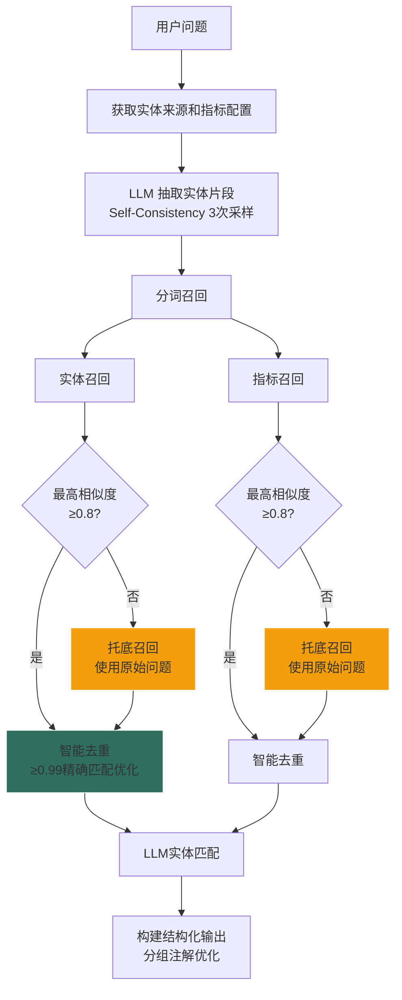
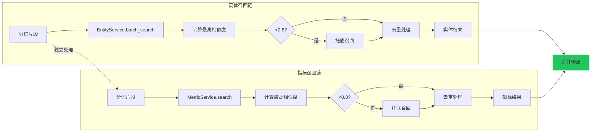
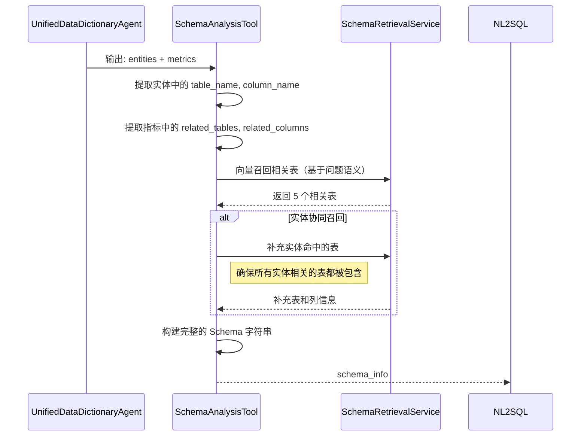
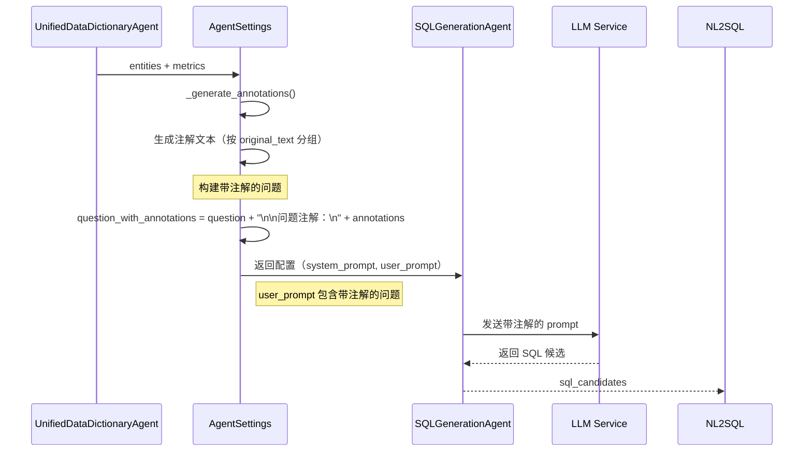

# UnifiedDataDictionaryAgent 设计文档

## 概述

`UnifiedDataDictionaryAgent` 是统一的数据词典处理器，负责智能业务术语标准化。它将用户自然语言问题中的业务术语（实体和指标）识别、召回、标准化，并生成 SQL 注解供下游 NL2SQL 使用。

---

## 核心流程



### 实体与指标召回独立性



---

## 设计目标

1. **实体和指标独立召回**：分词后分别召回实体和指标，结果互不影响
2. **智能托底召回**：如果召回的最高相似度 < 0.8，说明分词效果不好，用原始问题再召回一次补充
3. **生成注解**：召回结果用于生成 SQL 注解，辅助 NL2SQL

---

## 最新优化特性

### 1. 规则字段支持
- 实体召回时自动获取关联的配置规则
- 指标召回时获取指标的业务规则
- 规则信息提供给 LLM 用于精确匹配

### 2. 注解生成优化
- 按 `original_text` 分组，避免重复信息
- 子列表展示匹配项，减少 Token 消耗约 50-60%
- 结构化展示列名实体和列值实体

### 3. 精确匹配优化
- 同一来源下有相似度 ≥0.99 的实体时，丢弃低相似度候选
- 减少无效信息干扰，提高 LLM 处理效率

### 4. 智能托底机制
- 当最高相似度 < 0.8 时，使用原始问题重新召回
- 确保不遗漏重要实体和指标

---

## 配置常量

```python
# 召回配置
FALLBACK_SIMILARITY_THRESHOLD = 0.8  # 低于此阈值触发托底召回
METRIC_TOP_K = 3                     # 最多显示的指标数量

# 智能筛选配置
SMART_FILTER_CONFIG = {
    'similarity_threshold': 0.75,     # 高相似度阈值
    'similarity_gap_threshold': 0.2,  # 相似度差距阈值
    'max_llm_entities': 10,          # 最大LLM处理实体数
}
```

**配置项说明**：

| 配置 | 默认值 | 说明 |
|------|--------|------|
| `FALLBACK_SIMILARITY_THRESHOLD` | 0.8 | 低于此阈值触发托底召回 |
| `METRIC_TOP_K` | 3 | 最多显示的指标数量 |
| `limit_per_fragment` | 5 (实体) / 3 (指标) | 每个片段召回数量 |

---

## 核心方法详解

### 1. reasoning()

主入口方法，执行完整的九步实体处理流程。

**输入**：
- `user_message`: 用户问题
- `database_id`: 数据库连接ID
- `user_id`: 用户ID

**九步处理流程**：
```python
# 1. 获取实体来源和指标配置
sources = await self._get_entity_sources(database_id, user_id)
metrics = await self._get_metric_sources(database_id, user_id)

# 2. LLM抽取实体片段（Self-Consistency）
fragments = await self._extract_entity_fragments(question, sources, user_id, database_id)

# 3. 分别召回实体和指标（支持智能托底）
sources_entities = await self._recall_by_fragments(fragments, database_id, user_id, question)
recalled_metrics = await self._recall_metrics(fragments, database_id, user_id, question)

# 4. LLM处理实体替换
result = await self._process_entities_with_sources(question, sources_entities, user_id, database_id, fragments)

# 5. 构建结构化输出
structured_output = self._build_structured_output(question, result, sources_entities, recalled_metrics)
```

### 2. _extract_entity_fragments()

使用 Self-Consistency 机制抽取实体片段。

**优化点**：
- 合并实体样本和指标名称作为提示
- 3次采样取并集，提高召回率

```python
# 合并样本：实体样本 + 指标名称
all_samples = []
for s in sources:
    all_samples.extend(s.get('sample_entities', []))
for m in metrics:
    all_samples.append(m['name'])
```

### 3. _recall_by_fragments()

实体召回，支持智能托底和精确匹配优化。

**智能托底逻辑**：
```python
# 计算最高相似度
max_similarity = max(entity.get('similarity', 0) for entities in all_results.values() for entity in entities)

# 触发托底召回
if max_similarity < self.FALLBACK_SIMILARITY_THRESHOLD:
    fallback_results = await EntityService.batch_search_entities_global(
        fragments=[original_question],
        connection_id=database_id,
        user_id=user_id
    )
```

**精确匹配优化**：
```python
def _dedupe_entities(self, all_results):
    for source_key, entities in all_results.items():
        # 按entity_name去重，保留最高相似度
        seen = {}
        for entity in entities:
            name = entity['entity_name']
            similarity = entity.get('similarity', 0)
            if name not in seen or similarity > seen[name].get('similarity', 0):
                seen[name] = entity

        # 如果有相似度≥0.99的实体，只保留精确匹配
        perfect_matches = [e for e in unique_entities if e.get('similarity', 0) >= 0.99]
        if perfect_matches:
            dedupe_results[source_key] = perfect_matches
```

### 4. _build_structured_output()

构建最终输出，生成优化后的注解。

**注解格式优化**（按 original_text 分组）：

```python
# 优化前（浪费 Token）
- 问题中的"河西支行"，匹配到值"河西支行"，相似度89%
  定位: from table where col = '河西支行'
  行内数据: other_col: value1
- 问题中的"河西支行"，匹配到值"长沙市河西支行"，相似度91%
  定位: from table where col = '长沙市河西支行'
  行内数据: other_col: value1

# 优化后（节省 Token）
- 问题中的"河西支行"，匹配以下数据
  - "河西支行"，相似度89%, 路径: from table where col = '河西支行', 行内其他数据: other_col: value1
  - "长沙市河西支行"，相似度91%, 路径: from table where col = '长沙市河西支行', 行内其他数据: other_col: value1
```

---

## 智能托底召回机制

### 触发条件

```python
FALLBACK_SIMILARITY_THRESHOLD = 0.8

# 伪代码
if max_similarity < FALLBACK_SIMILARITY_THRESHOLD:
    # 触发托底召回
    fallback_results = recall(original_question)
    results = merge_and_dedupe(results, fallback_results)
```

### 实体召回流程

```python
async def _recall_by_fragments(fragments, database_id, user_id, original_question):
    # 1. 用分词片段召回
    all_results = await EntityService.batch_search_entities_global(fragments, ...)

    # 2. 计算最高相似度
    max_similarity = max(entity['similarity'] for entities in all_results.values() for entity in entities)

    # 3. 智能托底
    if max_similarity < 0.8:
        logger.info(f"最高相似度 {max_similarity:.2f} < 0.8，触发托底召回")
        fallback = await EntityService.batch_search_entities_global([original_question], ...)
        # 合并结果
        for source_key, entities in fallback.items():
            all_results[source_key].extend(entities)

    # 4. 去重（保留相似度最高的）
    return dedupe_by_entity_name(all_results)
```

### 指标召回流程

```python
async def _recall_metrics(fragments, database_id, user_id, original_question):
    # 1. 用分词片段召回
    all_metrics = []
    max_similarity = 0.0
    for fragment in fragments:
        metrics = await MetricService.search_metrics(fragment, ...)
        for m in metrics:
            m['matched_fragment'] = fragment
            max_similarity = max(max_similarity, m['similarity'])
        all_metrics.extend(metrics)

    # 2. 智能托底
    if max_similarity < 0.8:
        logger.info(f"最高相似度 {max_similarity:.2f} < 0.8，触发托底召回")
        fallback = await MetricService.search_metrics(original_question, ...)
        for m in fallback:
            m['matched_fragment'] = original_question
        all_metrics.extend(fallback)

    # 3. 去重（保留相似度最高的）
    return dedupe_by_metric_id(all_metrics)
```

### 实体与指标独立性

| 维度 | 实体召回 | 指标召回 |
|------|----------|----------|
| 召回服务 | `EntityService` | `MetricService` |
| 数据来源 | 业务实体表 | 指标定义表 |
| 托底判断 | 独立计算 max_similarity | 独立计算 max_similarity |
| 去重策略 | 按 entity_name | 按 metric_id |
| 输出格式 | `WHERE col = 'value'` | `SELECT template` |

**关键点**：实体召回失败不会影响指标召回，反之亦然。

---

## 输出格式示例

**原问题**：
```
查询华阴支行2025年个人住房贷款余客户数量本年净增
```

**处理后**：
```
查询陕西省华阴市支行2025年个人住房贷款结余客户数量本年净增（户）
---注解---
问题中的"华阴支行"，匹配以下数据
  - "陕西省华阴市支行"，相似度95%, 路径: from rpt_org where org_nm = '陕西省华阴市支行'
  - "华阴支行"，相似度90%, 路径: from org_info where org_name = '华阴支行'

问题中的"贷款余额"，匹配以下列
  - loan_balance.loan_balance，相似度95%, 描述: 贷款余额字段
  - rtl_line_loan.houloan_bal，相似度90%, 描述: 个人住房贷款余额

问题中的"个人住房贷款余客户数量本年净增"，匹配以下指标
  - 指标"个人住房贷款结余客户数量本年净增（户）"，相似度92%, 计算模板: SELECT RTL_LINE_LOAN.HOULOAN_BAL_CUNUM_TY_NINCR, 描述: 个人住房贷款客户数量年度净增长
```

### 注解生成规则

#### 单个匹配格式

```
问题中的"[原文]"，匹配到[类型]"[标准值]"，两者相似度[N]%，[SQL提示]
```

**示例**：
```
问题中的"华阴支行"，匹配到实体"陕西省华阴市支行"，两者相似度95%，WHERE org.org_nm = '陕西省华阴市支行'
```

#### 多个匹配格式

```
问题中的"[原文]"匹配到多个结果，请确认：
  - [实体] "值1"，相似度[N]%, 路径: [SQL提示]
  - [实体] "值2"，相似度[N]%, 路径: [SQL提示]
```

---

## 技术实现细节

### Self-Consistency 配置
```python
sc_config = SelfConsistencyConfig(
    n_candidates=3,
    base_temperature=0.3,
    temperature_variance=0.1,
    strict_mode=False
)
```

### 规则字段获取
```python
# 实体规则（通过SQLAlchemy outerjoin获取）
entity_rule = entity_dict.get('rule', '')

# 指标规则
metric_rule = metric.get('rule', '')
```

### 智能筛选策略
```python
# 预筛选高相似度实体
if similarity >= config['similarity_threshold']:
    return entity

# 检查相似度差距
if top_similarity - similarity > config['similarity_gap_threshold']:
    continue
```

---

## 性能优化

1. **并发召回**：实体和指标可并行处理
2. **批量查询**：使用 batch_search 减少网络开销
3. **智能筛选**：预筛选减少 LLM 处理量
4. **缓存机制**：高频查询结果缓存
5. **注解优化**：减少 50-60% Token 消耗

---

## 依赖服务

- `EntityService`: 实体向量检索（支持规则字段）
- `MetricService`: 指标向量检索
- `AgentSettings`: Agent 配置管理（优化注解生成）
- `chat()`: LLM 调用（Self-Consistency支持）

---

## 日志输出

```
🎯 「智能词典」启动，进行业务术语标准化...
🔍 正在识别问题中的实体和指标...
✨ [DataDictionary] 抽取到 3 个实体片段: ['华阴支行', '个人住房贷款', '客户数量']
🔍 [EntityRecall] 分词召回最高相似度: 0.95
🔍 [Dedupe] source_1: 发现 2 个精确匹配(≥0.99)，丢弃其他 5 个候选
✨ 「智能词典」识别到 2 个实体、1 个指标
✨ 「智能词典」将问题优化为：
[改写后的问题]
---注解---
[优化后的注解内容]
```

**日志关键点**：
```
🔍 [EntityRecall] 分词召回最高相似度: 0.75
🔍 [EntityRecall] 最高相似度 0.75 < 0.8，触发托底召回
🔍 [EntityRecall] 托底召回完成，合并结果

🔍 [MetricRecall] 分词召回最高相似度: 0.92
🔍 [MetricRecall] 最高相似度 0.92 >= 0.8，无需托底
```

---

## 与其他模块的协作

### 1. 与 Schema 召回的协作

实体处理的输出为 Schema 分析提供关键输入：



**协作细节**：

1. **实体驱动召回**：
   ```python
   # 从实体提取表和列信息
   entity_tables, entity_columns = self._extract_entity_schema_info(entities)
   metric_tables, metric_columns = self._extract_metric_schema_info(metrics)

   # 向量召回 + 实体补充召回
   tables = await self._recall_tables(
       database_id,
       user_message,
       user_id,
       entity_tables,  # 实体确定的表
       entity_columns  # 实体确定的列
   )
   ```

2. **优先级策略**：
   - 向量召回表 + 实体命中表的并集
   - 实体列作为必选列（即使不在向量召回的列列表中）
   - 完整保留实体相关的上下文信息

### 2. 与 SQL 生成的协作

实体处理通过 AgentSettings 将注解信息传递给 SQL 生成：



**注解在 SQL 生成中的作用**：

1. **实体列信息**：
   ```
   问题注解：
   - 问题中的"贷款余额"，匹配以下列
     - loan_balance.loan_balance，相似度95%
     - rtl_line_loan.houloan_bal，相似度90%
   ```
   - 告知 LLM 应该使用哪些具体的表和列
   - 相似度帮助 LLM 选择最佳匹配

2. **实体值信息**：
   ```
   - 问题中的"河西支行"，匹配以下数据
     - "陕西省华阴市支行"，相似度95%, 路径: from rpt_org where org_nm = '陕西省华阴市支行'
   ```
   - 提供 WHERE 条件的具体值
   - 避免模糊匹配导致错误

3. **指标模板**：
   ```
   - 指标"个人住房贷款余额"，计算模板: SUM(loan_balance)
   ```
   - 直接提供聚合函数的使用方式
   - 减少复杂计算的错误率

### 3. 数据流转示例

完整的 NL2SQL 流程中，实体处理的数据流转：

```python
# 1. 实体处理输出
entity_result = {
    "user_message": "查询陕西省华阴市支行2025年贷款余额",
    "entities": [
        {
            "original_text": "河西支行",
            "entity_value": "陕西省华阴市支行",
            "table_name": "rpt_org",
            "column_name": "org_nm",
            "similarity": 0.95,
            "rule": "只匹配支行级别机构",
        }
    ],
    "metrics": [
        {
            "name": "贷款余额",
            "sql_template": "SUM(loan_balance)",
            "matched_fragment": "贷款余额",
            "similarity": 0.92
        }
    ]
}

# 2. Schema 分析输入
schema_input = {
    "user_message": entity_result["user_message"],
    "entities": entity_result["entities"],
    "metrics": entity_result["metrics"]
}

# 3. SQL 生成输入（通过 AgentSettings 生成注解）
config = await AgentSettings.get_nl2sql_config(
    user_id=user_id,
    database_connection_id=database_id,
    question=entity_result["user_message"],
    entities=entity_result["entities"],  # 用于生成注解
    metrics=entity_result["metrics"]      # 用于生成注解
)

# 4. LLM 收到的完整 prompt 包含：
system_prompt: 包含业务规则
user_prompt:
"""
数据库类型：MySQL
数据库名称：bank_db
Schema信息：...（包含实体相关表）...
用户问题：查询陕西省华阴市支行2025年贷款余额

问题注解：
- 问题中的"河西支行"，匹配以下数据
  - "陕西省华阴市支行"，相似度95%, 路径: from rpt_org where org_nm = '陕西省华阴市支行', 规则: 只匹配支行级别机构
- 问题中的"贷款余额"，匹配以下指标
  - 指标"贷款余额"，相似度92%, 计算模板: SUM(loan_balance)
"""
```

---

## 扩展性设计

1. **多源支持**：支持多个实体来源同时处理
2. **规则驱动**：每个实体/指标可配置独立规则
3. **算法可插拔**：支持不同的相似度计算和去重策略
4. **输出格式可配置**：支持不同的注解格式需求
5. **协同召回**：与 Schema 分析深度集成，确保信息完整性
