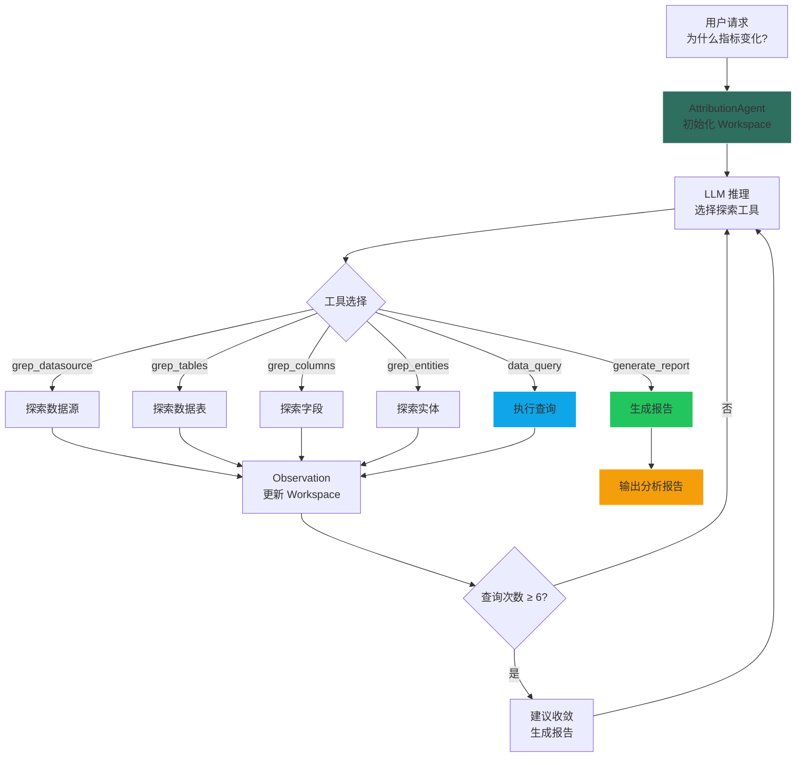

# 归因分析 Agent 设计文档

> **版本**: 2.0
> **更新日期**: 2026-03-13
> **架构**: ReAct 循环 + Tool 驱动探索

## 概述

归因分析 Agent（AttributionAgent）通过迭代式数据探索，帮助用户发现指标波动的根本原因。采用 Tool 驱动的探索模式，逐层深入分析数据，自动追踪已探索路径避免重复，最终生成完整的分析报告。

### 核心特性

- 🔍 **自动数据源探索**: 通过 Grep 系列工具发现可分析的数据源、表和列
- 🔄 **迭代式分析**: 最多 15 轮 ReAct 循环，逐层深入
- 📊 **路径追踪**: 记录已探索路径，防止重复查询
- 📝 **Workspace 管理**: plan.md 持久化分析进度
- 🎯 **智能收敛**: ≥6 次数据查询后建议生成报告
- 📋 **Markdown 报告**: 结构化的分析报告输出

---

## 1. 系统架构

### 1.1 工具清单

| Tool | 名称 | 职责 |
|------|------|------|
| `grep_datasource` | GrepDataSourceTool | 探索可用数据源 |
| `grep_tables` | GrepTablesTool | 探索数据表 |
| `grep_columns` | GrepColumnsTool | 探索表字段 |
| `grep_entities` | GrepEntitiesTool | 探索业务实体 |
| `data_query` | DataQueryTool | 执行数据查询 |
| `generate_report` | AttributionReportTool | 生成分析报告 |

### 1.2 执行流程图



### 1.3 配置参数

```python
class AttributionAgent(BaseAgent):
    max_iterations = 15        # 最大迭代轮次
    # 收敛触发: ≥6 次 data_query 调用后建议生成报告
```

---

## 2. 核心机制

### 2.1 Workspace 状态管理

每个分析任务维护一个 Workspace，通过 plan.md 追踪进度：

```python
class Workspace:
    def status_for_prompt(self) -> str:
        """返回当前状态摘要，注入 LLM prompt"""

    # Workspace 提供给 LLM 的上下文包括：
    # - 已执行的查询列表
    # - 已发现的数据分布
    # - 已探索的路径
```

### 2.2 路径追踪

防止重复查询同一维度：

```python
# 记录已探索路径
_explored_paths = set()

# 每次查询后记录
_explored_paths.add(f"{table}.{column}")

# LLM 上下文中包含已探索信息
# 避免重复分析相同的维度组合
```

### 2.3 收敛机制

```python
def _should_suggest_convergence(self):
    """当 data_query 调用次数 ≥ 6 时，建议生成报告"""
    query_count = sum(1 for s in steps if s.tool == "data_query")
    return query_count >= 6
```

### 2.4 结果流式展示

根据工具类型选择不同的展示方式：

```python
def _stream_result(self, tool_type, result):
    if tool_type in ("grep_datasource", "grep_tables", "grep_columns"):
        # 语义展示：数据源/表/列信息
        stream_as_info_block(result)
    elif tool_type == "data_query":
        # 表格展示：查询结果
        stream_as_markdown_table(result)
    elif tool_type == "generate_report":
        # 报告展示：完整分析报告
        stream_as_report(result)
```

---

## 3. 典型分析流程

```
用户: "西安分行为什么业绩最好？"

【第1轮】grep_datasource → 发现可用数据库
【第2轮】grep_tables → 发现业绩相关表
【第3轮】grep_columns → 发现分行、产品、客户等维度列
【第4轮】data_query → 分行维度分析
  → 西安 1200万(32.4%), 北京 980万, 上海 850万...
【第5轮】data_query → 产品维度分析
  → 西安理财产品占比 56.7%（高于平均 47.7%）
【第6轮】data_query → 客户维度分析
  → 西安VIP客户占比 23%（高于平均 18%）
【收敛建议】已执行 3 次数据查询，建议生成报告
【第7轮】generate_report → 生成分析报告
```

---

## 4. 使用示例

### 4.1 通过 TaskService 调用

```python
session = await SessionService.create(
    project_id="proj_456",
    action_type="root_cause"  # 归因分析
)

task = await TaskService.submit_task(
    session_id=session.id,
    user_message="分析本月销售额下降的原因",
    data_sources_info={
        "source_type": "database",
        "source_id": "db_sales"
    }
)
```

### 4.2 直接调用

```python
from yiw_kernel.data_science.dsagents.agents.attribution_agent import AttributionAgent

agent = AttributionAgent()
context = AgentContext(
    task_id="task_001",
    user_id="user_123",
    input_data={
        "user_message": "分析本月销售额下降的原因",
        "data_sources_info": {
            "source_type": "database",
            "source_id": "db_sales"
        }
    }
)

result = await agent.execute(context, stream_callback)
```

---

## 5. 日志解读

```log
[AttributionAgent] 📁 初始化 Workspace
[AttributionAgent] 🔍 探索数据源...
[AttributionAgent] ✅ 发现 3 个可用数据库
[AttributionAgent] 🔍 探索数据表...
[AttributionAgent] ✅ 发现 8 个相关表
[AttributionAgent] 📊 执行数据查询: 分行维度分析
[AttributionAgent] ✅ 查询成功，返回 15 条数据
[AttributionAgent] 📊 执行数据查询: 产品维度分析
[AttributionAgent] ✅ 查询成功，返回 12 条数据
[AttributionAgent] 💡 已执行 6 次查询，建议生成报告
[AttributionAgent] 📋 生成分析报告...
[AttributionAgent] ✅ 分析完成
```

---

## 6. 相关文件

| 文件 | 说明 |
|------|------|
| `attribution_agent.py` | 主 Agent 实现 |
| `grep_datasource_tool.py` | 数据源探索工具 |
| `data_query_tool.py` | 数据查询工具 |
| `attribution_report_tool.py` | 报告生成工具 |

---

**文档版本**: 2.0
**最后更新**: 2026-03-13
**维护者**: YiW Team
