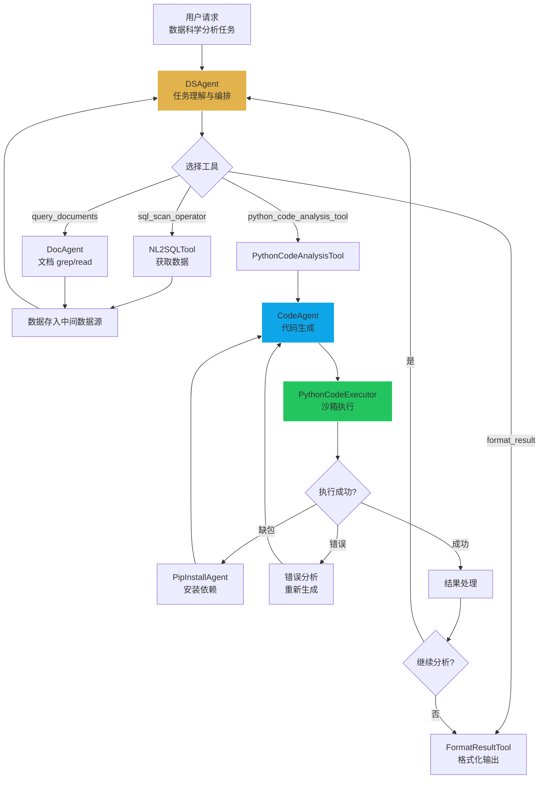

# 数据科学 Agent 设计文档

> **版本**: 1.0
> **更新日期**: 2026-03-13
> **架构**: DSAgent 协调 + CodeAgent 代码执行

## 概述

数据科学 Agent（DSAgent）提供基于 Python 的数据科学工作流，支持预测分析、回归建模、统计检验等高级分析任务。通过 LLM 驱动的代码生成和沙箱执行，将自然语言分析需求转化为可执行的 Python 代码。

### 核心特性

- 🐍 **Python 代码生成**: LLM 自动生成数据分析代码
- 📦 **自动依赖管理**: PipInstallAgent 自动安装缺失的 Python 包
- 🔒 **沙箱执行**: 代码在隔离环境中安全执行
- 📊 **多库支持**: pandas、numpy、sklearn、matplotlib 等
- 🔄 **数据获取**: 复用 NL2SQLTool 和 SemanticScanTool 获取数据
- 💾 **辅助结果**: 中间数据源存储分析中间产物

---

## 1. 系统架构

### 1.1 组件清单

#### DSAgent 工具

| Tool | 名称 | 职责 |
|------|------|------|
| `sql_scan_operator` | NL2SQLTool | 数据查询（复用智能问数能力）|
| `query_documents` | DocAgent | 使用 grep/read 查询 Markdown 文档并返回证据 |
| `python_code_analysis_tool` | PythonCodeAnalysisTool | Python 代码分析执行 |
| `format_result` | FormatResultTool | 结果格式化 |

#### CodeAgent 子组件

| 组件 | 类型 | 职责 |
|------|------|------|
| PythonCodeExecutor | Tool | Python 代码执行器 |
| PipInstallAgent | 子 Agent | 自动安装缺失的 Python 包 |

### 1.2 执行流程图



### 1.3 配置参数

```python
class DSAgent(BaseAgent):
    max_iterations = 50        # 最大迭代次数
    max_empty_results = 3      # 连续空结果触发终止

class CodeAgent(BaseAgent):
    max_parsing_retries = 4    # 代码解析最大重试次数
    temperature = 0.05         # 严格代码生成
```

---

## 2. DSAgent 详解

### 2.1 工作流程

DSAgent 的典型工作流程：

1. **数据获取**: 通过 sql_scan_operator 或 query_documents 获取分析所需数据
2. **代码分析**: 通过 python_code_analysis_tool 调用 CodeAgent 执行 Python 分析
3. **结果格式化**: 通过 format_result 格式化输出

### 2.2 与智能问数的差异

| 特性 | 智能问数 (SuperAgent) | 数据科学 (DSAgent) |
|------|----------------------|-------------------|
| 核心能力 | SQL 查询 | Python 分析 |
| 输出类型 | 表格/图表 | 分析报告/可视化/模型 |
| 分析深度 | 数据检索 | 统计建模、预测、回归 |
| 工具 | NL2SQL 为主 | Python 代码执行为主 |
| 适用场景 | "查询销售额" | "预测下季度销售趋势" |

### 2.3 辅助结果处理

PythonCodeAnalysisTool 的执行结果可能产生辅助数据（如 DataFrame），存入中间数据源：

```python
# CodeAgent 执行结果
if isinstance(result, pd.DataFrame):
    # 存入中间数据源 (DuckDB)
    intermediate_ds.store(table_name=f"analysis_{task_id}", data=result)
    # 构造 Table 对象返回给 DSAgent
```

---

## 3. CodeAgent 详解

### 3.1 代码生成流程

```python
# 1. 首次执行时进行数据画像
data_profile = profile_input_data(input_files)

# 2. 构建 system prompt（包含工作目录概览）
system_prompt = load_prompt("code_agent.yaml")

# 3. LLM 生成代码
code = await llm.generate(
    system_prompt=system_prompt,
    messages=memory_steps,
    temperature=0.05
)

# 4. 解析代码块（最多 4 次重试）
parsed_code = parse_code_block(code)

# 5. 执行代码
result = await python_executor.execute(parsed_code)
```

### 3.2 自动依赖安装

当代码执行遇到 `ModuleNotFoundError` 时，自动调用 PipInstallAgent：

```python
# 检测缺失包
if "ModuleNotFoundError" in error_message:
    missing_package = extract_package_name(error_message)

    # 调用 PipInstallAgent
    pip_agent = PipInstallAgent()
    await pip_agent.execute(
        context=AgentContext(input_data={"package": missing_package}),
        stream_callback=callback
    )

    # 重新执行代码
    result = await python_executor.execute(parsed_code)
```

### 3.3 支持的分析类型

| 类型 | 示例 | 常用库 |
|------|------|--------|
| 描述性统计 | 数据分布、相关性分析 | pandas, scipy |
| 预测分析 | 时间序列预测、回归 | sklearn, statsmodels |
| 分类建模 | 客户分群、异常检测 | sklearn, xgboost |
| 可视化 | 图表生成、热力图 | matplotlib, seaborn |
| 数据处理 | 清洗、转换、聚合 | pandas, numpy |

---

## 4. 使用示例

### 4.1 通过 TaskService 调用

```python
session = await SessionService.create(
    project_id="proj_456",
    action_type="data_science"  # 数据科学
)

task = await TaskService.submit_task(
    session_id=session.id,
    user_message="基于历史销售数据，预测下个季度的销售趋势",
    data_sources_info={
        "source_type": "database",
        "source_id": "db_sales"
    }
)
```

### 4.2 直接调用

```python
from yiw_kernel.data_science.dsagents.agents.ds_agent import DSAgent

agent = DSAgent()
context = AgentContext(
    task_id="task_001",
    user_id="user_123",
    input_data={
        "user_message": "对销售数据进行聚类分析，找出客户分群",
        "selected_data_profiles": [...],
        "session_context": []
    }
)

result = await agent.execute(context, stream_callback)
```

---

## 5. 日志解读

```log
🚀 [DSAgent] 启动数据科学分析...
🔍 [DSAgent] 调用 sql_scan_operator 获取数据...
✅ [NL2SQL] 数据获取成功，共 1000 条
📊 [DSAgent] 调用 python_code_analysis_tool...
🐍 [CodeAgent] 开始代码生成...
📝 [CodeAgent] 生成 Python 代码 (45 行)
⚙️ [CodeAgent] 执行中...
❌ [CodeAgent] ModuleNotFoundError: No module named 'seaborn'
📦 [PipInstallAgent] 安装 seaborn...
✅ [PipInstallAgent] 安装成功
🔄 [CodeAgent] 重新执行...
✅ [CodeAgent] 执行成功
📊 [DSAgent] 分析完成，格式化输出...
```

---

## 6. 相关文件

| 文件 | 说明 |
|------|------|
| `ds_agent.py` | DSAgent 主协调 |
| `code_agent.py` | CodeAgent 代码生成执行 |
| `pip_install_agent.py` | Python 包安装 |
| `code_agent.yaml` | CodeAgent prompt 模板 |
| `pip_install_agent.yaml` | PipInstallAgent prompt 模板 |

---

**文档版本**: 1.0
**最后更新**: 2026-03-13
**维护者**: YiW Team
