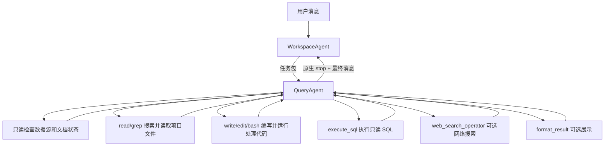

# QueryAgent 设计说明

> 版本：4.1
> 更新日期：2026-07-20

## 目标

QueryAgent 是 WorkspaceAgent 调用的叶子 Agent，负责处理一个已经明确的数据查询任务。它可以搜索和修改项目文件、编写并运行处理代码、执行只读 SQL，并在原生工具循环中修正查询。

数据导入和内容准备不属于 QueryAgent。两条链路必须分开：

- 离线准备：导入数据、生成 Schema SQL、转换 Markdown、执行 OCR、补充说明和示例值。
- 在线问答：检查已有内容、搜索文件、按需编写处理代码、执行只读 SQL、整理证据并回答。

## 调用关系

WorkspaceAgent 决定委派内容。服务层不会用当前轮原文覆盖它的判断。任务包可以包含：

- `question`
- `resolved_context`
- `answer_requirements`
- `source_hints`
- `presentation_hint`

## 在线工具

| 工具 | 作用 |
|---|---|
| `read`、`grep`、`ls`、`find` | 搜索并读取 Schema SQL、Markdown、代码和其他项目文件 |
| `write`、`edit`、`bash` | 编写代码或脚本、生成输出并执行数据处理；按工作区设置审批 |
| `execute_sql` | 在指定 `source_id` 上执行一条只读 `SELECT` 或 `WITH` |
| `web_search_operator` | 项目允许时搜索网络来源 |
| `format_result` | 生成图表或大表，不结束任务 |
| `ask_user` | 口径确实无法判断时请求澄清 |
| `update_plan` | 多步任务展示和更新计划 |

QueryAgent 不再调用：

- `sql_scan_operator`
- `query_documents`
- `NL2SQLAgent`
- `DocAgent`
- 指标视图和实体对齐工具
- 任何专用完成工具

## 文件与数据源

每轮开始时，系统只读检查项目目录，在内存中生成数据源和文档清单，直接放入本轮上下文。在线问答不会写 `SOURCES.md` 或 `DOCUMENTS.md`。

数据源清单包含稳定的 `source_id`、SQL 方言、Schema 文件路径和准备状态。文档清单包含文档路径、转换状态和错误。

QueryAgent 的查找顺序：

1. 核对本轮清单和准备状态。
2. 用 `grep` 搜索真实 `.sql` 或 `.md` 文件。
3. 用 `read` 读取命中位置附近内容。
4. 复杂的文件解析、关联或计算可以用 `write/edit` 编写小脚本，再用 `bash` 执行并检查输出。
5. 数据库问题调用 `execute_sql`。
6. SQL 或脚本失败时根据真实错误继续查文件并修改，不能原样重试。

Schema、Markdown 和数据源清单仍是离线准备的事实产物，在线问答不会自动重建或刷新。代码、脚本和输出文件属于任务工作内容，可以在用户的审批设置下写入工作区。`ask` 模式确认 `write/edit/bash`，`auto` 模式确认 `bash`，`full` 模式直接执行。

多个数据源不能在一条原始 SQL 中直接关联。各来源先分别查询，结果自动进入会话中间 DuckDB；后续使用 `source_id=session_intermediate` 做关联或聚合。

## 完成方式

工具只产生证据，不负责结束任务。

当 QueryAgent 判断已有证据足以回答时，它停止调用工具并输出最终消息。运行时只有在最后一条 assistant 消息满足以下条件时才算成功：

- `stopReason=stop`
- 最终答案非空

没有 `complete_sql`、`complete_doc` 或通用 `complete`。超时、模型报错、轮数达到上限或没有最终答案时，QueryAgent 会向 WorkspaceAgent 返回明确的失败原因、停止原因和模型轮次。

## 离线准备状态

| 状态 | 含义 |
|---|---|
| `importing` | 原始内容还没有完成登记或导入 |
| `queryable_raw` | 原始结构化数据和基础 Schema 已经能查 |
| `context_ready` | 说明、示例值或 Markdown 等内容也已准备好 |
| `failed` | 离线准备失败；保留仍可用的原始数据或上一版内容 |

结构化数据在基础 Schema 生成后即可查询，不必等待说明内容。文档必须存在可读 Markdown 才能用于回答；图片和扫描件由用户配置的 OCR 或副模型在离线阶段处理。
