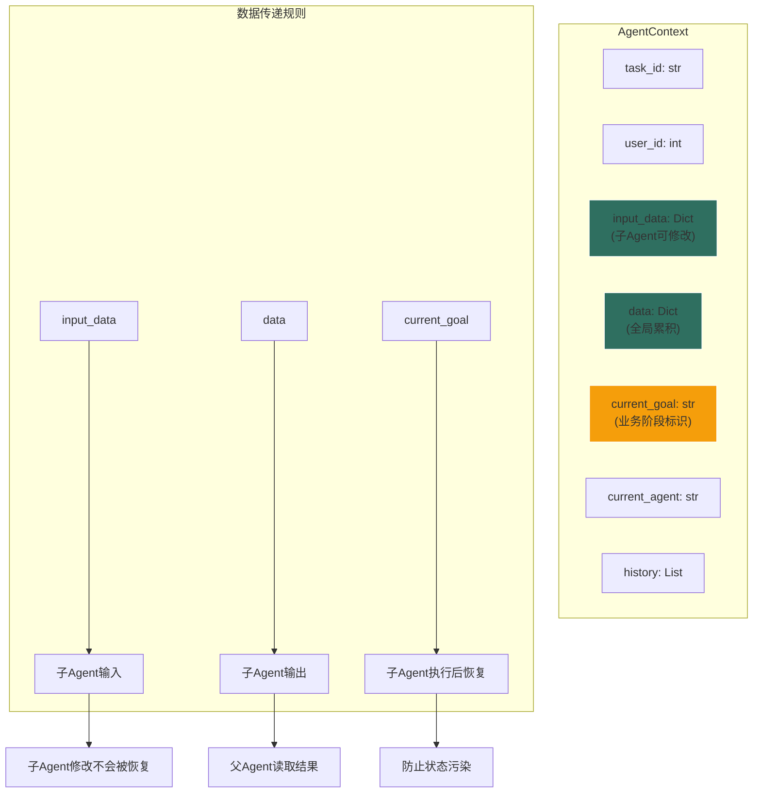
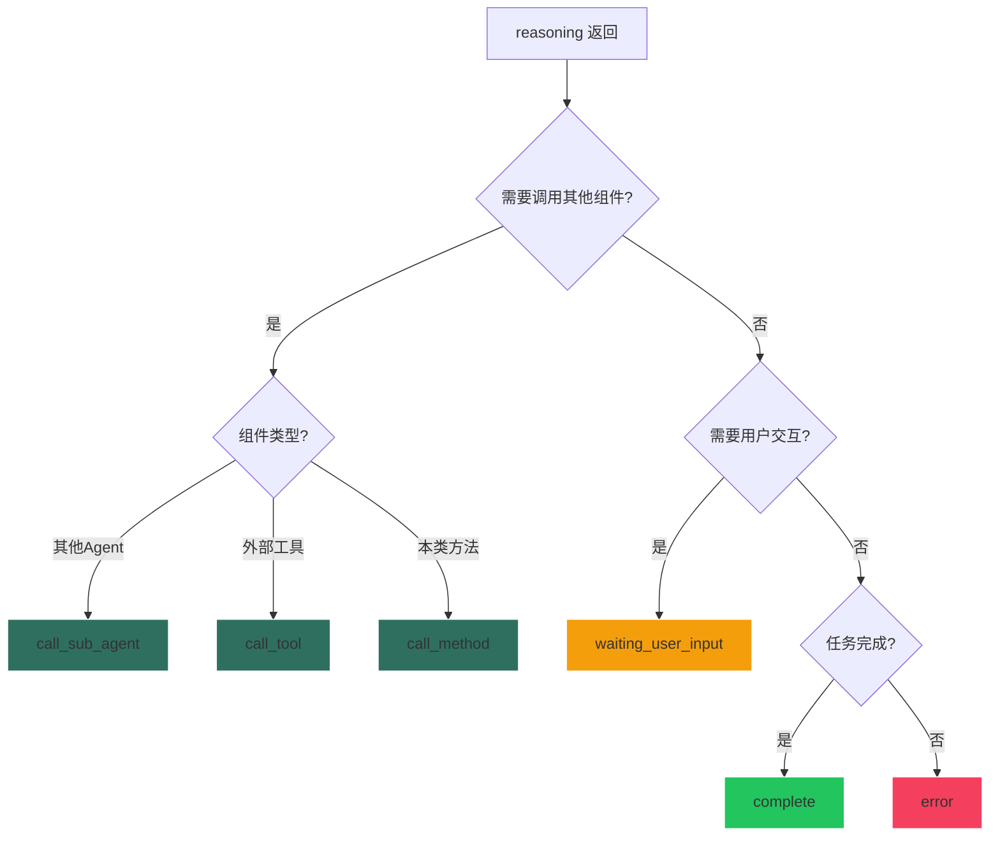
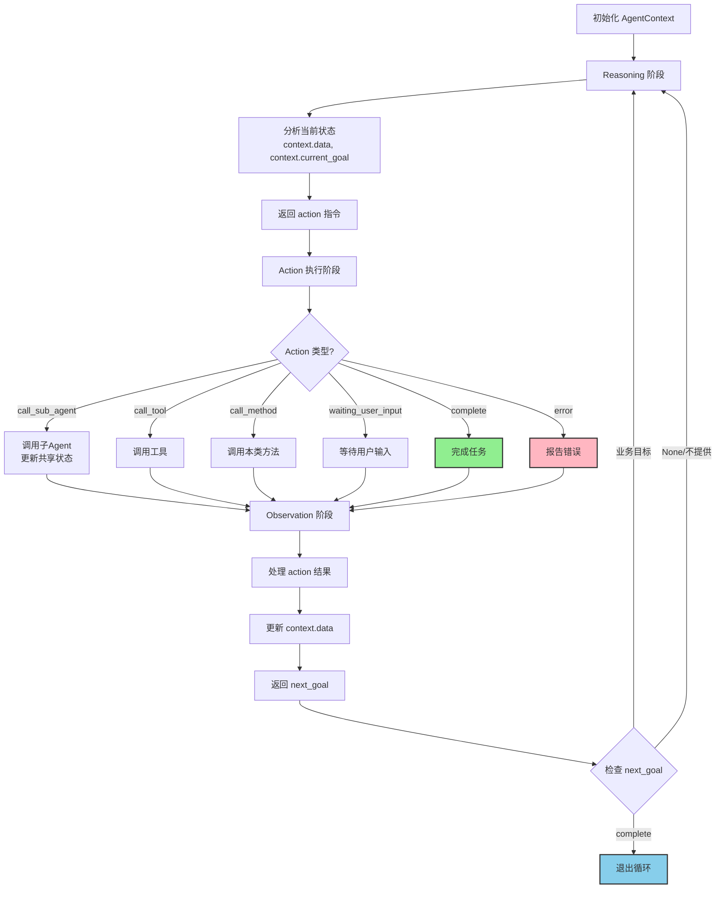
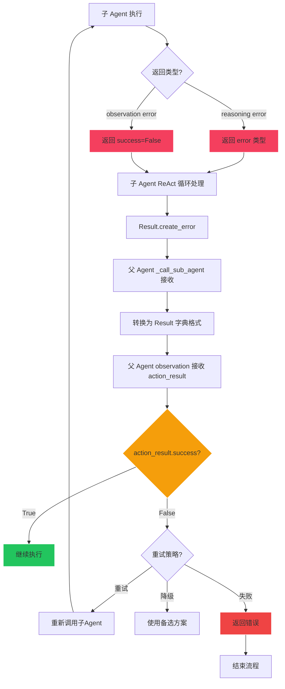

# BaseAgent 框架设计文档

## 概述

BaseAgent 是一个统一的 Agent 基类，采用 ReAct (Reasoning-Action-Observation) 循环模式，支持单一功能和多组件协调两种场景。

## 设计原则

### 1. 数据结构决定行为
- **有 sub_agents/tools**：自动多次迭代，协调多个组件
- **无 sub_agents/tools**：第1次迭代后自然退出，专注单一功能
- 不需要两个基类，一个判断足够

### 2. 统一的执行流程
- 所有 Agent 使用统一的 ReAct 循环
- 一个执行入口，没有特殊分支
- 简化的 action 类型系统

### 3. 简洁的状态管理
- 函数职责单一：reasoning 只做推理，observation 只做观察
- 状态由 AgentContext 统一管理
- 子 Agent 直接修改共享状态，无需恢复机制

## 核心概念

### AgentContext - 共享上下文

```python
class AgentContext:
    task_id: str           # 任务ID
    user_id: int           # 用户ID
    input_data: Dict       # 输入参数（子Agent可修改）
    data: Dict             # 共享状态（全局累积）
    current_goal: str      # 当前目标（业务阶段标识）
    current_agent: str     # 当前Agent（仅日志用）
    history: List          # 执行历史
```

**设计要点**：
- `input_data`：子Agent的输入参数，可被修改
- `data`：全局共享状态，累积所有结果
- `current_goal`：当前业务目标/阶段标识（如 "profiling", "planning" 等）
- 子Agent执行后，`input_data` 和 `data` 的修改**不会被恢复**
- 子Agent执行后，`current_goal` **会被恢复**（防止子Agent污染父Agent状态）



#### 数据传递路径详解

**父 Agent → 子 Agent（输入）**：
```python
# 父 Agent 的 reasoning
return {
    "type": "call_sub_agent",
    "target": "child",
    "params": {
        "query_result": final_result,  # 传递参数
        "database_id": db_id
    }
}

# BaseAgent._call_sub_agent 处理
agent_context.input_data.update(params)  # params → input_data

# 子 Agent 的 reasoning 获取参数
query_result = agent_context.input_data.get("query_result")  # 从 input_data 读取
```

**子 Agent → 父 Agent（输出）**：
```python
# 子 Agent 的 reasoning 返回
return {
    "type": "complete",
    "params": {
        "enhanced_question": new_question,  # 返回结果
        "entities": entities
    }
}

# BaseAgent.observation 处理
return {
    "success": True,
    "data": params,  # params → data
    "next_goal": "complete"
}

# 父 Agent 的 observation 获取结果
result_data = action_result.get("data", {})  # 从 data 读取
enhanced_q = result_data.get("enhanced_question")
```

**核心原则**：
- **input_data** = 父 Agent 给子 Agent 的**输入** (params → input_data)
- **data** = 子 Agent 给父 Agent 的**输出** (params → data)
- 清晰的单向数据流，不混用

### Action 类型 - 行动指令系统

reasoning() 必须返回以下类型之一：

```python
# 1. 调用子Agent
{
    "type": "call_sub_agent",
    "target": "agent_name",
    "params": {...}
}

# 2. 调用工具
{
    "type": "call_tool",
    "target": "tool_name",
    "params": {...}
}

# 3. 调用本类方法
{
    "type": "call_method",
    "target": "method_name",
    "params": {...}
}

# 4. 等待用户输入（Ask User 机制）
{
    "type": "waiting_user_input",
    "pause_step": "entity_ambiguity",  # 暂停步骤标识
    "params": {
        "prompt": "请选择匹配的实体",
        "options": [...],      # 单组场景
        "groups": [...],       # 多组场景（优先）
        "allow_custom": False,
        "context": {...}       # 恢复时需要的上下文
    }
}

# 5. 完成任务
{
    "type": "complete",
    "params": {...}  # 返回数据
}

# 6. 报告错误
{
    "type": "error",
    "error": "错误信息"
}
```

#### 为什么只有这六种类型？

**设计哲学**：**"消除特殊情况，用最少的概念解决问题"**

这六种类型覆盖了 Agent 系统的所有必要操作：

1. **call_sub_agent / call_tool / call_method**：**组合操作**
   - 构建复杂行为的完整方式
   - Agent 通过组合子 Agent/Tool/Method 实现功能
   - `call_method` 提供了调用本类方法的能力，避免需要为简单逻辑创建额外的工具

2. **waiting_user_input**：**用户交互**
   - 允许 Agent 在执行过程中暂停，请求用户输入
   - 支持歧义消解、选择确认、补充信息等场景
   - 暂停后可从断点恢复执行（详见 [Ask User 机制](#ask-user-机制)）

3. **complete**：**成功终止**
   - 明确表示任务完成
   - 携带结果数据
   - 触发 observation 返回 `next_goal="complete"`

4. **error**：**失败终止**
   - 明确表示任务失败
   - 携带错误信息
   - 立即退出 ReAct 循环

**不需要的类型**：
- ❌ `"continue"` - 不需要，call_sub_agent/call_tool/call_method 自然会继续循环
- ❌ `"wait"` - 不需要，用 `waiting_user_input` 处理用户交互
- ❌ `"retry"` - 不需要，重试逻辑在 observation 中处理
- ❌ 自定义类型 - 会破坏统一性，增加复杂度

**关键洞察**：
> "如果你需要第7种类型（除了现有的6种），说明你的 Agent 职责不清晰"
>
> 重新思考：这个操作应该是一个新的 sub_agent、一个新工具，还是调用本类方法？



### Observation 返回值

observation() 必须返回以下格式：

```python
# 切换到新目标（继续循环）
{
    "success": True,
    "data": {...},              # 要更新到 context.data 的数据
    "next_goal": "new_phase"    # 设置新的业务目标
}

# 保持当前目标（继续循环）
{
    "success": True,
    "data": {...}
    # 不提供 next_goal，保持 current_goal 不变
}

# 任务完成（退出循环）
{
    "success": True,
    "data": {...},
    "next_goal": "complete"     # 保留字：退出循环
}

# 失败
{
    "success": False,
    "error": "错误信息"
}
```

**next_goal 字段说明**：
- **`"complete"`**: 保留字，表示任务完成，退出 ReAct 循环
- **`"业务目标名"`**: 设置新的 current_goal，继续循环（如 "profiling", "planning"）
- **`None/不提供`**: 保持当前 current_goal 不变，继续循环

**重要注意事项**：
- ❌ 不要使用 `next_goal="continue"`（会把 current_goal 设置为 "continue"）
- ✅ 如果想保持当前目标继续循环，不提供 `next_goal` 字段
- ✅ 业务目标名不能使用 "complete"（保留字冲突）
- ✅ `next_goal` 会被直接传递给 `agent_context.set_goal()`

## ReAct 循环流程



## 错误处理机制

### 错误传播路径

BaseAgent 使用**多层错误检查**机制，确保错误不被遗漏：



**关键点**：
- 子 Agent 无论在哪个阶段出错（reasoning 或 observation），最终都通过 `Result.create_error()` 返回
- `_call_sub_agent` 将 Result 转换为字典格式 `{"success": False, "error": "..."}`
- 父 Agent 的 observation 通过检查 `action_result["success"]` 来判断子 Agent 是否成功

#### 2. 三层错误检查

**第一层：reasoning 阶段**
```python
async def reasoning(self, agent_context, stream_callback):
    # 验证输入
    if not question:
        return {
            "type": "error",
            "error": "缺少question参数"
        }

    # 调用子 Agent
    return {
        "type": "call_sub_agent",
        "target": "child",
        "params": {...}
    }
```

**第二层：_call_sub_agent/tool 捕获异常**
```python
async def _call_sub_agent(self, agent_name, params, ...):
    try:
        result = await sub_agent.execute(...)
        result_dict = result.to_dict()
        return result_dict  # {"success": True/False, "data": {...}}
    except Exception as e:
        return {
            "success": False,
            "error": f"子Agent执行异常: {str(e)}"
        }
```

**第三层：observation 处理错误**
```python
async def observation(self, action_result, agent_context, stream_callback):
    # 检查 action_result.success
    if not action_result.get("success"):
        error = action_result.get("error", "未知错误")

        # 选项1: 直接失败
        return {
            "success": False,
            "error": error
        }

        # 选项2: 重试逻辑
        retry_count = agent_context.data.get("retry_count", 0)
        if retry_count < 3:
            agent_context.data["retry_count"] = retry_count + 1
            return {
                "success": True,
                "data": {},
                "next_goal": "continue"  # 重新进入 reasoning
            }
        else:
            return {
                "success": False,
                "error": f"重试3次后仍失败: {error}"
            }

        # 选项3: 降级处理
        logger.warning(f"子Agent失败，使用降级方案: {error}")
        fallback_result = self.get_fallback_result()
        return {
            "success": True,
            "data": fallback_result,
            "next_goal": "continue"
        }
```

### 错误处理策略

#### 策略1: 立即失败（默认）

**适用场景**：关键步骤，不允许降级

```python
async def observation(self, action_result, agent_context, stream_callback):
    if not action_result.get("success"):
        return {
            "success": False,
            "error": action_result.get("error")
        }
    # 正常处理
    return {"success": True, "data": {...}, "next_goal": "continue"}
```

#### 策略2: 重试机制

**适用场景**：网络请求、LLM 调用等可能临时失败的操作

```python
async def observation(self, action_result, agent_context, stream_callback):
    if not action_result.get("success"):
        retry_count = agent_context.data.get("retry_count", 0)
        max_retries = 3

        if retry_count < max_retries:
            agent_context.data["retry_count"] = retry_count + 1
            agent_context.data["previous_error"] = action_result.get("error")
            logger.warning(f"重试 {retry_count + 1}/{max_retries}")

            return {
                "success": True,
                "data": {},
                "next_goal": "continue"  # 重新执行 reasoning
            }
        else:
            return {
                "success": False,
                "error": f"重试{max_retries}次后仍失败"
            }

    # 成功，重置重试计数
    agent_context.data["retry_count"] = 0
    return {"success": True, "data": {...}, "next_goal": "continue"}
```

#### 策略3: 降级处理

**适用场景**：非关键步骤，可以使用备选方案

```python
async def observation(self, action_result, agent_context, stream_callback):
    if not action_result.get("success"):
        error = action_result.get("error")
        logger.warning(f"主流程失败，使用降级方案: {error}")

        # 使用降级逻辑
        fallback_data = {
            "result": "默认结果",
            "is_fallback": True,
            "original_error": error
        }

        return {
            "success": True,
            "data": fallback_data,
            "next_goal": "continue"  # 继续后续流程
        }

    # 正常处理
    return {"success": True, "data": {...}, "next_goal": "continue"}
```

#### 策略4: 条件降级（先重试，再降级）

**适用场景**：重要但非关键的步骤

```python
async def observation(self, action_result, agent_context, stream_callback):
    if not action_result.get("success"):
        retry_count = agent_context.data.get("retry_count", 0)

        # 先重试2次
        if retry_count < 2:
            agent_context.data["retry_count"] = retry_count + 1
            return {
                "success": True,
                "data": {},
                "next_goal": "continue"
            }

        # 重试失败，使用降级
        logger.warning("重试失败，使用降级方案")
        fallback_data = self.get_fallback_result()
        agent_context.data["retry_count"] = 0  # 重置

        return {
            "success": True,
            "data": fallback_data,
            "next_goal": "continue"
        }

    # 成功
    agent_context.data["retry_count"] = 0
    return {"success": True, "data": {...}, "next_goal": "continue"}
```

### 错误处理最佳实践

1. **在源头验证输入** (reasoning 阶段)
   ```python
   if not required_param:
       return {"type": "error", "error": "缺少必要参数"}
   ```

2. **在 observation 决定错误策略**
   - 关键步骤 → 立即失败
   - 可恢复错误 → 重试
   - 非关键步骤 → 降级

3. **记录错误上下文**
   ```python
   logger.error(f"子Agent失败: {error}")
   logger.error(f"  输入参数: {agent_context.input_data}")
   logger.error(f"  当前状态: {agent_context.data}")
   ```

4. **避免吞掉错误**
   ```python
   # ❌ 错误：吞掉所有错误
   except Exception as e:
       logger.error(e)
       return {"success": True, "data": {}}  # 假装成功

   # ✅ 正确：明确错误处理策略
   except Exception as e:
       logger.error(e)
       if can_fallback:
           return {"success": True, "data": fallback_result}
       else:
           return {"success": False, "error": str(e)}
   ```

## 核心方法

### execute() - 入口方法

```python
async def execute(self, agent_context: AgentContext, stream_callback: callable, **kwargs) -> Result:
    """统一入口，所有Agent都使用ReAct循环"""
    try:
        result = await self._react_loop(agent_context, stream_callback, **kwargs)
        return result
    except Exception as e:
        return Result.create_error(error=str(e), message=f"{self.name} 执行异常")
```

**设计要点**：
- 不再判断是否有 sub_agents/tools
- 统一调用 `_react_loop()`
- 异常统一转换为 Result.error

### reasoning() - 推理阶段（抽象方法）

```python
@abstractmethod
async def reasoning(self, agent_context: AgentContext, stream_callback: callable) -> Dict[str, Any]:
    """
    推理阶段 - 决定下一步行动

    返回格式：
    - {"type": "call_sub_agent", "target": "agent_name", "params": {...}}
    - {"type": "call_tool", "target": "tool_name", "params": {...}}
    - {"type": "complete", "params": {...}}
    - {"type": "error", "error": "错误信息"}
    """
    pass
```

**实现要点**：
- 根据 `agent_context.current_goal` 判断当前阶段
- 根据 `agent_context.data` 获取前序结果
- 返回明确的 action，**不要依赖循环触发机制**
- 如果需要进入下一阶段，**直接调用下一个 sub_agent**，不要返回 continue

**反例**：
```python
# ❌ 错误：通过标志位 + 循环间接触发
data["stage_completed"] = True
return {"type": "continue"}  # 期望下次循环进入新阶段
```

**正例**：
```python
# ✅ 正确：直接调用下一阶段
data["stage_completed"] = True
return {
    "type": "call_sub_agent",
    "target": "next_stage_agent",
    "params": {...}
}
```

### observation() - 观察阶段（可选覆盖）

```python
async def observation(
    self,
    action_result: Any,
    agent_context: AgentContext,
    stream_callback: callable
) -> Dict[str, Any]:
    """
    观察阶段 - 处理行动结果

    默认实现：
    1. 处理 complete/error 类型（直接执行型Agent）
    2. 直接返回 call_sub_agent/call_tool 的结果

    返回格式：
    - {"success": True, "data": {...}, "next_goal": "continue"}
    - {"success": True, "data": {...}, "next_goal": "complete"}
    - {"success": False, "error": "错误信息"}
    """
```

**何时需要覆盖**：
- 需要复杂的错误处理（重试、回退）
- 需要根据结果动态设置 next_goal
- 需要修改状态（如标记节点完成）

**默认实现逻辑**：

```python
# 1. 处理 complete 类型
if action_result.get("type") == "complete":
    # 检查顶层 error
    if action_result.get("error"):
        return {"success": False, "error": action_result["error"]}

    # 检查 params.error
    params = action_result.get("params", {})
    if params.get("error"):
        return {"success": False, "error": params["error"]}

    # 成功：必须返回 next_goal="complete"
    return {
        "success": True,
        "data": params,
        "next_goal": "complete"
    }

# 2. 处理 error 类型
elif action_result.get("type") == "error":
    return {"success": False, "error": action_result.get("error", "未知错误")}

# 3. 处理 call_sub_agent/call_tool 结果
else:
    return action_result  # 直接返回（已包含 success, data, next_goal）
```

### _call_sub_agent() - 子Agent调用

```python
async def _call_sub_agent(
    self,
    agent_name: str,
    params: Dict[str, Any],
    agent_context: AgentContext,
    stream_callback: callable,
    **kwargs
) -> Dict[str, Any]:
    """
    调用子Agent

    状态管理（修复共享状态污染问题）：
    - 保存 current_agent 和 current_goal
    - 更新 input_data（子Agent参数）
    - 执行子Agent
    - 恢复 current_agent 和 current_goal
    - input_data 和 data 由子Agent修改，不恢复
    """
```

**关键设计**：
- 子Agent执行后，`input_data` 和 `data` 的修改**不会被恢复**（预期行为）
- `current_agent` 和 `current_goal` **会被恢复**（防止状态污染）
- 避免子Agent的 `next_goal="complete"` 导致父Agent提前退出

**修复历史**：
- v2.1: 添加 `current_goal` 恢复机制，修复子Agent污染父Agent状态的Bug

### _call_method() - 本类方法调用

```python
async def _call_method(
    self,
    method_name: str,
    params: Dict[str, Any],
    agent_context: AgentContext
) -> Dict[str, Any]:
    """
    调用本类方法

    特点：
    - 直接访问Agent的状态和上下文
    - 不需要额外的类实例化
    - 统一的异常处理机制
    """
```

**关键设计**：
- 方法调用时直接传递`agent_context`和参数
- 统一的结果格式：`{"success": True, "data": result, "method_name": method_name}`
- 异常会自动冒泡到顶层`execute()`统一处理

### 方法注册机制

BaseAgent提供了统一的方法注册方式，与子Agent和工具保持一致：

```python
class MyAgent(BaseAgent):
    def __init__(self):
        super().__init__()

        # 统一的注册方式
        self.register_sub_agent("validator", ValidationAgent())
        self.register_tool("database", DatabaseTool())
        self.register_method("calculator", self.calculate_stats)  # 注册本类方法

    async def calculate_stats(self, agent_context, data):
        """被注册的方法 - 可以是任意名称"""
        return {"count": len(data), "total": sum(data)}

    async def reasoning(self, agent_context, stream_callback):
        # 调用注册的方法
        return {
            "type": "call_method",
            "target": "calculator",
            "params": {"data": [1, 2, 3, 4, 5]}
        }
```

**注册参数说明**：
- **name**: 方法名称（在reasoning中通过target引用）
- **method**: 方法引用（传递self.method_name，不绑定参数）
- **参数**: 调用时通过params动态传递

**架构优势**：
1. **统一性**: Agent、工具、方法使用相同的注册模式
2. **灵活性**: 方法可以任意命名，不受前缀限制
3. **简洁性**: 只需定义方法并在__init__中注册
4. **状态安全**: 直接使用agent_context，无额外状态隔离开销

## 使用示例

### 示例1：无工具Agent（单一功能）

```python
class SimpleAgent(BaseAgent):
    """无工具Agent，第1次迭代后自然退出"""

    def __init__(self):
        super().__init__(name="SimpleAgent", description="简单处理")
        # 不注册 sub_agents 和 tools

    async def reasoning(self, agent_context: AgentContext, stream_callback: callable):
        # 执行业务逻辑
        result = self.do_work(agent_context.input_data)

        # 直接返回 complete
        return {
            "type": "complete",
            "params": {"result": result}
        }

    # 不需要覆盖 observation，使用默认实现
```

**执行流程**：
1. Reasoning → 返回 complete
2. Observation → 返回 `next_goal="complete"`
3. 退出循环（第1次迭代后结束）

### 示例2：多步骤Agent（协调多个组件）

```python
class WorkflowAgent(BaseAgent):
    """多步骤Agent，协调多个子Agent"""

    def __init__(self):
        super().__init__(name="WorkflowAgent", description="工作流协调")

        # 注册子Agent
        self.register_sub_agent("step1", Step1Agent())
        self.register_sub_agent("step2", Step2Agent())
        self.register_sub_agent("step3", Step3Agent())

    async def reasoning(self, agent_context: AgentContext, stream_callback: callable):
        data = agent_context.data

        # 阶段1：执行step1
        if not data.get("step1_done"):
            return {
                "type": "call_sub_agent",
                "target": "step1",
                "params": {"input": agent_context.input_data.get("query")}
            }

        # 阶段2：执行step2
        if not data.get("step2_done"):
            return {
                "type": "call_sub_agent",
                "target": "step2",
                "params": {"step1_result": data.get("step1_result")}
            }

        # 阶段3：执行step3
        if not data.get("step3_done"):
            return {
                "type": "call_sub_agent",
                "target": "step3",
                "params": {"step2_result": data.get("step2_result")}
            }

        # 完成
        return {
            "type": "complete",
            "params": {"final_result": data.get("step3_result")}
        }

    async def observation(self, action_result, agent_context, stream_callback):
        """处理子Agent返回结果，更新状态"""

        if not action_result.get("success"):
            return {"success": False, "error": action_result.get("error")}

        data = action_result.get("data", {})
        agent_name = action_result.get("agent_name")

        # 根据子Agent更新状态
        if agent_name == "step1":
            agent_context.data["step1_done"] = True
            agent_context.data["step1_result"] = data.get("result")
        elif agent_name == "step2":
            agent_context.data["step2_done"] = True
            agent_context.data["step2_result"] = data.get("result")
        elif agent_name == "step3":
            agent_context.data["step3_done"] = True
            agent_context.data["step3_result"] = data.get("result")

        # 继续循环
        return {
            "success": True,
            "data": agent_context.data,
            "next_goal": "continue"
        }
```

**执行流程**：
1. Reasoning → call step1
2. Observation → 标记 step1_done，返回 next_goal="continue"
3. Reasoning → call step2
4. Observation → 标记 step2_done，返回 next_goal="continue"
5. Reasoning → call step3
6. Observation → 标记 step3_done，返回 next_goal="continue"
7. Reasoning → 返回 complete
8. Observation → 返回 next_goal="complete"
9. 退出循环

### 示例3：方法调用Agent（混合调用模式）

```python
class OrderQueryAgent(BaseAgent):
    """订单查询Agent - 演示子Agent、工具、方法三种调用方式"""

    def __init__(self):
        super().__init__(name="OrderQuery", description="订单查询协调Agent")

        # 注册子Agent
        self.register_sub_agent("user_validation", UserValidationAgent())
        self.register_sub_agent("order_search", OrderSearchAgent())

        # 注册本类方法
        self.register_method("validate_params", self.validate_query_params)
        self.register_method("calculate_stats", self.calculate_summary_stats)

    async def validate_query_params(self, agent_context, user_id, limit):
        """验证查询参数 - 本类方法"""
        if user_id <= 0:
            return {"valid": False, "error": f"无效用户ID: {user_id}"}
        if limit <= 0:
            return {"valid": False, "error": f"无效数量限制: {limit}"}
        return {"valid": True, "user_id": user_id, "limit": min(limit, 50)}

    async def calculate_summary_stats(self, agent_context, orders):
        """计算订单统计 - 本类方法"""
        if not orders:
            return {"order_count": 0, "total_amount": 0.0}

        total = sum(order.get("amount", 0) for order in orders)
        return {
            "order_count": len(orders),
            "total_amount": round(total, 2),
            "avg_amount": round(total / len(orders), 2)
        }

    async def reasoning(self, agent_context, stream_callback):
        """推理阶段 - 混合三种调用方式"""
        goal = agent_context.current_goal

        # 阶段1: 参数验证 - 调用本类方法
        if goal == "process_question":
            user_id = agent_context.input_data.get("user_id")
            limit = agent_context.input_data.get("limit", 3)
            return {
                "type": "call_method",
                "target": "validate_params",
                "params": {"user_id": user_id, "limit": limit}
            }

        # 阶段2: 用户验证 - 调用子Agent
        elif goal == "validate_user":
            user_id = agent_context.data.get("validated_user_id")
            return {
                "type": "call_sub_agent",
                "target": "user_validation",
                "params": {"user_id": user_id}
            }

        # 阶段3: 订单查询 - 调用子Agent
        elif goal == "search_orders":
            user_id = agent_context.data.get("validated_user_id")
            limit = agent_context.data.get("validated_limit", 3)
            return {
                "type": "call_sub_agent",
                "target": "order_search",
                "params": {"user_id": user_id, "limit": limit}
            }

        # 阶段4: 统计计算 - 调用本类方法
        elif goal == "calculate_stats":
            orders = agent_context.data.get("orders", [])
            return {
                "type": "call_method",
                "target": "calculate_stats",
                "params": {"orders": orders}
            }

        # 阶段5: 完成
        else:
            return {
                "type": "complete",
                "params": {
                    "user_info": agent_context.data.get("user_info", {}),
                    "orders": agent_context.data.get("orders", []),
                    "stats": agent_context.data.get("stats", {})
                }
            }

    async def observation(self, action_result, agent_context, stream_callback):
        """观察阶段 - 处理三种不同类型的结果"""
        if not action_result.get("success"):
            return {"success": False, "error": action_result.get("error")}

        # 处理方法调用结果
        if action_result.get("method_name") == "validate_params":
            result_data = action_result.get("data", {})
            if result_data.get("valid"):
                return {
                    "success": True,
                    "data": {
                        "validated_user_id": result_data.get("user_id"),
                        "validated_limit": result_data.get("limit")
                    },
                    "next_goal": "validate_user"
                }
            else:
                return {"success": False, "error": result_data.get("error")}

        # 处理方法调用结果
        elif action_result.get("method_name") == "calculate_stats":
            return {
                "success": True,
                "data": {"stats": action_result.get("data", {})},
                "next_goal": "complete"
            }

        # 处理子Agent调用结果
        elif action_result.get("agent_name") == "user_validation":
            return {
                "success": True,
                "data": {"user_info": action_result.get("data", {})},
                "next_goal": "search_orders"
            }

        # 处理子Agent调用结果
        elif action_result.get("agent_name") == "order_search":
            return {
                "success": True,
                "data": {"orders": action_result.get("data", {}).get("orders", [])},
                "next_goal": "calculate_stats"
            }

        # 默认：继续当前目标
        return {"success": True, "data": action_result.get("data", {})}
```

**执行流程**：
1. Reasoning → call_method (validate_params)
2. Observation → 验证成功，设置 next_goal="validate_user"
3. Reasoning → call_sub_agent (user_validation)
4. Observation → 用户验证成功，设置 next_goal="search_orders"
5. Reasoning → call_sub_agent (order_search)
6. Observation → 查询成功，设置 next_goal="calculate_stats"
7. Reasoning → call_method (calculate_stats)
8. Observation → 统计完成，设置 next_goal="complete"
9. Reasoning → complete
10. 退出循环

**架构优势**：
- **三种调用方式统一**：call_sub_agent、call_tool、call_method使用相同的模式
- **灵活的能力组合**：既可以用子Agent处理复杂逻辑，也可以用本类方法处理简单计算
- **清晰的状态管理**：通过next_goal控制流程转换
- **一致的错误处理**：所有调用类型都通过observation统一处理

## 常见问题

### Q1: `next_goal` 和 action type 的区别？

**A**:
- **Action type**: reasoning 返回，告诉 BaseAgent **执行什么操作**
  - `call_sub_agent`, `call_tool`, `call_method`, `waiting_user_input`, `complete`, `error`
- **Next goal**: observation 返回，告诉 BaseAgent **是否继续循环**
  - 不提供 `next_goal` → 保持当前目标继续
  - `"complete"` → 退出循环
  - `"业务目标名"` → 切换到新目标继续

### Q2: 子Agent 修改 `input_data` 会影响父Agent吗？

**A**: **会**。子Agent执行后，`input_data` 和 `data` 的修改不会被恢复。这是设计选择：

**优点**：
- 简化状态管理（不需要复杂的恢复机制）
- 子Agent可以传递数据给后续阶段
- 避免状态不一致

**注意事项**：
- 如果需要隔离状态，为子Agent创建新的 AgentContext
- 如果需要保留原始输入，在调用前复制

### Q3: 如何结束 ReAct 循环？

**A**: 三种方式：

1. **Reasoning 返回 complete**:
   ```python
   return {"type": "complete", "params": {...}}
   ```
   Observation 默认实现会返回 `next_goal="complete"`

2. **Observation 返回 next_goal="complete"**:
   ```python
   return {"success": True, "data": {...}, "next_goal": "complete"}
   ```

3. **Reasoning 返回 error**:
   ```python
   return {"type": "error", "error": "错误信息"}
   ```
   立即退出循环

### Q4: 何时需要覆盖 observation()？

**A**: 默认实现适用于大多数场景。需要覆盖的情况：

1. **复杂错误处理**（重试、回退）
2. **动态设置 next_goal**（根据结果决定是否完成）
3. **修改状态**（如标记节点完成）
4. **结果转换**（提取特定字段）

简单的 Agent 不需要覆盖，使用默认实现即可。

### Q5: call_method 和 call_tool 的区别？什么时候使用哪个？

**A**: 这是新功能的核心设计问题：

**call_tool 适用于**：
- **外部依赖**：数据库API、文件系统、网络服务
- **复杂逻辑**：需要单独类的完整功能
- **可复用组件**：多个Agent都需要使用的能力
- **状态隔离**：需要独立状态管理的场景

```python
# 使用工具的场景
self.register_tool("database", DatabaseTool())
self.register_tool("http_client", HttpClientTool())
```

**call_method 适用于**：
- **简单计算**：数据转换、格式化、统计计算
- **参数验证**：输入检查、类型转换、范围验证
- **内部逻辑**：Agent特定的业务规则
- **状态访问**：需要直接访问Agent内部状态的场景

```python
# 使用方法的场景
self.register_method("validate_params", self.validate_params)
self.register_method("calculate_stats", self.calculate_summary_stats)
```

**性能考虑**：
- **call_tool**：有实例化开销，但功能独立性强
- **call_method**：无实例化开销，直接访问，性能更好

**最佳实践**：
- **通用能力** → 工具（可被多个Agent使用）
- **特定逻辑** → 方法（仅供该Agent使用）
- **复杂功能** → 子Agent（需要独立ReAct循环）
- **混合使用** → 根据业务需求灵活组合

## 最佳实践

### 1. Reasoning 职责单一

```python
# ✓ 只做判断，返回 action
async def reasoning(self, agent_context, stream_callback):
    if condition:
        return {"type": "call_sub_agent", ...}
    else:
        return {"type": "complete", ...}
```

**要点**：
- reasoning 只做判断和决策
- 不要在 reasoning 中修改 agent_context.data
- 状态修改应该在 observation 中进行

### 2. 直接调用下一阶段

```python
# ✓ 直接调用下一阶段的 sub_agent
if stage1_done:
    return {"type": "call_sub_agent", "target": "stage2", ...}
```

**要点**：
- 阶段转换通过 call_sub_agent 完成
- 不要设置标志位期望下次循环处理
- 明确的调用链优于隐式的循环触发

### 3. 错误优先检查

```python
# ✓ 优先检查顶层 error，再检查 params.error
if action_result.get("error"):
    return {"success": False, "error": action_result["error"]}

params = action_result.get("params", {})
if params.get("error"):
    return {"success": False, "error": params["error"]}

# 正常处理
return {"success": True, "data": params, "next_goal": "complete"}
```

**要点**：
- 顶层 error 优先级最高
- 嵌套的 params.error 次之
- 避免错误被忽略

### 4. 状态在 observation 中修改

```python
# ✓ 在 observation 中更新状态
async def observation(self, action_result, agent_context, stream_callback):
    if action_result.get("success"):
        agent_context.data["step_completed"] = True
        agent_context.data["result"] = action_result.get("data")

    return {"success": True, "data": agent_context.data, "next_goal": "continue"}
```

**要点**：
- observation 负责处理结果和更新状态
- 可以根据结果修改 agent_context.data
- 返回 next_goal 控制循环

---

## Ask User 机制

### 概述

Ask User 机制允许 Agent 在执行过程中暂停，向用户请求输入或选择，待用户响应后从暂停点继续执行。这是多 Agent 系统中处理歧义、确认等交互场景的核心功能。

**典型场景**：
- **歧义消解**：检测到用户提到的术语可能指多个不同实体时，请求用户澄清
- **选择确认**：需要用户在多个选项中做出选择
- **补充信息**：需要用户提供额外信息才能继续执行

### 设计原则

1. **单一真相来源** - 状态保存在 AgentContext.data 中，避免不一致
2. **框架级通用** - 不依赖具体业务逻辑，所有 Agent 都可使用
3. **自动恢复** - 框架自动处理暂停/恢复流程
4. **父子透明** - 支持 Agent 层级嵌套，子 Agent 暂停时父 Agent 也能正确处理

### 核心数据结构

#### ActionDict - waiting_user_input 类型

```python
{
    "type": "waiting_user_input",
    "pause_step": "entity_ambiguity",  # 暂停步骤标识（用于恢复时识别）
    "params": {
        "prompt": "请选择匹配的实体",
        "options": [           # 单组场景
            {"value": "A", "label": "选项A", "meta": {...}},
            {"value": "B", "label": "选项B", "meta": {...}}
        ],
        "groups": [            # 多组场景（优先于 options）
            {"name": "组1", "options": [...]},
            {"name": "组2", "options": [...]}
        ],
        "allow_custom": False,  # 是否允许自定义输入
        "allow_multiple": False, # 是否允许多选
        "context": {...}        # 恢复时需要的上下文
    }
}
```

### 框架辅助方法

#### ask_user() - 发起用户输入请求

```python
def ask_user(
    self,
    pause_step: str,              # 暂停步骤标识（如 "entity_ambiguity"）
    prompt: str,                  # 提示语
    options: List[Dict] = None,   # 选项列表（单组）
    groups: List[Dict] = None,    # 分组选项（多组）
    allow_multiple: bool = False,
    allow_custom: bool = False,
    context: Dict = None
) -> ActionDict:
    """返回 waiting_user_input action"""
```

**使用示例**：

```python
# 单组选项
return self.ask_user(
    pause_step="entity_ambiguity",
    prompt="问题中的「华阴市支行」匹配以下哪个？",
    options=[
        {"value": "华蓥市支行", "label": "华蓥市支行", "meta": {"similarity": 0.9}},
        {"value": "华阴县支行", "label": "华阴县支行", "meta": {"similarity": 0.85}}
    ],
    allow_custom=True
)

# 多组选项
return self.ask_user(
    pause_step="entity_ambiguity",
    prompt="请分别选择以下名词的匹配项：",
    groups=[
        {"name": "华阴市支行", "options": [...]},
        {"name": "河西支行", "options": [...]}
    ]
)
```

#### parse_user_response() - 解析用户响应

```python
def parse_user_response(self, user_input_response: Dict) -> Dict[str, str]:
    """返回 {group: value} 格式的用户选择"""

# 输入格式
user_input_response = {
    "selections": [
        {"group": "华阴市支行", "value": "华蓥市支行"},
        {"group": "河西支行", "value": "天津河西区支行"}
    ]
}
# 返回: {"华阴市支行": "华蓥市支行", "河西支行": "天津河西区支行"}
```

### 完整实现示例

```python
from core.agentic_flow.core.base_agent import BaseAgent
from core.agentic_flow.core.agent_registry import register_agent

@register_agent("your_agent")
class YourAgent(BaseAgent):
    def __init__(self):
        super().__init__(name="YourAgent", description="...")

    async def reasoning(self, agent_context, stream_callback) -> ActionDict:
        question = agent_context.input_data.get("user_message", "")

        # 1. 检查是否为恢复任务
        user_input_response = agent_context.input_data.get("user_input_response")
        if user_input_response:
            pause_state = agent_context.data.get("_pause_state", {})
            return await self._handle_resume(pause_state, user_input_response, agent_context)

        # 2. 正常执行，检测是否需要用户输入
        if self._detect_ambiguity(question):
            return await self._ask_for_clarification(question, agent_context, stream_callback)

        # 3. 无需用户输入，继续执行
        return self._process_question(question, agent_context)

    async def _ask_for_clarification(self, question, agent_context, stream_callback):
        """请求用户输入"""
        options = [
            {"value": "选项A", "label": "选项A"},
            {"value": "选项B", "label": "选项B"}
        ]

        # 保存暂停状态（只存恢复必需的数据）
        agent_context.data["_pause_state"] = {
            "step": "ambiguity",
            "options": options
        }

        return self.ask_user(
            pause_step="ambiguity",
            prompt="请选择：",
            options=options,
            allow_custom=True
        )

    async def _handle_resume(self, pause_state, user_input_response, agent_context):
        """处理恢复"""
        user_selections = self.parse_user_response(user_input_response)

        # 清理暂停状态
        agent_context.data.pop("_pause_state", None)

        # 应用用户选择，继续执行
        return self._process_with_selection(user_selections, agent_context)
```

### 状态管理

#### 暂停流程

```
1. Agent.reasoning() 检测到歧义
   └─> ask_user(pause_step, prompt, options)
       └─> 返回 {"type": "waiting_user_input", ...}

2. BaseAgent._react_loop()
   └─> 检测到 waiting_user_input
       └─> agent_context.freeze()
           └─> Result.metadata['context_checkpoint'] = frozen
               └─> 保存到 Task.result_data

3. API 返回暂停状态给前端
   └─> status = "waiting_user_input"
       └─> 推送 options 给用户选择
```

#### 恢复流程

```
4. 用户提交选择
   └─> POST /projects/{id}/chat/respond
       └─> 从 Task.result_data 获取 checkpoint
           └─> 构造恢复输入:
               {"_resume_target": agent_name,
                "user_input_response": {...},
                "_saved_context": checkpoint}

5. TaskService 执行恢复
   └─> agent_class = AgentRegistry.get_agent_class(target)
       └─> target_context = AgentContext.from_thaw(checkpoint)
           └─> target_instance.execute(target_context)

6. Agent 恢复执行
   └─> reasoning() 检测到 user_input_response
       └─> 从 _pause_state 获取用户选择
           └─> 应用选择继续业务逻辑
```

### 关键要点

1. **暂停状态只存必需数据**
   ```python
   # ✅ 推荐
   pause_state = {"step": "ambiguity", "ambiguous_groups": [...]}

   # ❌ 不推荐（冗余）
   pause_state = {"step": "...", "question": question, "fragments": [...], ...}
   ```

2. **恢复后清理状态**
   ```python
   agent_context.data.pop("_pause_state", None)
   ```

3. **使用框架方法解析响应**
   ```python
   user_selections = self.parse_user_response(user_input_response)
   ```

### 框架工具方法

为减少重复代码，框架层提供以下工具方法：

```python
class BaseAgent:
    # Ask User 数据字段列表
    _UI_METADATA_KEYS = ["options", "prompt", "groups", "question", "pause_step",
                         "allow_custom", "allow_multiple", "input_type", "default_value"]

    def _clear_resume_flags(self, agent_context: AgentContext):
        """清理恢复相关标志 - 子 Agent 完成后调用"""

    def _clear_ui_temp_data(self, data: dict):
        """清除临时 Ask User 数据 - 恢复完成后调用"""

    def _copy_ui_data(self, source: dict, target: dict, fallback: dict = None):
        """复制 Ask User 数据 - 将子 Agent 的 UI 数据向上传递"""

    def _check_waiting_user_input(self, action_result: dict) -> bool:
        """统一检查是否需要等待用户输入 - 从字典检查"""

    def _is_waiting_user_input(self, result: Result) -> bool:
        """统一检查是否需要等待用户输入 - 从 Result 对象检查"""
```

**使用示例**：

```python
# Before（每处 6+ 行重复代码）
agent_context.input_data.pop("_resume_from_child", None)
agent_context.input_data.pop("_child_agent_result", None)
data.pop("user_input_status", None)
for key in ['options', 'groups', 'prompt', ...]:
    data.pop(key, None)

# After（2 行）
self._clear_resume_flags(agent_context)
self._clear_ui_temp_data(data)
```

### 故障排查

| 问题 | 检查项 |
|------|--------|
| Agent 未恢复到暂停点 | 1. Agent 是否在 AgentRegistry 中注册？<br>2. `_resume_target` 是否正确传递？<br>3. `_pause_state` 是否正确保存和读取？ |
| 用户选择丢失 | 1. `user_input_response` 格式是否正确？<br>2. `parse_user_response` 解析是否正确？<br>3. 应用选择的逻辑是否正确？ |
| 子 Agent 暂停后父 Agent 无法恢复 | 1. `_paused_agent_id` 是否正确设置？<br>2. 父 checkpoint 中是否有子 checkpoint？ |

---


## 常见陷阱与修复

### 陷阱1: 使用 `next_goal="continue"` 污染状态

**错误示例**：
```python
async def observation(self, action_result, agent_context, stream_callback):
    return {
        "success": True,
        "data": data,
        "next_goal": "continue"  # ❌ 错误！会把 current_goal 设置为 "continue"
    }
```

**问题**：
- BaseAgent 会调用 `agent_context.set_goal("continue")`
- 如果 Agent 的 reasoning 依赖 `current_goal` 进行路由，会找不到 `"continue"` 分支
- 对于数据驱动的 Agent（如 NL2SQLAgent）影响较小，但仍是不必要的状态污染

**正确写法**：
```python
# 如果想保持当前目标继续循环
async def observation(self, action_result, agent_context, stream_callback):
    return {
        "success": True,
        "data": data
        # ✅ 不提供 next_goal，保持 current_goal 不变
    }
```

---

### 陷阱2: 子Agent污染父Agent的 `current_goal`

**问题场景**：
```
1. 父 Agent: current_goal = "profiling"
2. 调用子 Agent
3. 子 Agent 完成: observation 返回 next_goal="complete"
4. 子 Agent 的 _react_loop: 不调用 mark_success，正常退出
5. 回到父 Agent
6. 父 Agent 的 current_goal 仍然是 "profiling" ✅
```

**修复前的 Bug**：
```
1. 父 Agent: current_goal = "profiling"
2. 调用子 Agent
3. 子 Agent 完成: _react_loop 调用 agent_context.mark_success()
4. mark_success() 把 current_goal 设置为 "complete"
5. 回到父 Agent
6. 父 Agent 的 should_continue() 检测到 current_goal == "complete"
7. 父 Agent 提前退出！❌
```

**修复方案**：
1. 在 `_react_loop` 中删除 `mark_success()` 调用（line 205）
2. 在 `_call_sub_agent` 的 finally 块中恢复 `current_goal`（line 281）

**代码修复**：
```python
# base_agent.py:204-208
if next_goal == "complete":
    # 注意：不调用 mark_success，避免子 Agent 污染父 Agent 的状态
    # mark_success 应该只由顶层 Agent 显式调用
    logger.info(f"✅ [{self.name}] next_goal=complete，正常退出ReAct循环")
    return Result.success(data=data, message=f"{self.name} 执行完成")

# base_agent.py:254-281
finally:
    # 恢复父Agent的状态
    # 注意：input_data和data由子Agent修改，不恢复（这是预期行为）
    # 但 current_goal 必须恢复，否则子Agent的complete会导致父Agent提前退出
    agent_context.current_agent = original_agent
    agent_context.current_goal = original_goal  # ← 关键修复
```

---

### 陷阱3: 变量未定义错误

**问题示例**（NL2SQLAgent）：
```python
async def _execute_query_graph(self, query_graph, data, database_id, agent_context, stream_callback):
    # ... 方法内部
    return {
        "type": "call_sub_agent",
        "target": "self_consistency",
        "params": {
            "question": question,  # ❌ question 未定义
        }
    }
```

**原因**：
- `question` 在调用方法（reasoning）中定义，但没有传递给 `_execute_query_graph`
- `_execute_query_graph` 尝试使用未定义的变量

**修复**：
```python
async def _execute_query_graph(self, query_graph, data, database_id, agent_context, stream_callback):
    # ✅ 在方法开头从 agent_context 获取
    question = agent_context.input_data.get("user_message") or agent_context.input_data.get("question", "")

    # 现在可以安全使用 question
    return {
        "type": "call_sub_agent",
        "params": {"question": question}
    }
```

---

## 版本历史

### v2.4 (2025-01-05) - 当前版本
**文档修复**：
- **更正 action 类型数量**：5种 → 6种
  - 新增 `waiting_user_input` action 类型说明
  - 更新"为什么只有这六种类型"章节

**文档优化**：
- **整合 Ask User 机制**到主文档
  - 新增"Ask User 机制"完整章节
  - 包含概述、设计原则、数据结构、框架辅助方法
  - 包含完整实现示例、状态管理流程、故障排查
  - 删除对独立文档的依赖，形成单一真相来源

**相关改动**：
- 更新 Q1 中的 action type 列表（包含 waiting_user_input）
- 更新"关键洞察"中的类型数量引用（第6种 → 第7种）

### v2.3 (2025-01-24)
**新增功能**：
- **call_method功能**：支持Agent调用本类方法
  - 新增 `call_method` action类型
  - 统一的方法注册机制：`register_method(name, method)`
  - 与sub_agent和tool保持一致的架构设计
  - 方法调用直接使用agent_context，无额外状态隔离开销

**架构优化**：
- **统一三种调用模式**：call_sub_agent、call_tool、call_method
- **灵活的能力组合**：可以混合使用子Agent、工具和本类方法
- **简化开发流程**：无需为简单逻辑创建额外工具类
- **保持向后兼容**：现有代码无需修改

**文档更新**：
- 新增方法注册机制说明
- 新增_call_method实现细节
- 新增混合调用模式示例（订单查询Agent）

### v2.2 (2025-01-18)
**关键 Bug 修复**：
- 修复子Agent污染父Agent `current_goal` 的问题
  - 删除 `_react_loop` 中的 `mark_success()` 调用
  - 在 `_call_sub_agent` 中恢复 `current_goal`
- 修复 `next_goal` 语义混乱问题
  - 明确 `next_goal` 的三种用法（业务目标/不提供/complete）
  - 删除错误的 `next_goal="continue"` 用法
- 修复 NL2SQLAgent 的 `question` 未定义错误

**文档更新**：
- 更新 `next_goal` 字段说明（新增注意事项）
- 新增 "常见陷阱与修复" 章节
- 更新 `_call_sub_agent` 的状态管理说明

### v2.1 (2025-01-14)
**核心优化**：
- 明确数据传递路径：input_data（输入）vs data（输出）
- 完善错误处理机制：三层错误检查 + 四种处理策略
- 行动指令设计说明：为什么只需要这四种类型
- 统一日志规范：所有 Agent 使用 `logger.info("🔄 [AgentName] ...")`

**新增文档**：
- 数据传递路径详解（父→子，子→父）
- 错误处理策略（立即失败、重试、降级、条件降级）
- 行动指令设计哲学（消除特殊情况）
- 错误处理最佳实践

### v2.0 (2025-01-13)
**核心优化**：
- 统一执行流程：所有 Agent 使用相同的 ReAct 循环
- 简化 action 类型：只保留 4 种必要类型
- 简化状态管理：子 Agent 直接修改共享状态，无需恢复
- 增强错误检查：observation 正确处理多层级错误

**设计改进**：
- 数据结构决定行为：有/无工具自动选择迭代次数
- 直接调用优于间接触发：阶段转换通过 call_sub_agent 完成
- 职责单一：reasoning 推理，observation 观察，各司其职
