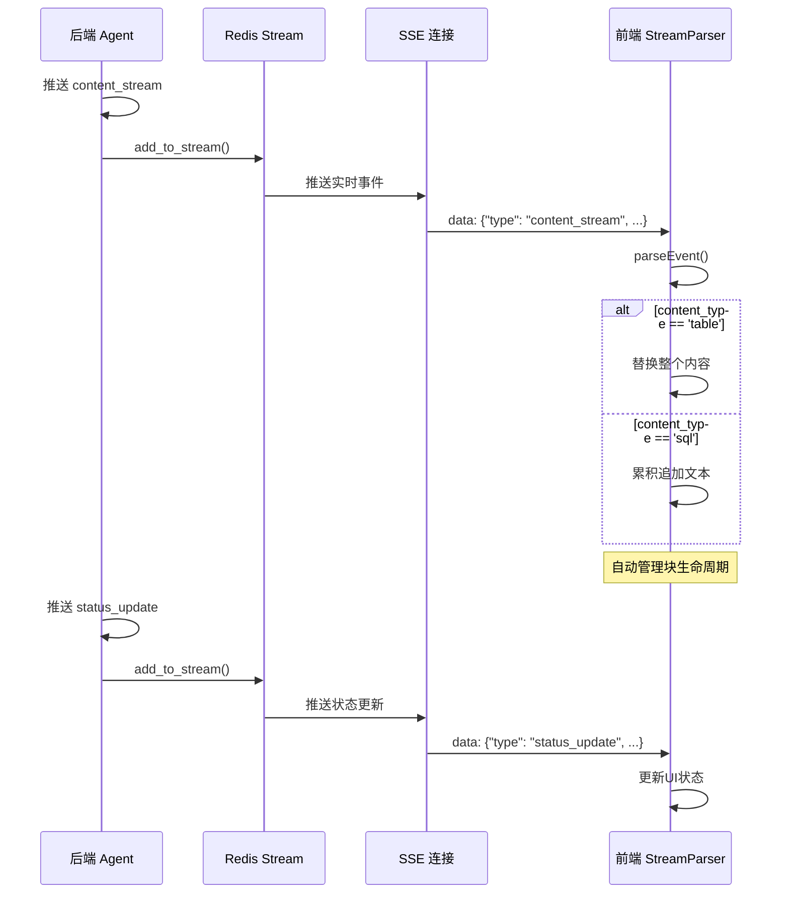
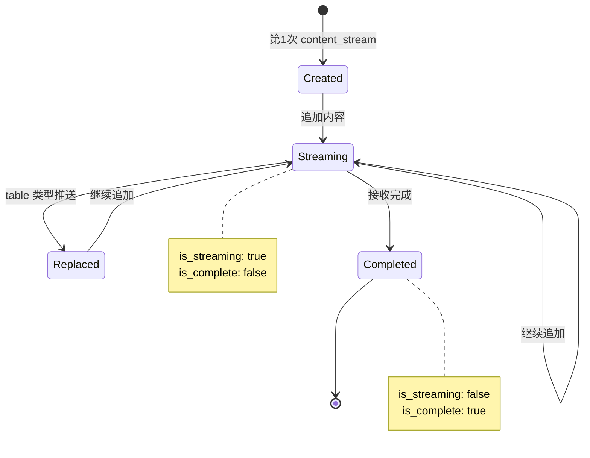

# 流式通信协议文档

**版本**: 2.0（简化版）
**更新日期**: 2025-11-04
**实现参考**:

- 后端: `backend/api/services/task_service.py`
- 前端: `webui/src/utils/StreamParser.js`

## 概述

本文档定义了前后端流式通信的标准协议。系统采用**精简设计**，自动管理内容块生命周期，无需显式的 `content_start`/`content_end` 事件。

## 核心原则（Linus 风格）

1. **极简化**: 事件格式精简（只有 content_stream），自动生命周期管理
2. **单一职责**: 每个事件做一件事，做好
3. **数据驱动**: 用数据结构（content_id）表达逻辑，而不是繁琐的事件
4. **零冗余**: 删除不必要的事件类型（content_start/content_end）

## 事件格式标准

### 基础事件结构（精简版）

所有流式事件都遵循统一的 JSON 格式：

```json
{
  "type": "事件类型",
  "content_id": "内容块唯一标识（仅content_stream需要）",
  "content_type": "内容类型：text|markdown|sql|table|error（仅content_stream需要）",
  "content": "增量内容（仅content_stream需要）",
  "title": "内容块标题（仅content_stream需要，可选）",
  "message": "状态消息（status_update/error事件需要）",
  "status": "处理状态（可选）"
}
```

### 事件类型定义

只有 **4 种核心事件类型**：

#### 1. content_stream - 流式内容（唯一的内容事件）

**特点**:

- 自动管理内容块生命周期（创建 → 更新 → 完成）
- 根据 content_id 自动识别是新块还是既有块
- 无需显式的 start/end 事件

**事件格式**:

```json
{
  "type": "content_stream",
  "content_id": "reasoning-001",
  "content_type": "text",
  "content": "分析用户问题...",
  "title": "问题分析",
  "session_id": "session-123",
  "user_id": 42
}
```

**前端处理逻辑**:

```javascript
// 前端自动执行
if (块不存在) {
  创建新块(content_id, content_type)
}
if (content_type == 'table' && content是对象) {
  替换表格数据（最新覆盖）
} else if (content是字符串) {
  累积追加文本
}
```

**工作流程**:

```
第1次推送：content_id="sql-001", content="SELECT "
  → 前端创建新块，初始内容="SELECT "

第2次推送：content_id="sql-001", content="* FROM users"
  → 前端追加，累积内容="SELECT * FROM users"

第3次推送：content_id="sql-001", content_type="table",
           content={"headers": [...], "rows": [...]}
  → 前端替换整个内容（表格数据直接替换）
```

#### 2. status_update - 状态更新

**事件格式**:

```json
{
  "type": "status_update",
  "status": "processing",
  "message": "正在生成SQL查询..."
}
```

**可用状态值**:

- `connected`: SSE 连接已建立
- `processing`: 处理中
- `completed`: 处理完成
- `error`: 错误

#### 3. error - 错误事件

**事件格式**:

```json
{
  "type": "error",
  "message": "SQL生成失败",
  "content": "详细错误信息"
}
```

#### 4. connection_established - 连接建立事件

**事件格式**:

```json
{
  "type": "connection_established",
  "message": "连接已建立"
}
```

### 实际传输示例

**原始事件流**（来自后端 Redis Stream）:

```json
{"type": "task_started", ...}
{"type": "processing_started", ...}
{"type": "content_stream", "content_id": "reasoning-001", "content_type": "text", "content": "分析..."}
{"type": "content_stream", "content_id": "reasoning-001", "content": "继续分析..."}
{"type": "content_stream", "content_id": "sql-001", "content_type": "sql", "content": "SELECT ..."}
{"type": "content_stream", "content_id": "sql-001", "content": " * FROM ..."}
{"type": "task_completed", ...}
```

**前端接收处理**（SSE 格式）:

```
data: {"type": "content_stream", "content_id": "reasoning-001", ...}
data: {"type": "content_stream", "content_id": "reasoning-001", ...}
data: {"type": "content_stream", "content_id": "sql-001", ...}
...
```

## 内容类型定义

系统支持以下内容类型，均通过 `content_stream` 事件传输：

### 1. text - 纯文本

**示例**:

```json
{
  "type": "content_stream",
  "content_id": "text-001",
  "content_type": "text",
  "content": "这是分析结果...",
  "title": "分析结果"
}
```

### 2. markdown - Markdown 富文本

**示例**:

```json
{
  "type": "content_stream",
  "content_id": "md-001",
  "content_type": "markdown",
  "content": "## 思考过程\n\n正在分析..."
}
```

### 3. sql - SQL 代码

**示例**:

```json
{
  "type": "content_stream",
  "content_id": "sql-001",
  "content_type": "sql",
  "content": "SELECT * FROM users WHERE id > 10",
  "title": "SQL 查询"
}
```

### 4. table - 表格数据

**特点**:

- 内容是对象格式，包含 headers 和 rows
- 多次推送时最新的完全替换（不是累积）

**示例**:

```json
{
  "type": "content_stream",
  "content_id": "table-001",
  "content_type": "table",
  "content": {
    "headers": ["id", "name", "age"],
    "rows": [
      { "id": 1, "name": "Alice", "age": 30 },
      { "id": 2, "name": "Bob", "age": 25 }
    ],
    "row_count": 2
  },
  "title": "查询结果"
}
```

### 5. error - 错误信息

**示例**:

```json
{
  "type": "error",
  "message": "SQL 执行失败",
  "content": "表 'invalid_table' 不存在"
}
```

## 前端处理规范

### 事件流时序图



### 内容块生命周期状态图



### StreamParser - 流式解析器

前端使用 `StreamParser` 类处理所有流式事件（位置：`webui/src/utils/StreamParser.js`）：

```javascript
import { StreamParser } from "@/utils/StreamParser";

const parser = new StreamParser();

// 处理每个 SSE 事件
parser.parseEvent(payload, streamingMessage, addContentItem);
```

### 核心处理逻辑

**1. 内容块自动生命周期管理**

```javascript
// 第一个 content_stream（新块）
{
  "type": "content_stream",
  "content_id": "sql-001",
  "content_type": "sql",
  "content": "SELECT "
}
→ 前端创建新块：
  {
    id: "sql-001",
    type: "sql",
    content: "SELECT ",
    is_streaming: true,
    is_complete: false
  }

// 第二个 content_stream（既有块）
{
  "type": "content_stream",
  "content_id": "sql-001",
  "content": "* FROM users"
}
→ 前端更新既有块：
  {
    id: "sql-001",
    type: "sql",
    content: "SELECT * FROM users",  // 累积
    is_streaming: true,
    is_complete: false
  }
```

**2. 表格数据替换（不是累积）**

```javascript
// 第一次推送表格
{
  "type": "content_stream",
  "content_id": "table-001",
  "content_type": "table",
  "content": { "headers": ["id"], "rows": [{...}] }
}

// 第二次推送表格（新数据）
{
  "type": "content_stream",
  "content_id": "table-001",
  "content_type": "table",
  "content": { "headers": ["id", "name"], "rows": [{...}, {...}] }
}
→ 前端直接替换，不是追加
```

### StreamParser 的事件处理器

```javascript
handlers = {
  content_stream: handleContentStream, // 唯一的内容事件
  status_update: handleStatusUpdate,
  error: handleError,
  connection_established: handleConnectionEstablished,
  complete: handleComplete,
};
```

### 内容块数据结构

```javascript
{
  id: string,              // content_id
  type: string,            // content_type: text|markdown|sql|table|error
  content: string|object,  // 累积的文本，或对象（table）
  title: string,           // 可选的标题
  is_streaming: boolean,   // 正在接收中
  is_complete: boolean,    // 接收完成
  metadata: object         // 其他元数据
}
```

## 后端实现规范

### StreamCallback - 流式回调接口

后端在 Agent 执行过程中使用 `StreamCallback` 对象推送事件：

**定义** (`backend/api/utils/streaming/stream_callback.py`):

```python
class StreamCallback:
    def __init__(self, task_id, session_id, user_id):
        self.task_id = task_id
        self.session_id = session_id
        self.user_id = user_id

    async def __call__(self, content: str, content_id: Optional[str] = None,
                      content_type: str = "text", title: Optional[str] = None,
                      recall: Optional[bool] = False, **kwargs):
        """推送内容到前端"""
        # 自动生成 content_id（如果未提供）
        if not content_id:
            content_id = f"{content_type}_{int(time.time() * 1000)}"

        # 构造事件
        event = {
            "type": "content_stream",
            "content_id": content_id,
            "content_type": content_type,
            "title": title or self.get_default_title(content_type),
            "content": content,
            "session_id": self.session_id,
            "user_id": self.user_id,
            "recall": recall
        }

        # 推送到 Redis Stream（持久化）
        await redis_manager.add_to_stream(stream_key, message_data)

        # 推送到内存队列（实时）
        memory_event_queue.put_event(task_id, "content_stream", event)
```

### Agent 中的使用示例

```python
# 在 Agent 的 reasoning() 或 observation() 中
async def reasoning(self, context, stream_callback, **kwargs):
    """Agent 推理阶段"""

    # 推送分析过程（文本）
    await stream_callback(
        "分析用户问题中的关键词...",
        content_id="analysis-001",
        content_type="text",
        title="问题分析"
    )

    # 推送生成的 SQL（代码）
    await stream_callback(
        "SELECT * FROM users WHERE age > 18",
        content_id="sql-001",
        content_type="sql",
        title="生成的 SQL"
    )

    # 推送查询结果（表格）
    await stream_callback(
        {
            "headers": ["id", "name", "age"],
            "rows": [
                {"id": 1, "name": "Alice", "age": 30},
                {"id": 2, "name": "Bob", "age": 25}
            ],
            "row_count": 2
        },
        content_id="result-001",
        content_type="table",
        title="查询结果"
    )
```

### 实际事件流示例（task_service.py）

在 `_execute_nl2sql_task()` 中：

```python
# 1. 握手成功消息
await stream_callback(
    "🖥️ 控制台握手成功，正在注入「语义解析引擎」...",
    title="握手成功",
    content_type="text"
)

# 2. Agent 执行（自动推送）
result = await nl2sql_agent.execute(agent_context, stream_callback=stream_callback)

# 3. 完成消息
if result.success:
    await stream_callback("查询处理完成", status="end")
else:
    error_msg = result.error
    await stream_callback(f"查询处理失败：{error_msg}", status="end")
```

### 内容类型和 content_id 管理

**建议命名规则**:

```
• 分析文本: "analysis-{timestamp}"
• SQL 代码: "sql-{node_id}"
• 查询结果: "result-{node_id}"
• 错误信息: "error-{timestamp}"
```

**自动生成**（如果未指定）:

```python
content_id = f"{content_type}_{int(time.time() * 1000)}"
# 示例: "text_1730704123000"
```

## 完整的流程示例

### 查询执行的完整事件流

```javascript
// 1. 握手成功
{
  "type": "content_stream",
  "content_id": "handshake-001",
  "content_type": "text",
  "content": "🖥️ 控制台握手成功，正在注入「语义解析引擎」...",
  "title": "握手成功"
}

// 2. 问题分析
{
  "type": "content_stream",
  "content_id": "analysis-001",
  "content_type": "text",
  "content": "分析问题..."
}

// 3. SQL 生成（分段推送）
{
  "type": "content_stream",
  "content_id": "sql-001",
  "content_type": "sql",
  "content": "SELECT "
}

{
  "type": "content_stream",
  "content_id": "sql-001",
  "content": "* FROM users WHERE "
}

{
  "type": "content_stream",
  "content_id": "sql-001",
  "content": "age > 18"
}

// 4. 查询结果（表格替换）
{
  "type": "content_stream",
  "content_id": "result-001",
  "content_type": "table",
  "content": {
    "headers": ["id", "name", "age"],
    "rows": [
      {"id": 1, "name": "Alice", "age": 30},
      {"id": 2, "name": "Bob", "age": 25}
    ],
    "row_count": 2
  },
  "title": "查询结果"
}

// 5. 完成
{
  "type": "status_update",
  "status": "completed",
  "message": "处理完成"
}
```

## 错误场景示例

### SQL 执行失败

```javascript
// 1. 状态更新
{
  "type": "status_update",
  "status": "processing",
  "message": "执行 SQL..."
}

// 2. 错误事件
{
  "type": "error",
  "message": "SQL 执行失败",
  "content": "表 'users' 不存在"
}

// 3. 完成
{
  "type": "status_update",
  "status": "error",
  "message": "查询失败"
}
```

## 扩展指南

### 添加新内容类型

如需添加新的内容类型（如 chart、json 等）：

1. **后端**: 在 Agent 中调用 `stream_callback`，传入新的 `content_type`
2. **前端**: 在 `StreamParser` 中的 `getDefaultTitle()` 添加对应的标题
3. **前端 UI**: 在组件中添加对应类型的渲染逻辑

### 修改事件格式

由于当前设计极其精简，添加新字段时：

1. **向后兼容**: 新字段应该是可选的
2. **命名规范**: 使用下划线分隔的小写字段名
3. **文档更新**: 更新本文档中的格式定义

## 最佳实践

### 后端推送

1. **提供有意义的 title**: 帮助用户理解内容
2. **使用合适的 content_type**: 让前端正确渲染
3. **生成唯一的 content_id**: 避免意外覆盖
4. **及时推送错误信息**: 不要隐藏失败

### 前端接收

1. **逐行处理**: 根据 content_id 自动管理块
2. **处理不完整数据**: 设置 `is_streaming` 标志
3. **验证 session_id**: 确保消息属于当前会话
4. **错误降级**: 缺失字段时使用默认值

### 性能优化

1. **批量推送**: 避免过多小事件
2. **适当延迟**: 流式传输时使用缓冲
3. **清理过期数据**: 在 Redis 中设置 TTL
4. **监控流量**: 记录大型内容块的推送

---

**文档版本**: 2.0（简化版）
**最后更新**: 2025-11-04
**实现文件**:

- 后端: `backend/api/services/task_service.py`, `backend/api/utils/streaming/stream_callback.py`
- 前端: `webui/src/utils/StreamParser.js`
  **维护者**: 开发团队
