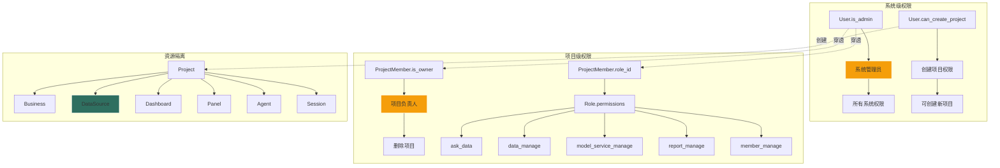
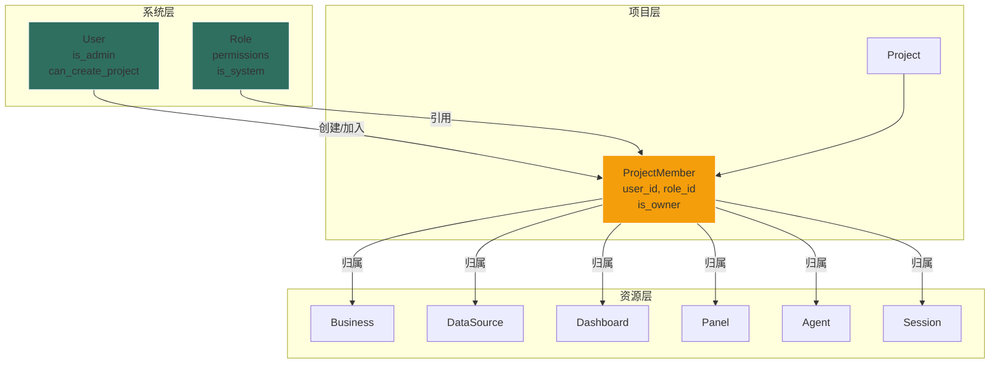
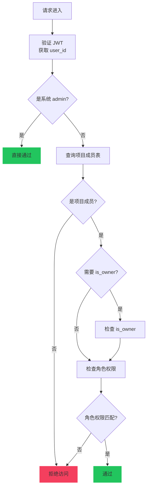

# YiW 权限管理设计文档

> **版本**: 1.0
> **更新日期**: 2025-01-XX
> **状态**: 统一规范（整合自原有三份设计文档）

---

## 一、背景与目标

### 1.1 现状分析

当前系统仅支持简单的双角色模式：

- `admin`: 超级管理员
- `user`: 普通用户

所有资源仅通过 `user_id` 绑定到创建者，存在以下问题：

1. **无法团队协作**：资源只属于个人，无法在团队内共享
2. **权限粒度太粗**：要么全有，要么全无
3. **无法按项目隔离**：不同项目的数据源、业务配置混在一起

### 1.2 设计目标

引入 **项目(Project)** 作为权限隔离的核心边界，实现：

1. 资源按项目组织和隔离
2. 细粒度权限控制，支持任意权限组合
3. 保持设计简洁，用最少代码解决 80% 的需求

---

## 二、双层权限模型

### 2.1 权限架构概览



### 2.2 系统级权限

系统级采用 **两个 Boolean 字段** 控制，简单直接。

#### 系统权限字段

| 字段                 | 类型    | 说明                               |
| -------------------- | ------- | ---------------------------------- |
| `is_admin`           | Boolean | 是否为系统管理员，拥有所有系统权限 |
| `can_create_project` | Boolean | 是否可创建项目                     |

#### 用户类型示例

| 用户类型   | is_admin | can_create_project | 说明                                   |
| ---------- | -------- | ------------------ | -------------------------------------- |
| 超级管理员 | true     | true               | 拥有所有权限，可穿透所有项目           |
| 自主用户   | false    | true               | 可创建项目，在自己项目中拥有完整权限   |
| 普通用户   | false    | false              | 不能创建项目，但可在被邀请的项目中工作 |

#### 系统 admin 的职责

| 职责     | 说明                             | 典型场景                         |
| -------- | -------------------------------- | -------------------------------- |
| 用户管理 | 创建用户、设置系统权限、禁用用户 | 新员工入职、员工离职             |
| 项目接管 | 处理成员离职后的项目交接         | 唯一项目负责人离职，指定新负责人 |
| 异常处理 | 处理项目纠纷、数据恢复           | 误删数据、权限争议               |
| 角色管理 | 创建/修改/删除系统角色           | 调整预置角色权限、创建自定义角色 |

> **设计原则**：系统 admin 是 **兜底角色**，日常运营由各项目负责人自治，admin 只在异常情况下介入。

### 2.3 项目级权限（角色模式）

项目内使用 **角色模式** 进行权限管理。

#### 权限代码定义

| 权限代码               | 权限名称   | 说明                                      |
| ---------------------- | ---------- | ----------------------------------------- |
| `ask_data`             | 问数       | 使用问数功能、查看会话历史、执行查询      |
| `data_manage`          | 数据管理   | 创建/编辑/删除数据源、业务配置、Agent 配置 |
| `model_service_manage` | 模型服务配置 | 在项目中选择/配置 Agent 使用的 LLM 模型   |
| `report_manage`        | 报表管理   | 创建/编辑/删除 Dashboard 和 Panel         |
| `member_manage`        | 成员管理   | 邀请/移除成员、修改成员角色、更新项目信息 |

> **关于 `data_manage` 的说明**：
>
> - 数据源管理：创建/编辑/删除数据库连接、结构化数据源、非结构化数据源
> - 业务管理：创建/编辑/删除业务配置、语义实体、业务指标、样例数据
> - **读取操作**（GET 列表/详情）：只需 `ask_data` 权限即可访问
> - **写入操作**（创建/编辑/删除）：需要 `data_manage` 权限

> **关于 `model_service_manage` 的说明**：
>
> - **系统级**：LLM 模型的创建/编辑/删除由系统管理员（`is_admin`）负责
> - **项目级**：项目管理员可以选择使用哪个已创建的模型，并在 Agent 中配置模型参数

#### 系统预置角色

| 角色代码        | 角色名称   | 权限                                               |
| --------------- | ---------- | -------------------------------------------------- |
| `project_admin` | 项目管理员 | 全部 5 个权限                                      |
| `developer`     | 开发者     | `ask_data`, `data_manage`                          |
| `analyst`       | 分析师     | `ask_data`, `report_manage`                        |
| `viewer`        | 访客       | `ask_data`                                         |

> **角色特性**：
>
> - 角色为 **系统级**，所有项目共用同一套角色
> - 系统管理员可修改预置角色的权限，修改后 **全局生效**
> - 成员在项目中只能绑定一个角色

### 2.4 项目负责人（is_owner）

#### 定义

`is_owner` 是 `project_members` 表中的布尔字段，用于标识 **项目负责人/所有者**。

#### 与角色的区别

| 概念       | 含义       | 作用                 |
| ---------- | ---------- | -------------------- |
| `is_owner` | 所有权标识 | 标记谁"拥有"这个项目 |
| `role_id`  | 权限角色   | 决定能做什么操作     |

> 一个成员可以是 `is_owner=True` 同时角色是 `developer`，这意味着他是项目负责人（有特殊管理权），但日常操作权限按 `developer` 角色来。

#### 项目负责人的特殊权限

| 特殊能力     | 说明                               |
| ------------ | ---------------------------------- |
| 不可被移除   | 必须先转让负责人身份才能被移出项目 |
| 可转让所有权 | 可以将负责人身份转让给其他项目成员 |
| 删除项目     | 可以删除自己负责的项目             |

#### 约束规则

- 每个项目 **必须有且仅有一个负责人**
- 创建项目时，创建者自动成为负责人（`is_owner=True`）
- 负责人可以是任意角色，角色决定日常操作权限，`is_owner` 决定管理权

### 2.5 权限矩阵

| 功能         | 系统 admin | 项目负责人 | 项目管理员 | 开发者 | 分析师 | 访客 |
| ------------ | ---------- | ---------- | ---------- | ------ | ------ | ---- |
| 问数         | ✓          | ✓          | ✓          | ✓      | ✓      | ✓    |
| 数据管理     | ✓          | 按角色     | ✓          | ✓      | ✗      | ✗    |
| 模型服务管理 | ✓          | 按角色     | ✓          | ✗      | ✗      | ✗    |
| 报表管理     | ✓          | 按角色     | ✓          | ✗      | ✓      | ✗    |
| 成员管理     | ✓          | 按角色     | ✓          | ✗      | ✗      | ✗    |
| 删除项目     | ✓          | ✓          | ✗          | ✗      | ✗      | ✗    |
| 转让负责人   | ✓          | ✓          | ✗          | ✗      | ✗      | ✗    |

> **数据管理** 包含：数据源管理（数据库连接、结构化数据源、非结构化数据源）和业务管理（业务配置、语义实体、业务指标、样例数据）

> **说明**：项目负责人的日常操作权限由其角色决定，但删除项目、转让负责人等特殊操作只有负责人和系统管理员可执行。

---

## 三、数据模型设计

### 3.1 整体架构图



### 3.2 表结构

#### users 表

| 字段               | 类型    | 约束          | 说明             |
| ------------------ | ------- | ------------- | ---------------- |
| id                 | String  | PK            | UUID v7 主键     |
| username           | String  | NOT NULL      | 用户名           |
| email              | String  | UNIQUE        | 邮箱             |
| is_admin           | Boolean | DEFAULT false | 是否为系统管理员 |
| can_create_project | Boolean | DEFAULT false | 是否可创建项目   |
| is_active          | Boolean | DEFAULT true  | 是否启用         |

#### roles 表

| 字段        | 类型       | 约束             | 说明                                         |
| ----------- | ---------- | ---------------- | -------------------------------------------- |
| id          | String(36) | PK               | UUID v7 主键                                 |
| code        | String(50) | NOT NULL, UNIQUE | 角色代码（如 project_admin）                 |
| name        | String(50) | NOT NULL         | 角色名称（如 项目管理员）                    |
| description | Text       | NULL             | 角色描述                                     |
| permissions | JSON       | NOT NULL         | 权限数组，如 `["ask_data", "report_manage"]` |
| is_system   | Boolean    | DEFAULT false    | 是否为系统预置角色（预置角色不可删除）       |

#### projects 表

| 字段        | 类型        | 约束         | 说明         |
| ----------- | ----------- | ------------ | ------------ |
| id          | String(36)  | PK           | UUID v7 主键 |
| name        | String(100) | NOT NULL     | 项目名称     |
| description | Text        | NULL         | 项目描述     |
| is_active   | Boolean     | DEFAULT true | 是否激活     |
| created_by  | String(36)  | FK           | 创建者       |
| deleted_at  | DateTime    | NULL         | 软删除时间   |
| deleted_by  | String(36)  | NULL         | 删除操作者   |

#### project_members 表

| 字段       | 类型       | 约束             | 说明             |
| ---------- | ---------- | ---------------- | ---------------- |
| id         | String(36) | PK               | UUID v7 主键     |
| project_id | String(36) | FK → projects.id | 所属项目         |
| user_id    | String(36) | FK → users.id    | 用户 ID          |
| role_id    | String(36) | FK → roles.id    | 角色 ID          |
| is_owner   | Boolean    | DEFAULT false    | 是否为项目负责人 |
| deleted_at | DateTime   | NULL             | 软删除时间       |
| deleted_by | String(36) | NULL             | 删除操作者       |

**唯一约束**：`UNIQUE(project_id, user_id)`

### 3.3 资源表变更

所有资源表增加 `project_id` 字段：

| 表名                      | 变更                   |
| ------------------------- | ---------------------- |
| businesses                | 新增 `project_id` 字段 |
| database_connections      | 新增 `project_id` 字段 |
| structured_data_sources   | 新增 `project_id` 字段 |
| unstructured_data_sources | 新增 `project_id` 字段 |
| dashboards                | 新增 `project_id` 字段 |
| panels                    | 新增 `project_id` 字段 |
| agents                    | 新增 `project_id` 字段 |
| sessions                  | 新增 `project_id` 字段 |

> **注意**：保留原有 `user_id` 字段作为 `created_by`，用于审计追踪

### 3.4 实体关系图

```mermaid
erDiagram
    USER {
        string id PK
        string username
        string email
        boolean is_admin
        boolean can_create_project
        boolean is_active
    }

    ROLE {
        string id PK
        string code UK
        string name
        text description
        json permissions
        boolean is_system
    }

    PROJECT {
        string id PK
        string name
        text description
        boolean is_active
        string created_by FK
        datetime deleted_at
    }

    PROJECT_MEMBER {
        string id PK
        string project_id FK
        string user_id FK
        string role_id FK
        boolean is_owner
        datetime deleted_at
    }

    USER ||--o{ PROJECT_MEMBER : "has"
    ROLE ||--o{ PROJECT_MEMBER : "has"
    PROJECT ||--o{ PROJECT_MEMBER : "has"

    USER }o--|| PROJECT : "creates"

    note right of PROJECT_MEMBER
        每个项目必须有且仅有一个
        is_owner = true 的成员
    end note
```

---

## 四、权限检查实现

### 4.1 设计原则

**单点权限检查原则**：权限检查只在入口处（路由层）做一次，内部方法不做重复检查。

```
路由层                           服务层
┌─────────────────────┐         ┌─────────────────────┐
│ @require_permission │ ──────> │ 纯业务逻辑          │
│ - 身份验证          │         │ - 不关心谁在调用    │
│ - 项目成员检查      │         │ - 只关心 project_id │
│ - 角色权限检查      │         │ - 可独立测试        │
└─────────────────────┘         └─────────────────────┘
```

### 4.2 权限检查流程



### 4.3 PermissionChecker 类

```python
class PermissionChecker:
    """权限检查器 - 作为 FastAPI 依赖使用"""

    def __init__(
        self,
        permissions: Optional[List[str]] = None,
        require_owner: bool = False
    ):
        """
        Args:
            permissions: 需要的权限列表（满足任一即可），None 表示只需项目成员身份
            require_owner: 是否要求项目负责人身份
        """
        self.permissions = permissions
        self.require_owner = require_owner

    async def __call__(
        self,
        project_id: str,
        user_id: str = Depends(get_current_active_user),
        db: AsyncSession = Depends(get_db)
    ) -> str:
        """验证权限，返回 user_id"""

        # 1. 系统管理员跳过所有检查
        if await self._is_admin(db, user_id):
            return user_id

        # 2. 检查项目成员身份
        member = await self._get_project_member(db, project_id, user_id)
        if not member:
            raise AuthorizationError("您不是该项目的成员")

        # 3. 检查是否要求项目负责人
        if self.require_owner and not member.is_owner:
            raise AuthorizationError("需要项目负责人权限")

        # 4. 检查角色权限
        if self.permissions:
            role_permissions = member.role.permissions if member.role else []
            if not any(p in role_permissions for p in self.permissions):
                raise AuthorizationError(
                    f"权限不足，需要以下权限之一: {', '.join(self.permissions)}"
                )

        return user_id
```

### 4.4 预定义权限检查器

```python
# 项目级检查器
require_project_access = PermissionChecker()                     # 只需项目成员身份
require_ask_data = PermissionChecker(["ask_data"])               # 问数权限
require_data_manage = PermissionChecker(["data_manage"])        # 数据管理（数据源+业务）
require_report_manage = PermissionChecker(["report_manage"])     # 报表管理
require_member_manage = PermissionChecker(["member_manage"])     # 成员管理
require_project_owner = PermissionChecker(require_owner=True)    # 项目负责人

# 系统级检查器
require_admin = ...           # 系统管理员
require_can_create_project = ...  # 创建项目权限
```

### 4.5 路由使用示例

```python
@router.get("/projects/{project_id}/dashboards")
async def list_dashboards(
    project_id: str,
    user_id: str = Depends(require_project_access),  # 只需成员身份
    db: AsyncSession = Depends(get_db)
):
    """获取项目的 Dashboard 列表"""
    return await DashboardService.list_dashboards(db, project_id)


@router.post("/projects/{project_id}/dashboards")
async def create_dashboard(
    project_id: str,
    request: DashboardCreate,
    user_id: str = Depends(require_report_manage),  # 需要报表管理权限
    db: AsyncSession = Depends(get_db)
):
    """创建 Dashboard"""
    return await DashboardService.create_dashboard(
        db, project_id=project_id, created_by=user_id, ...
    )


@router.delete("/projects/{project_id}")
async def delete_project(
    project_id: str,
    user_id: str = Depends(require_project_owner),  # 需要项目负责人
    db: AsyncSession = Depends(get_db)
):
    """删除项目"""
    return await ProjectService.delete_project(db, project_id, user_id)
```

---

## 五、API 设计

### 5.1 项目管理接口

| 方法   | 路径                 | 说明             | 权限要求                 |
| ------ | -------------------- | ---------------- | ------------------------ |
| POST   | `/api/projects`      | 创建项目         | `can_create_project`     |
| GET    | `/api/projects`      | 获取我的项目列表 | 任何登录用户             |
| GET    | `/api/projects/{id}` | 获取项目详情     | 项目成员                 |
| PUT    | `/api/projects/{id}` | 更新项目信息     | `member_manage`          |
| DELETE | `/api/projects/{id}` | 删除项目         | 项目负责人 或 系统 admin |

### 5.2 项目成员接口

| 方法   | 路径                                    | 说明         | 权限要求        |
| ------ | --------------------------------------- | ------------ | --------------- |
| GET    | `/api/projects/{id}/members`            | 获取成员列表 | 项目成员        |
| POST   | `/api/projects/{id}/members`            | 添加成员     | `member_manage` |
| PUT    | `/api/projects/{id}/members/{user_id}`  | 修改成员角色 | `member_manage` |
| DELETE | `/api/projects/{id}/members/{user_id}`  | 移除成员     | `member_manage` |
| POST   | `/api/projects/{id}/transfer-ownership` | 转让负责人   | 项目负责人      |

### 5.3 项目资源接口

所有资源接口统一格式：`/api/projects/{project_id}/{resource}`

```
GET    /api/projects/{project_id}/sessions      # 会话列表
POST   /api/projects/{project_id}/sessions      # 创建会话
GET    /api/projects/{project_id}/databases     # 数据源列表
POST   /api/projects/{project_id}/databases     # 创建数据源
GET    /api/projects/{project_id}/businesses    # 业务列表
POST   /api/projects/{project_id}/businesses    # 创建业务
GET    /api/projects/{project_id}/dashboards    # 报表列表
POST   /api/projects/{project_id}/dashboards    # 创建报表
```

### 5.4 系统管理接口

| 方法 | 路径                    | 说明             | 权限要求     |
| ---- | ----------------------- | ---------------- | ------------ |
| GET  | `/api/admin/users`      | 用户列表         | `is_admin`   |
| POST | `/api/admin/users`      | 创建用户         | `is_admin`   |
| PUT  | `/api/admin/users/{id}` | 修改用户/权限    | `is_admin`   |
| GET  | `/api/admin/roles`      | 角色列表         | `is_admin`   |
| PUT  | `/api/admin/roles/{id}` | 修改角色权限     | `is_admin`   |
| GET  | `/api/roles`            | 角色列表（只读） | 任何登录用户 |

---

## 六、典型场景

### 场景 1：创建项目

```
1. 张三（can_create_project=true）创建项目「销售分析」
2. 系统自动：
   - 创建 ProjectMember 记录
   - 设置 role_id = project_admin
   - 设置 is_owner = true
3. 张三成为项目负责人，拥有全部权限
```

### 场景 2：邀请成员

```
1. 张三（项目负责人 + 项目管理员）进入「销售分析」
2. 张三邀请李四，分配角色「分析师」
3. 系统创建 ProjectMember：
   - user_id = 李四
   - role_id = analyst
   - is_owner = false
4. 李四可以：问数、创建报表
5. 李四不能：管理数据源、邀请成员
```

### 场景 3：转让负责人

```
1. 张三决定让李四接管项目
2. 张三调用 /transfer-ownership 接口
3. 系统更新：
   - 张三：is_owner = false（角色不变）
   - 李四：is_owner = true（角色不变）
4. 李四现在是项目负责人
5. 张三仍是项目管理员（如果之前是的话）
```

### 场景 4：移除成员

```
1. 李四（项目负责人）要移除王五
2. 系统检查：王五的 is_owner = false
3. 软删除 ProjectMember 记录
4. 王五无法再访问项目

注意：不能移除项目负责人，必须先转让负责人身份
```

### 场景 5：成员离职交接

```
1. 张三是「销售分析」唯一的项目负责人
2. 张三离职，需要交接
3. 系统管理员介入：
   - 将李四的角色改为 project_admin
   - 调用 /transfer-ownership 将负责人转给李四
   - 将张三从项目移除
4. 李四成为新的项目负责人
```

---

## 七、服务层改造要点

### 7.1 参数签名变化

```python
# 旧签名
async def create_panel(db, user_id, title, ...) -> Panel

# 新签名
async def create_panel(db, project_id, created_by, title, ...) -> Panel
```

### 7.2 查询条件变化

```python
# 旧查询
select(Panel).where(Panel.user_id == user_id)

# 新查询
select(Panel).where(
    Panel.project_id == project_id,
    Panel.deleted_at.is_(None)
)
```

### 7.3 服务层不做权限检查

服务层只关心业务逻辑，权限在路由层处理：

```python
class DashboardService:
    @staticmethod
    async def list_dashboards(db: AsyncSession, project_id: str):
        """获取 Dashboard 列表 - 只需 project_id，不做权限检查"""
        query = select(Dashboard).where(
            Dashboard.project_id == project_id,
            Dashboard.deleted_at.is_(None)
        )
        result = await db.execute(query)
        return result.scalars().all()
```

---

## 八、核心规则总结

| 规则                     | 说明                                                         |
| ------------------------ | ------------------------------------------------------------ |
| 项目必有负责人           | 每个项目必须有且仅有一个 `is_owner=True` 的成员              |
| 负责人不可被移除         | 必须先转让负责人身份，才能被移出项目                         |
| 角色决定操作权限         | 日常操作权限由 role.permissions 决定                         |
| is_owner 决定管理权      | 删除项目、转让负责人等特殊操作需要 is_owner=True             |
| member_manage 可更新项目 | 拥有 `member_manage` 权限即可更新项目基本信息                |
| 系统 admin 穿透          | 系统管理员对所有项目拥有完整权限                             |
| 权限在路由层检查         | 服务层不做权限检查，只关心 project_id                        |
| 资源归属项目             | 所有资源通过 project_id 隔离，不再使用 user_id               |
| LLM 模型分级管理         | 系统 admin 管理模型 CRUD，项目 admin 配置 Agent 使用哪个模型 |

---

## 附录 A：权限检查快速参考

```python
from api.dependencies.permission import (
    # 项目级
    require_project_access,     # 只需项目成员身份
    require_ask_data,           # 问数权限
    require_data_manage,        # 数据管理权限（数据源+业务）
    require_report_manage,      # 报表管理权限
    require_member_manage,      # 成员管理权限
    require_project_owner,      # 项目负责人

    # 系统级
    require_admin,              # 系统管理员
    require_can_create_project, # 创建项目权限

    # 自定义
    PermissionChecker,          # 自定义检查器
)

# 使用示例
@router.get("/projects/{project_id}/xxx")
async def some_endpoint(
    project_id: str,
    user_id: str = Depends(require_xxx),
    db: AsyncSession = Depends(get_db)
):
    ...
```

---

## 附录 B：权限适配实施指南

### B.1 后端路由适配

#### 路由路径改造

所有资源路由添加 `/projects/{project_id}` 前缀：

```python
# 旧版
@router.get("/connections/{connection_id}/tables")

# 新版
@router.get("/projects/{project_id}/databases/{connection_id}/tables")
```

#### 权限依赖替换

```python
# 旧版
from api.dependencies.auth import get_current_user

@router.get("/xxx")
async def get_xxx(user_id: str = Depends(get_current_user)):
    pass

# 新版
from api.dependencies.permission import require_data_manage

@router.get("/projects/{project_id}/xxx")
async def get_xxx(
    project_id: str,
    user_id: str = Depends(require_data_manage),  # 返回user_id用于审计
    db: AsyncSession = Depends(get_db)
):
    pass
```

#### 路径命名规范

| 资源类型 | 路径格式 |
|---------|---------|
| 数据库连接 | `/projects/{pid}/databases/{cid}` |
| 表 | `/projects/{pid}/databases/{cid}/tables/{tid}` |
| 列 | `/projects/{pid}/databases/{cid}/columns/{col_id}` |
| 样例 | `/projects/{pid}/databases/{cid}/examples/{eid}` |
| 实体映射 | `/projects/{pid}/databases/{cid}/entity_mappings` |
| 实体配置 | `/projects/{pid}/databases/{cid}/entity_mapping_configs/{cfg_id}` |
| 指标 | `/projects/{pid}/databases/{cid}/metrics/{mid}` |

### B.2 服务层适配

#### 参数签名变化

```python
# 旧签名
async def create_panel(db, user_id, title, ...) -> Panel

# 新签名
async def create_panel(db, project_id, created_by, title, ...) -> Panel
```

#### 查询条件变化

```python
# 旧查询
select(Panel).where(Panel.user_id == user_id)

# 新查询
select(Panel).where(
    Panel.project_id == project_id,
    Panel.deleted_at.is_(None)  # 软删除过滤
)
```

#### 软删除操作

```python
from datetime import datetime, timezone

async def delete_panel(db, panel_id, deleted_by) -> bool:
    """软删除"""
    await db.execute(
        update(Panel)
        .where(Panel.id == panel_id)
        .values(
            deleted_at=datetime.now(timezone.utc),
            deleted_by=deleted_by
        )
    )
    await db.commit()
    return True
```

### B.3 前端适配

#### API 函数添加 projectId 参数

```javascript
// 旧版
export function getTablesReq(connectionId) {
  return request({
    url: `/api/connections/${connectionId}/tables`,
    method: 'get'
  })
}

// 新版
export function getTablesReq(projectId, connectionId) {
  return request({
    url: `/api/projects/${projectId}/databases/${connectionId}/tables`,
    method: 'get'
  })
}
```

#### 组件获取 projectId

```javascript
import { useProjectStore } from '@/store/project'

const projectStore = useProjectStore()

// 调用API时传入 projectStore.currentProjectId
const res = await getTablesReq(projectStore.currentProjectId, connectionId)
```

### B.4 常见错误排查

| 错误现象 | 原因 | 解决方案 |
|---------|-----|---------|
| 404 `/api/projects/undefined/...` | 未传递 projectId | 检查组件是否正确获取 projectStore.currentProjectId |
| 403 权限不足 | 用户无项目权限 | 检查用户是否有对应项目的相应权限 |
| 500 Service方法不存在 | 方法签名不匹配 | 检查Service方法是否已适配 project_id 参数 |

### B.5 适配检查清单

#### 后端检查项

- [ ] 路由路径包含 `/projects/{project_id}` 前缀
- [ ] 使用正确的权限依赖（require_data_manage 等）
- [ ] Service 方法签名使用 `project_id` 参数
- [ ] Service 内部调用 `get_xxx_by_id(db, id, project_id)` 验证权限
- [ ] 缓存 Key 包含 `project_id`
- [ ] 缓存失效方法正确清除对应前缀

#### 前端检查项

- [ ] API 函数第一个参数为 `projectId`
- [ ] API URL 格式为 `/api/projects/${projectId}/...`
- [ ] 组件正确引入 `useProjectStore`
- [ ] 调用 API 时传递 `projectStore.currentProjectId`

---

## 附录 C：核心设计决策

### C.1 单点权限检查原则

**核心原则：权限检查只在入口处做一次，内部方法不做重复检查。**

#### 为什么不需要冗余检查？

| 场景 | 是否需要内部检查 | 理由 |
|------|-----------------|------|
| 单体应用/单入口 | ❌ 不需要 | 所有请求经过路由层，已验证 |
| 微服务/多入口 | ⚠️ 视情况 | 部分入口可能绑过验证 |
| 金融/医疗/政府 | ✅ 需要 | 纵深防御，安全优先 |

**本项目属于单体应用/单入口场景，不需要冗余检查。**

#### 正确做法（推荐）

```python
# ✅ 路由层：唯一的权限检查点
@router.post("/projects/{project_id}/query")
async def execute_sql(
    project_id: str,
    request: SQLRequest,
    user_id: str = Depends(require_ask_data),  # 权限在这里验证一次
    db: AsyncSession = Depends(get_db)
):
    # 进入这里说明已经有权限了
    result = await sql_tool.execute(database_id=request.database_id, sql=request.sql)
    return result

# ✅ 内部方法：只关心业务逻辑，不做权限检查
async def _get_database_connection(self, database_id: str) -> DatabaseConnection:
    """直接根据 ID 获取，权限已在入口验证"""
    return await session.get(DatabaseConnection, database_id)
```

### C.2 权限检查层级选择

| 层级 | 优点 | 缺点 | 适用场景 |
|-----|------|------|---------|
| **路由层 (推荐)** | 服务层保持纯净可复用；权限逻辑集中 | 路由代码稍多 | 绝大多数场景 |
| **服务层** | 一处检查，多处调用 | 服务与权限耦合，难以测试 | 内部服务调用 |
| **中间件** | 完全解耦 | 难以处理细粒度权限 | 粗粒度全局检查 |

**决策：权限检查放在路由层**，通过 FastAPI 依赖注入实现。

### C.3 数据字段用途说明

| 字段 | 用途 | 不用于 |
|------|------|--------|
| `user_id` | 日志追踪、LLM调用计费、审计记录 | 内部权限检查 |
| `project_id` | 日志追踪、知道执行上下文 | 内部权限检查 |
| `created_by` | 审计追踪，记录创建者 | 权限判断 |

---

## 变更记录

| 日期       | 版本 | 变更内容                                                          |
| ---------- | ---- | ----------------------------------------------------------------- |
| 2025-01-05 | 1.2  | 文档整合                                                          |
| -          | -    | 新增附录 B：权限适配实施指南（整合自适配指南文档）                |
| -          | -    | 新增附录 C：核心设计决策（整合自业务层改造指南）                  |
| -          | -    | 删除过时的改造进度跟踪表                                          |
| -          | -    | 归档过时文档：`基于项目隔离的权限管理设计.md`                     |
| -          | -    | 归档过时文档：`权限控制设计文档.md`                               |
| -          | -    | 归档过时文档：`权限系统数据库模型修改计划.md`                     |
| -          | -    | 归档已整合文档：`前端与API权限适配指南.md`                        |
| -          | -    | 归档已整合文档：`业务层权限改造指南.md`                           |
| 2025-01-XX | 1.1  | 更新权限逻辑                                                      |
| -          | -    | 更新项目信息改为 `member_manage` 权限（原为项目负责人）           |
| -          | -    | 明确 `model_service_manage` 的双层含义：系统级 CRUD vs 项目级配置 |
| -          | -    | `member_manage` 权限新增"更新项目信息"功能                        |
| 2025-01-XX | 1.0  | 整合三份设计文档，统一规范                                        |
| -          | -    | 新增 is_owner 项目负责人定义                                      |
| -          | -    | 明确 developer 角色不包含 model_service_manage                    |
| -          | -    | 明确删除项目需要项目负责人或系统 admin                            |
| -          | -    | 统一权限检查在路由层执行的原则                                    |
